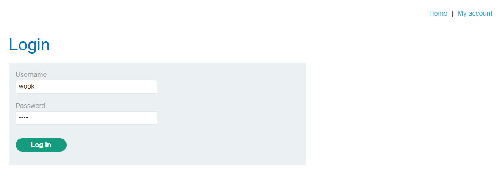
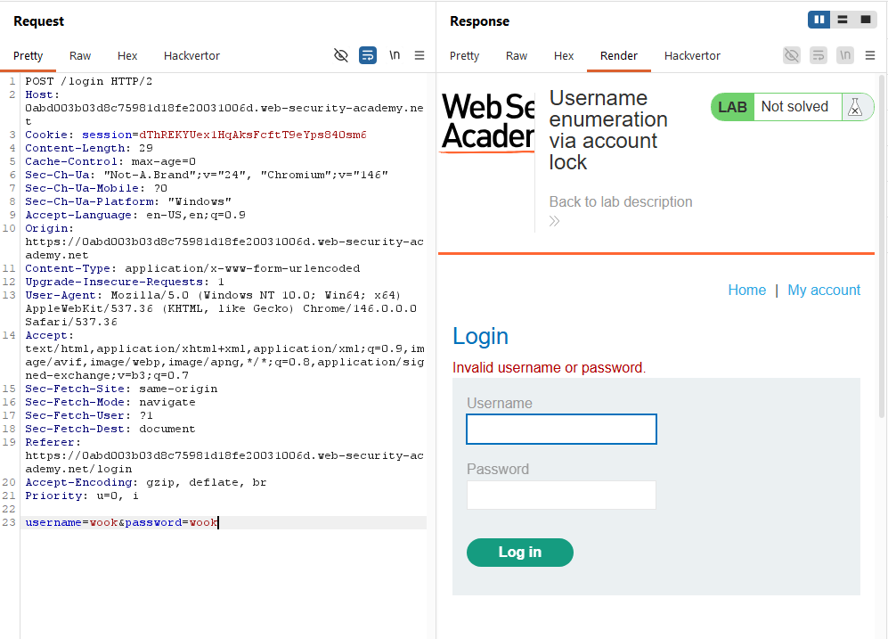
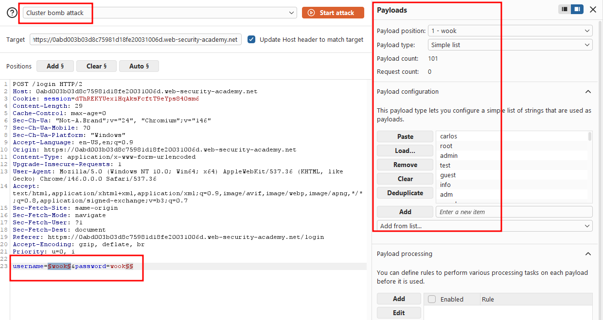
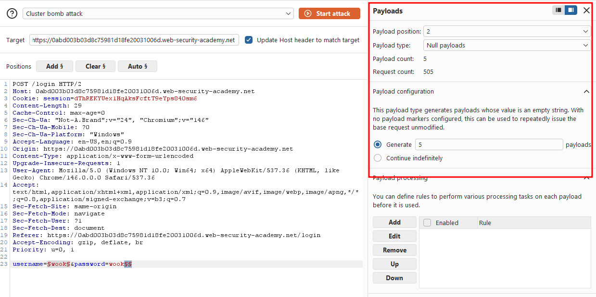
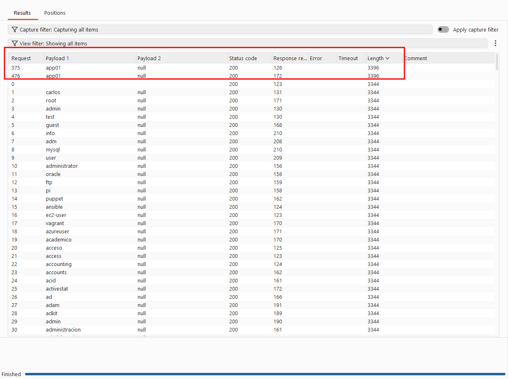
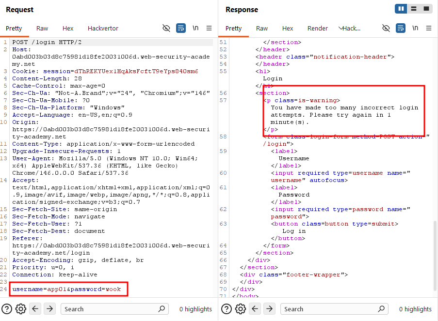
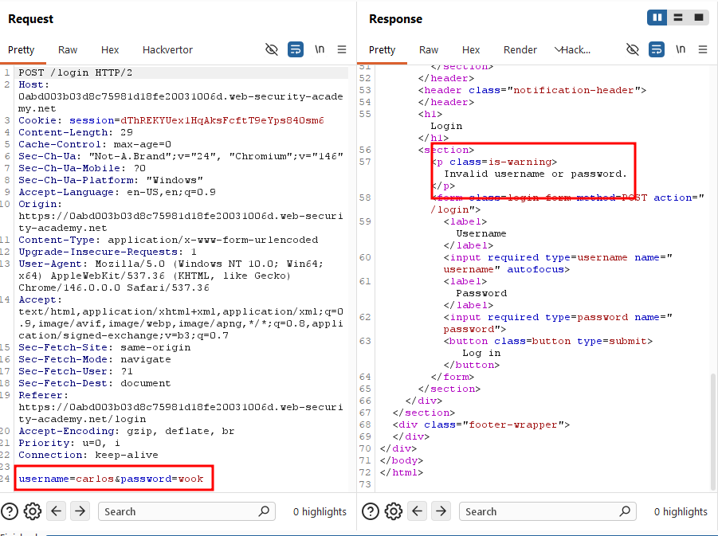
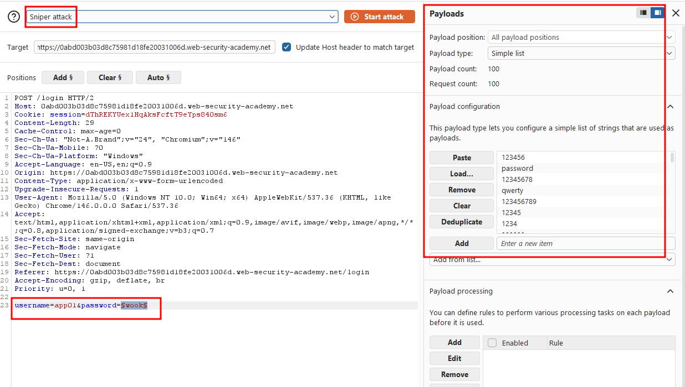
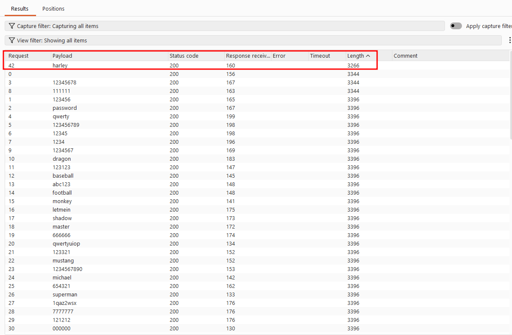
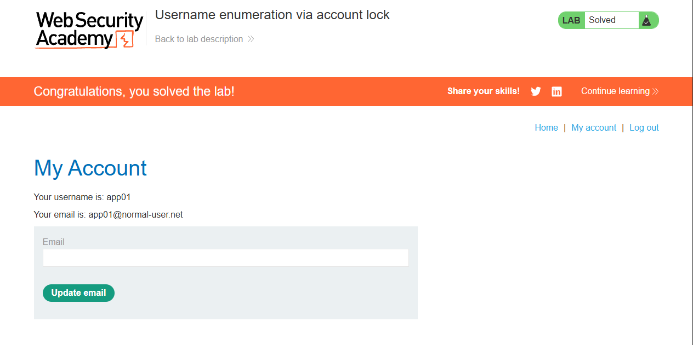

Write-up by wook413

# Lab: Username enumeration via account lock

This lab is vulnerable to username enumeration. It uses account locking, but this contains a logic flaw. To solve the lab, enumerate a valid username, brute-force this user's password, then access their account page.

- [Candidate usernames](https://portswigger.net/web-security/authentication/auth-lab-usernames)
- [Candidate passwords](https://portswigger.net/web-security/authentication/auth-lab-passwords)

---

I went straight to the login form and tried and invalid credential pair, `wook:wook`.

The server returned "**Invalid username or password.**" I sent the same request through Burp Repeater more than 10 times, but it kept returning the same message. No account lockout occurred.

I suspected the lockout logic was flawed and only triggered for valid usernames. To test this theory, I sent the request to Burp Intruder and set the attack type to **Cluster bomb**. I added a payload position on the `username` parameter, and a second, blank payload position after the `password` value.

For the second position, I set the payload type to `Null payloads` and configured it to generate 5 payloads. This effectively repeats each username 5 times in a row, letting me check whether any username triggers a lockout after repeated failed attempts.

I ran the attack, and only one payload group returned a different response length. `app01`.

Pulling it up, the server returned **"You have made too many incorrect login attempts. Please try again in 1 minute(s)."**

Every other request still returned **"Invalid username or password"**, confirming those usernames were invalid.

Now that I had a valid username, it was time to find the password. I switched the attack type back to **Sniper**, set the `password` parameter as the payload position, and loaded the provided password wordlist.

I ran the attack. All requests returned a **200 OK** status, as expected. One payload returns a distinct response length of 3266 with no error message. This is a strong indicator of success. Three payloads returned 3344, containing "**Invalid username or password,**" and the rest returned 3396, containing "**You have made too many incorrect login attempts. Please try again in 1 minute(s)**". This confirmed the account locks after 3 failed attempts: the first 3 wrong guesses return the standard error, and every attempt after that returns the lockout message instead until the successful attempt breaks the pattern.

I successfully authenticated as `app01` with the password.

### Solved!

