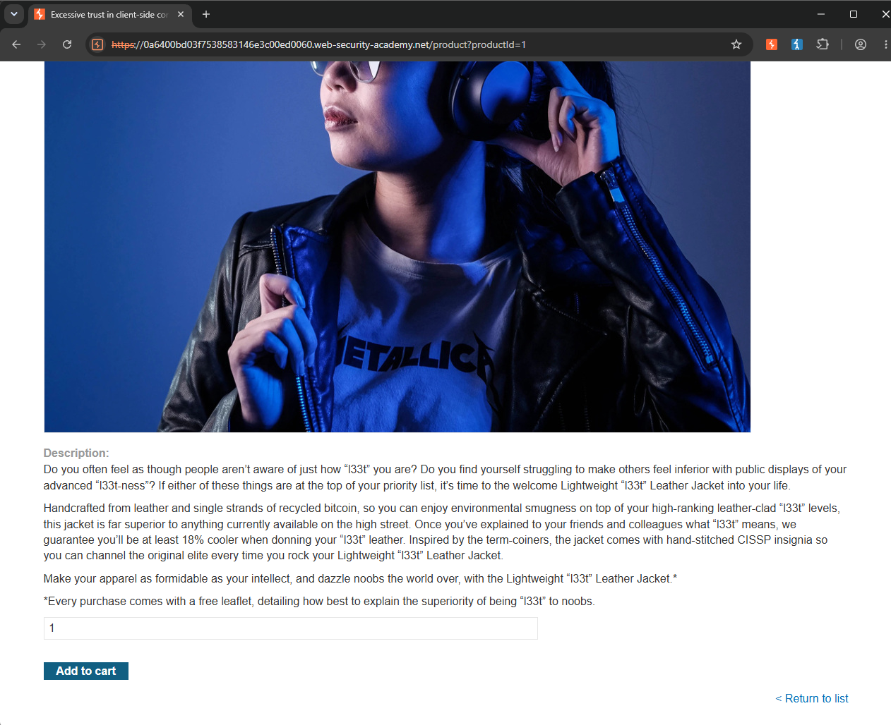
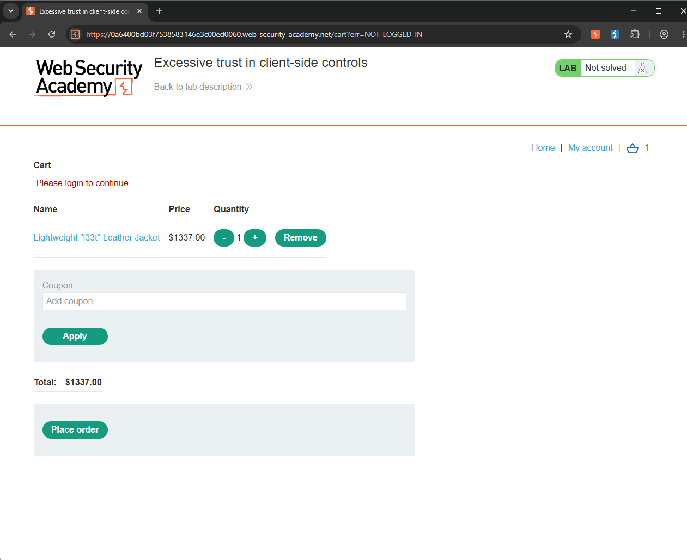
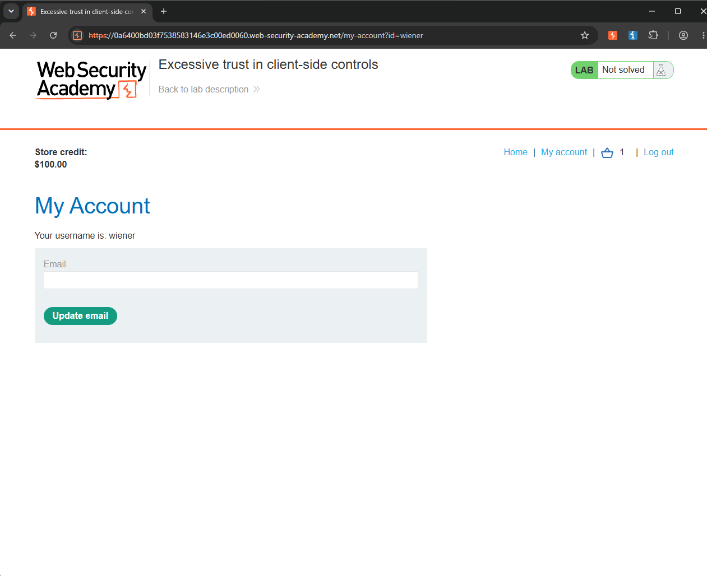
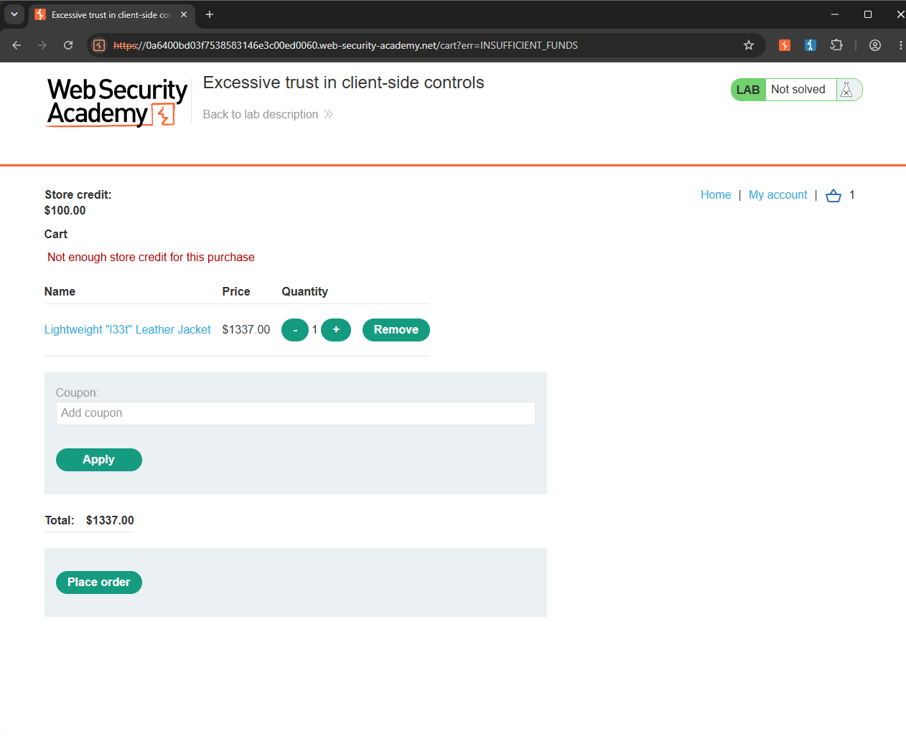
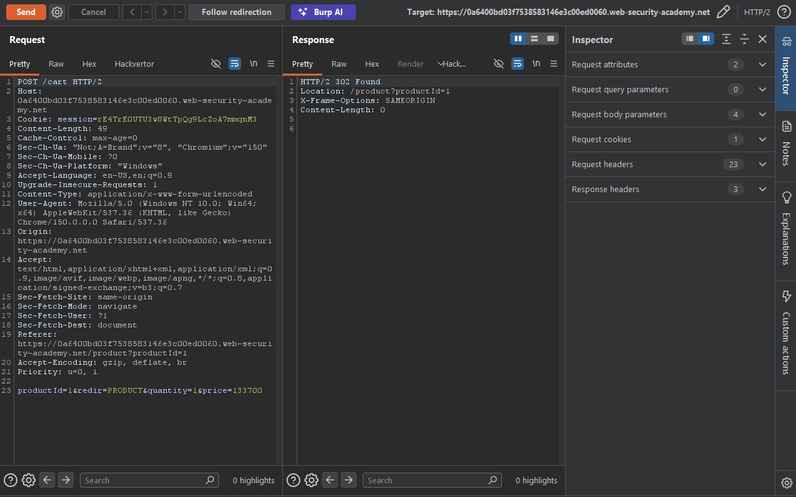
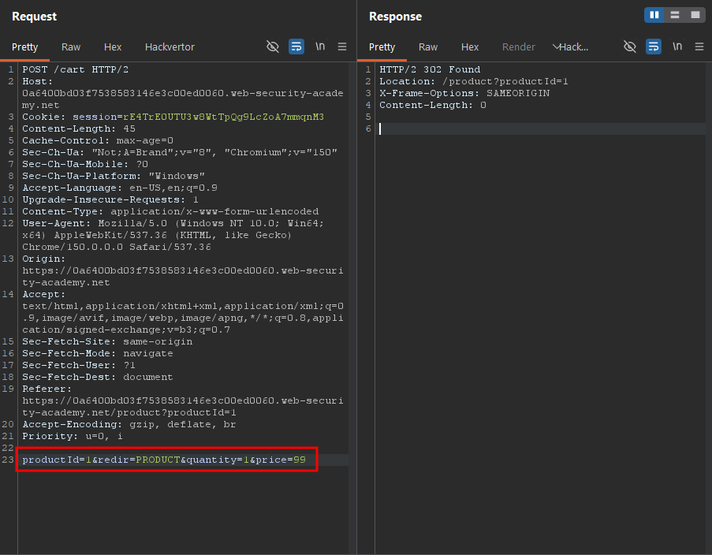
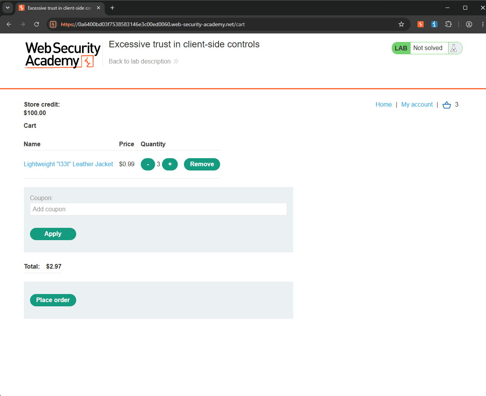
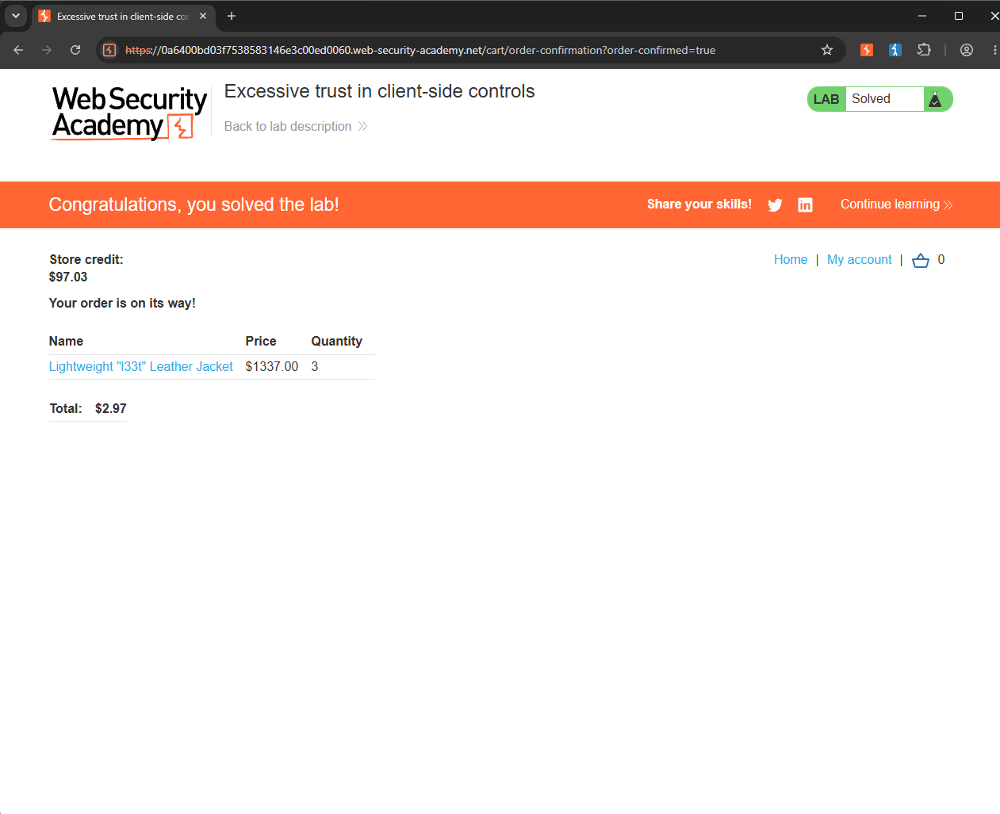

Write-up by wook413

# Lab: Excessive trust in client-side controls

This lab doesn't adequately validate user input. You can exploit a logic flaw in its purchasing workflow to buy items for an unintended price. To solve the lab, buy a "Lightweight l33t leather jacket".

You can log in to your own account using the following credentials: `wiener:peter`

---

As with every lab, the first step is to understand the application's workflow. Once I understand how the application functions, it becomes much easier to identify where vulnerabilities might exist. On the main page, I found the **Lightweight "l33t" Leather Jacket** that the lab instructed me to purchase.

I clicked on the item and pressed the "**Add to cart**" button.

A badge showing 1 appeared on the cart icon, indicating that the item had been added successfully. After opening the cart, I confirmed that the jacket was there. I then clicked the "**Place order**" button, but the application responded with **"Please login to continue"**.

I logged in using the credentials provided by the lab, `wiener:peter`. After logging in, I noticed that the account had **$100** in store credit.

I returned to the cart and clicked **Place order** again. This time, the application returned **"Not enough store credit for this purchase"**.

Now that I understood the purchasing workflow, it was time to inspect the HTTP requests in Burp Suite and look for potential vulnerabilities. I started by examining the POST request sent to the `/cart` endpoint. One parameter immediately caught my attention: `price`. Its value was set to **133700**, which made me wonder whether modifying this parameter would change the product's price.

I changed the value of the `price` parameter to **99** and re-sent the request.

Sure enough, when I returned to the application, the price of the jacket in my cart had been updated to **$0.99**. Even purchasing three jackets only cost **$2.97**, which was well within my **$100** store credit, allowing me to complete the purchase successfully.

### Solved!

