Write-up by wook413

# Lab: High-level logic vulnerability

This lab doesn't adequately validate user input. You can exploit a logic flaw in its purchasing workflow to buy items for an unintended price. To solve the lab, buy a "Lightweight l33t leather jacket".

You can log into your own account using the following credentials: `wiener:peter`

---

When I started the lab, I was presented with the familiar storefront page.

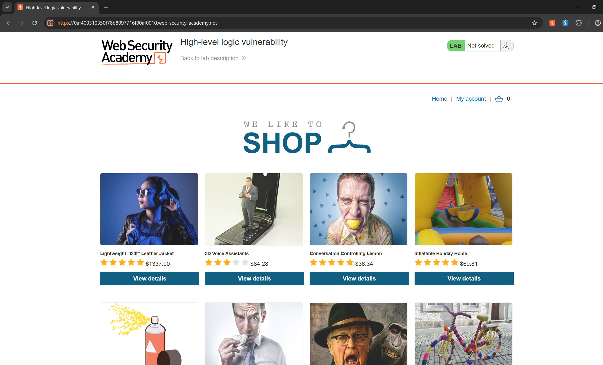

Before looking for the vulnerability, I wanted to understand the application's workflow. Since the lab required me to purchase the **Lightweight l33t Leather**, I selected the item and clicked **Add to cart**.

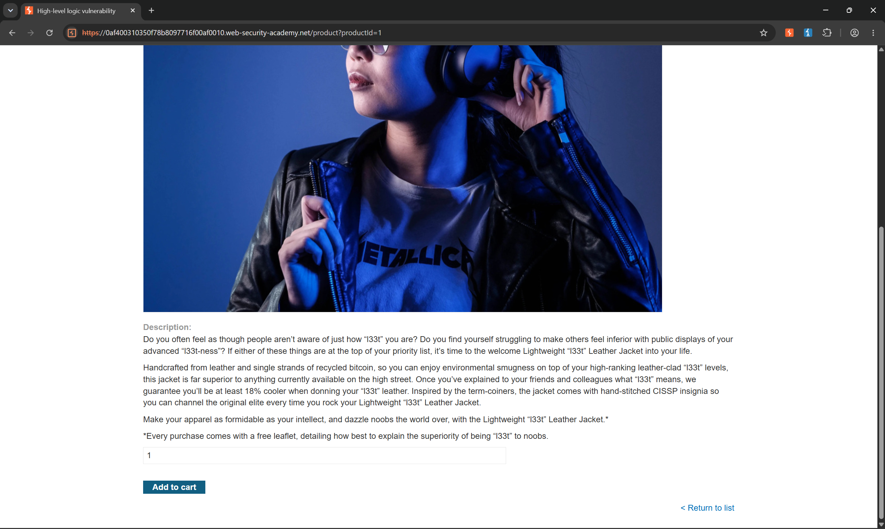

When I opened my cart, I saw that the jacket cost a whopping $1,337.

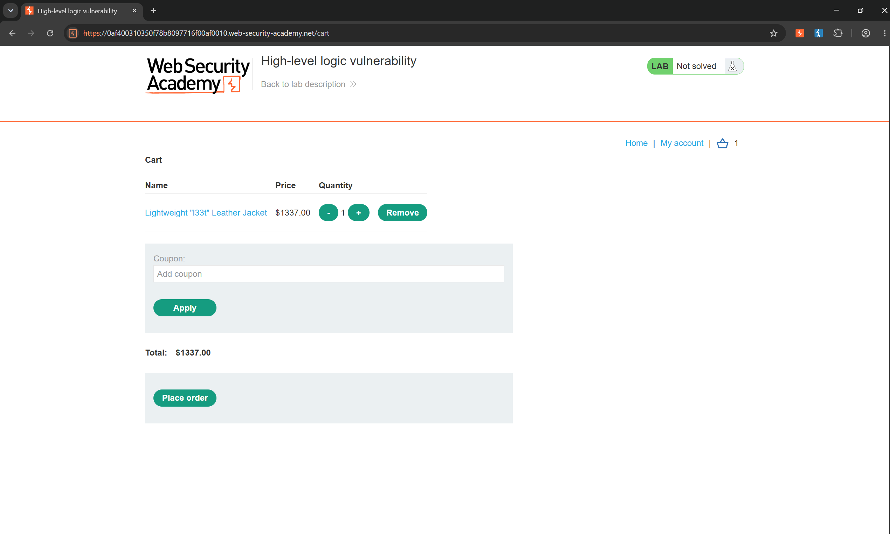

I clicked **Place order**, but the application displayed the message: **"Please login to continue"**.

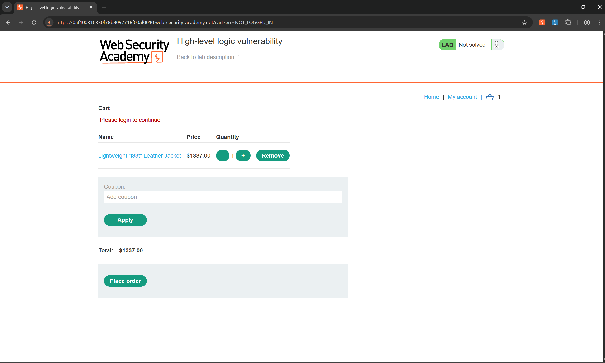

I clicked **My account** and logged in with the credentials **wiener**. After logging in, I noticed that the account had $100 in store credit.

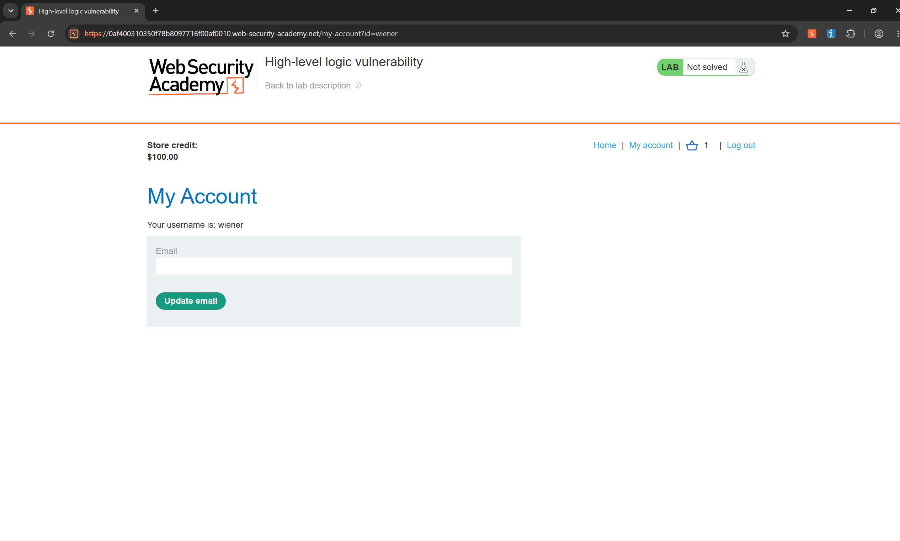

I returned to the cart and clicked **Place order** again. This time, I received the message: **"Not enough credit for this purchase."**

Now that I understood the purchase workflow, I examined the requests in Burp Suite's HTTP History. I found a request to the `/cart/checkout` endpoint, but nothing about it seemed particularly interesting.

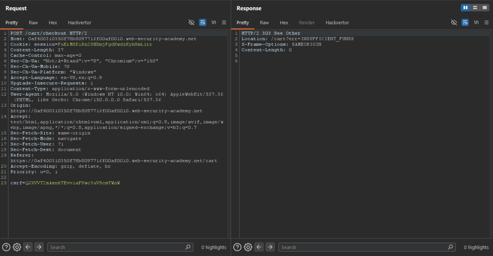

I went back to the application and changed the quantity of the jacket. This generated a POST request to the `/cart` endpoint containing the `productId`, `quantity`, and `redir` parameters.

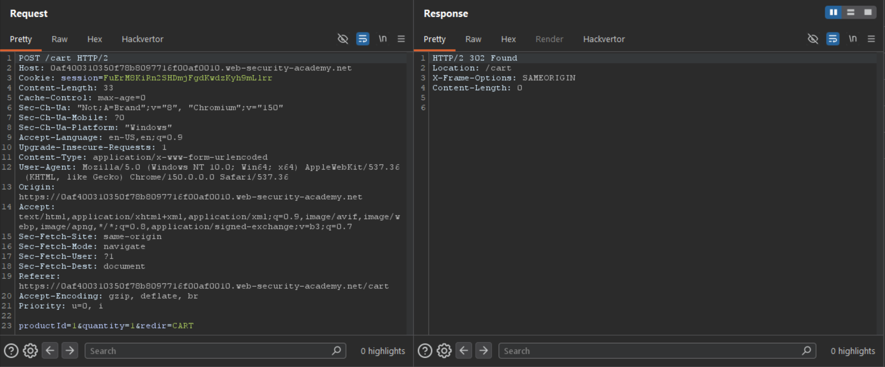

I modified the `quantity` parameter to `-1` and forwarded the request.

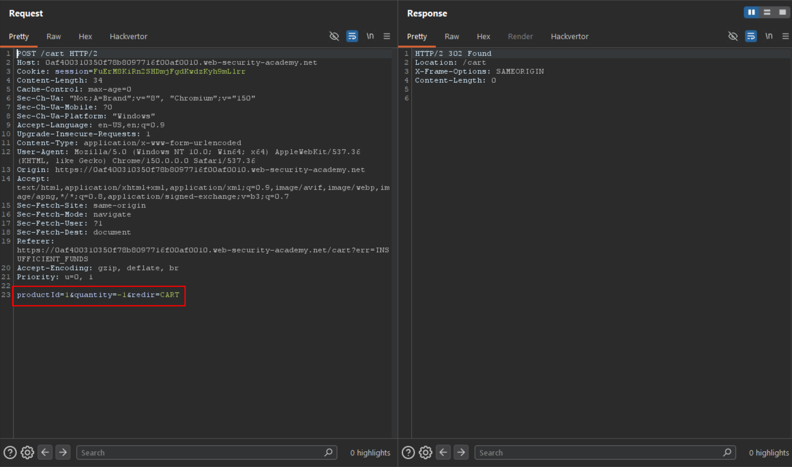

After refreshing the cart, I noticed that the total price had become **-$1,337**.

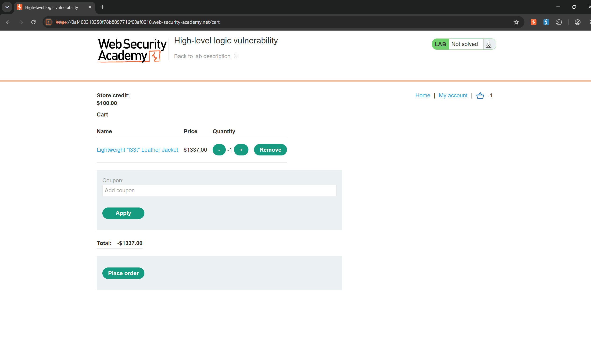

I clicked **Place order**, but the application responded that the total price could not be less than zero.

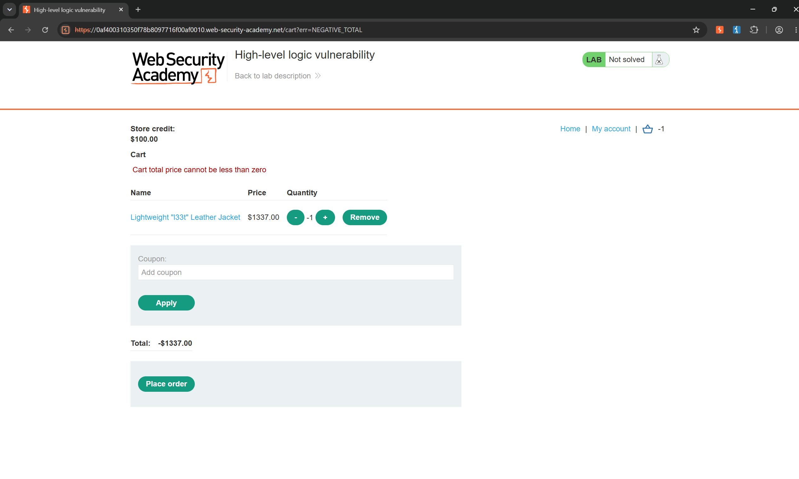

To work around this, I added 15 units of another product, **The Lazy Dog**, bringing the total back to a positive value of $26.20, and completed the purchase. However, the lab was still **Not solved**, likely because the jacket's quantity was **-1**.

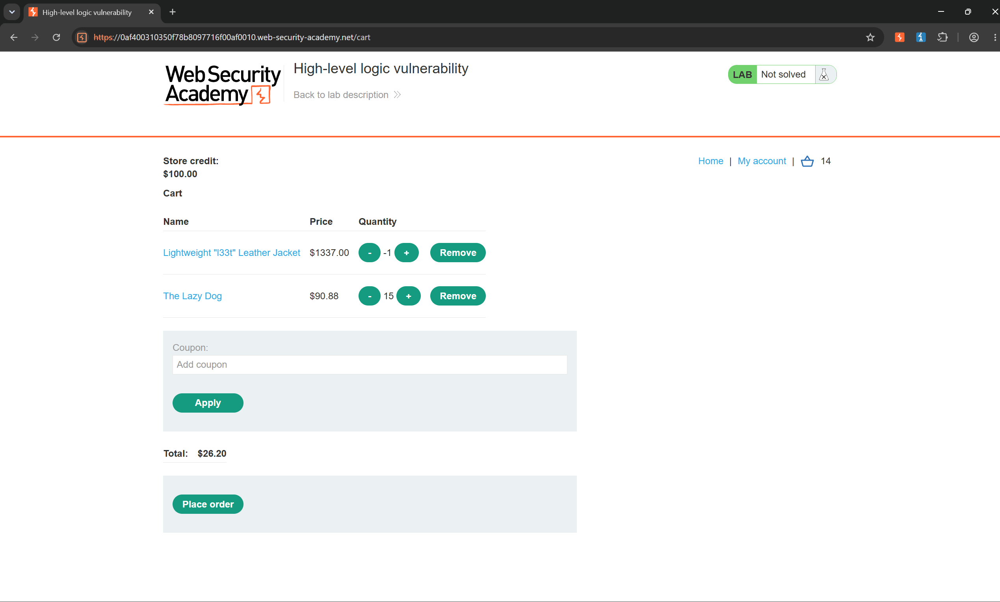

I continued experimenting with different products, and my remaining store credit eventually dropped to $19.34. This time, I kept the jacket's quantity at 1, changed the quantity of **3D Voice Assistants** to **-16**, and added one **Sprout More Brain Power** item. This reduced the total cost to $9.70, which was below my available store credit. I then clicked **Place order**.

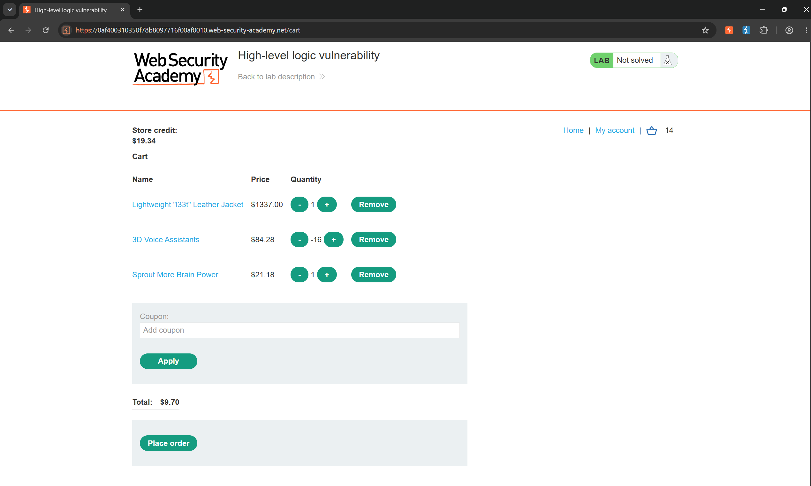

Success! The jacket was purchased.

### Solved!

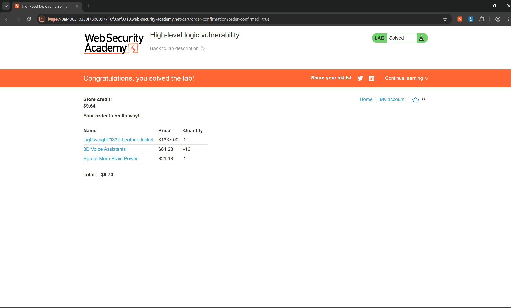