Write-up by wook413

# Lab: Inconsistent security controls

This lab's flawed logic allows arbitrary users to access administrative functionality that should only be available to company employees. To solve the lab, access the admin panel and delete the user `carlos`.

---

Unlike the previous labs, this lab has a **Register** button next to **My account**.

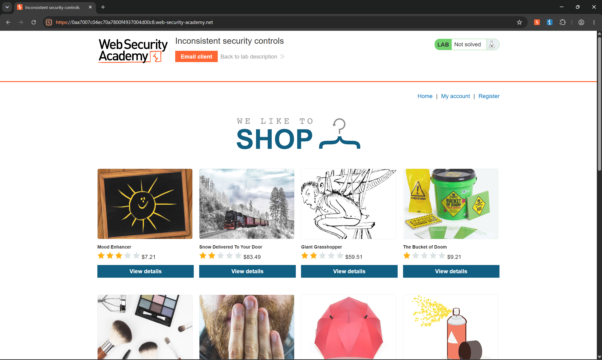

After clicking the **Register** button, I found a feature for creating a new account. At the top of the page, there was a message saying, "**If you work for DontWannaCry, please use your @dontwannacry.com email address.**"

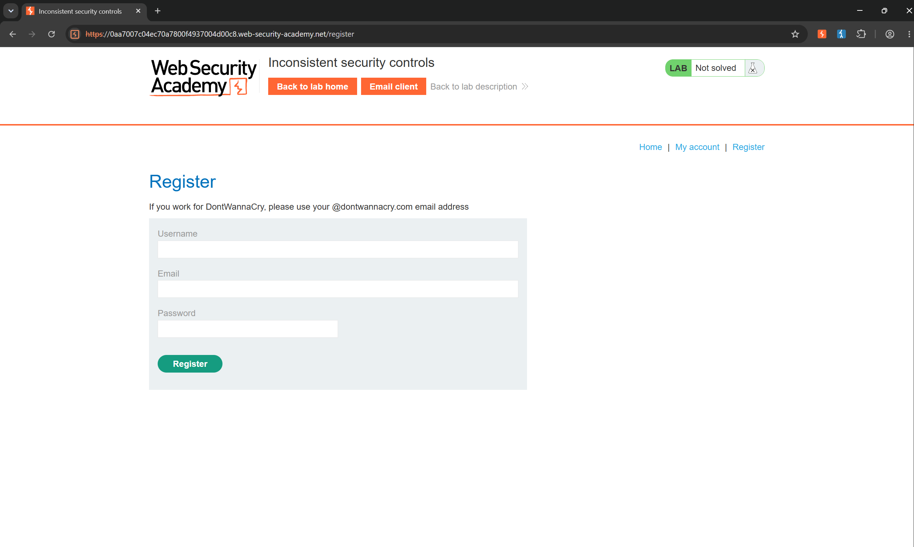

Since I am obviously not an employee of DontWannaCry, I clicked on **Email Client** and used the provided email address, `attacker@exploit-0a030098047070e180e348c101e20038.exploit-server.net`, to register an account.

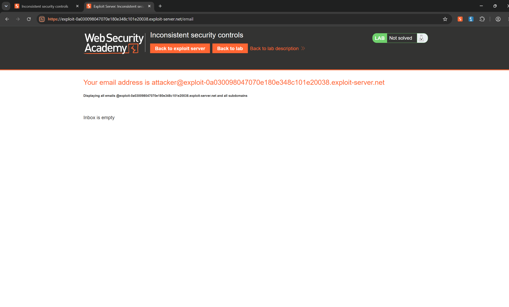

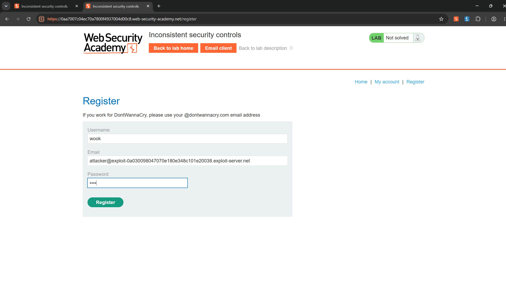

After clicking **Register**, I opened **Email Client** again and found an email in the inbox asking me to confirm my email address and complete the registration.

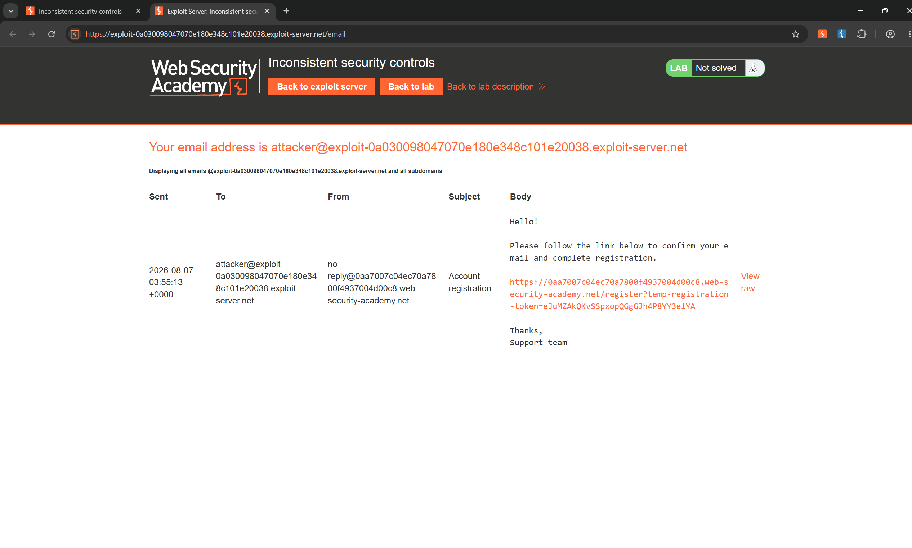

I clicked the link in the email, and the page displayed **"Account registration successful!"**.

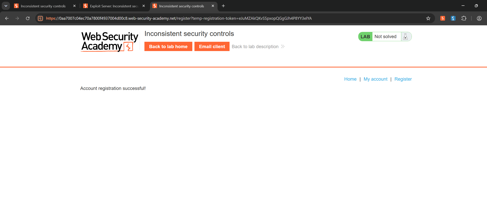

I then navigated to the **My account** tab and successfully logged in as the `wook` user. I noticed that there was an **Update email** feature.

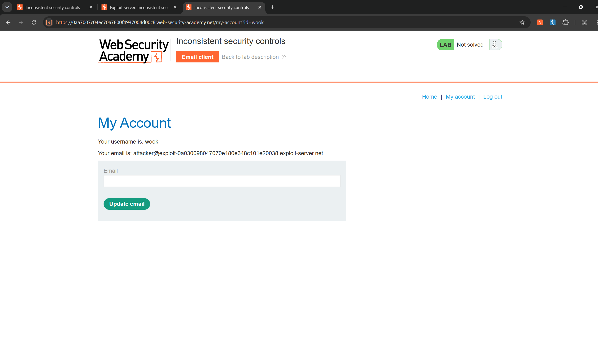

Just in case, I tried changing my email address to `wook@dontwannacry.com`.

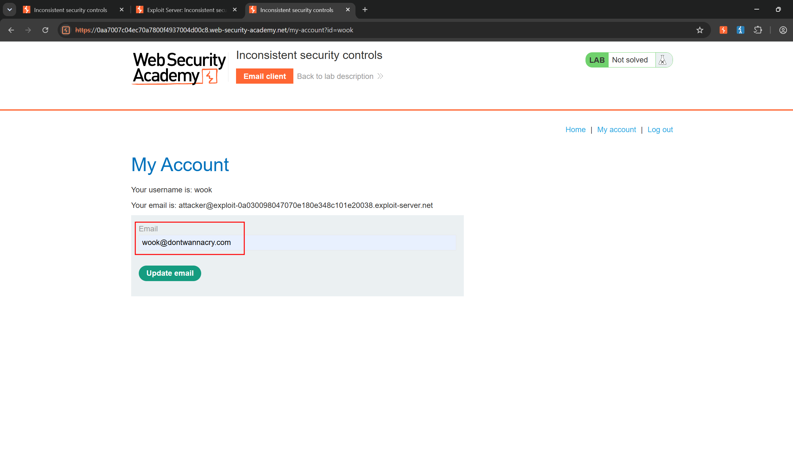

Surprisingly, my email address was successfully changed to `wook@dontwannacry.com`, and an **Admin panel** tab appeared at the same time.

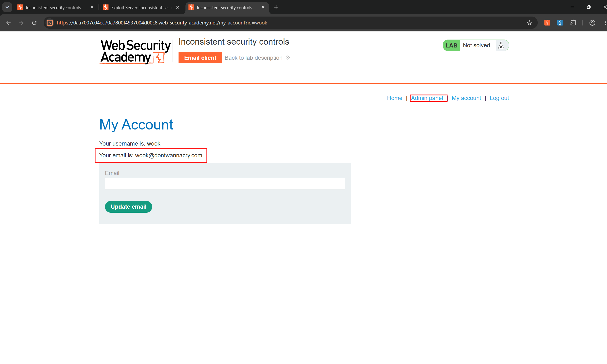

After clicking on the **Admin panel**, I could see a list of users.

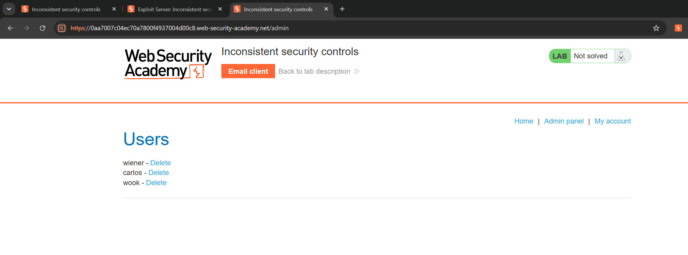

Following the lab objective, I deleted the `carlos` user and successfully completed the lab.

### Solved!

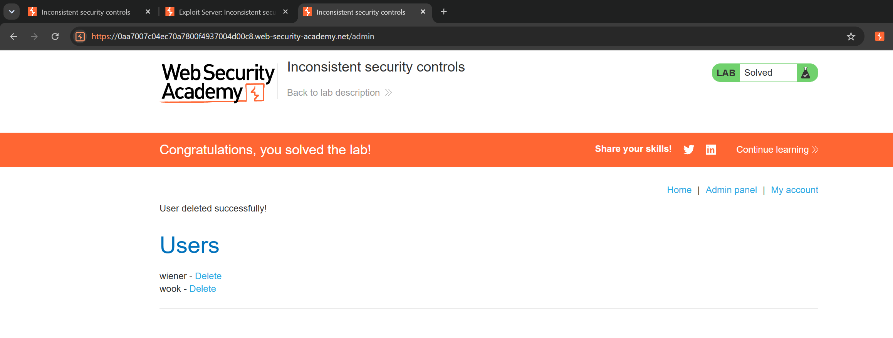

