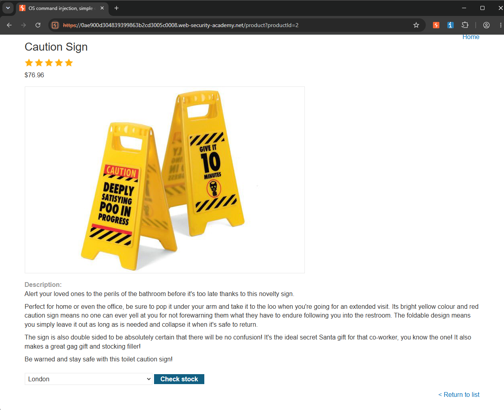
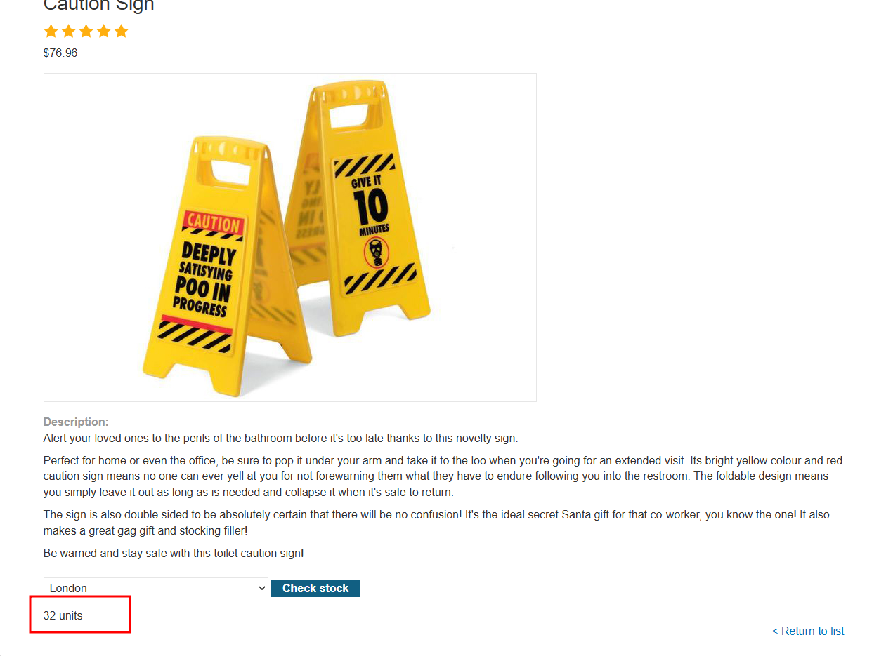
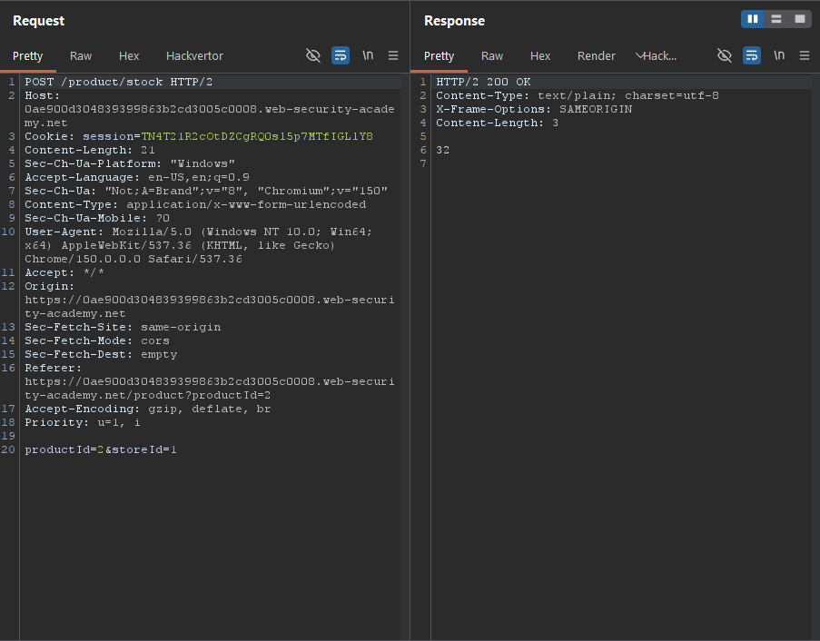
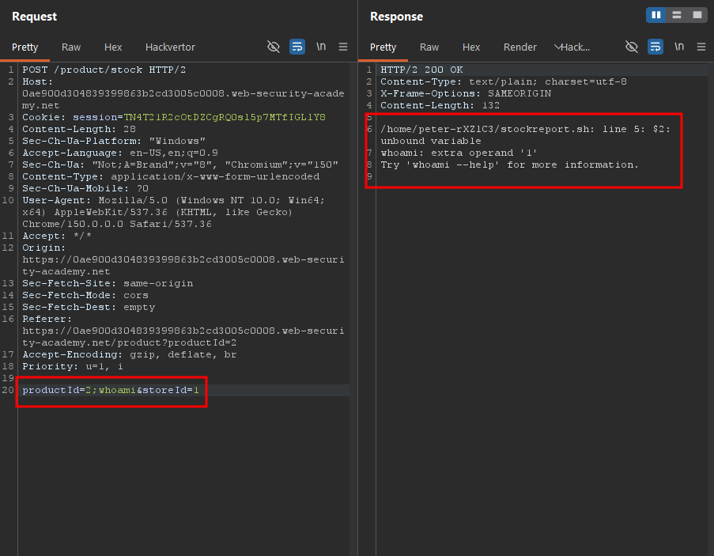
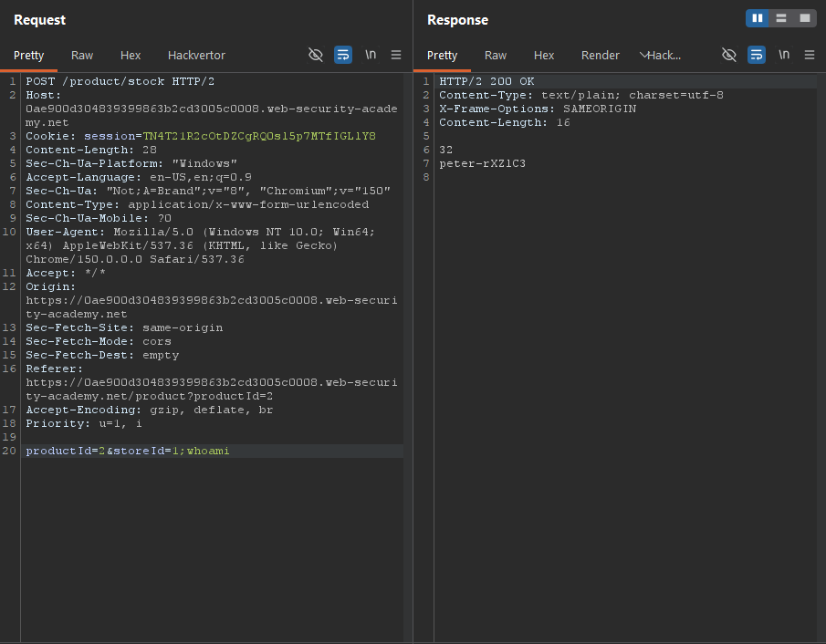
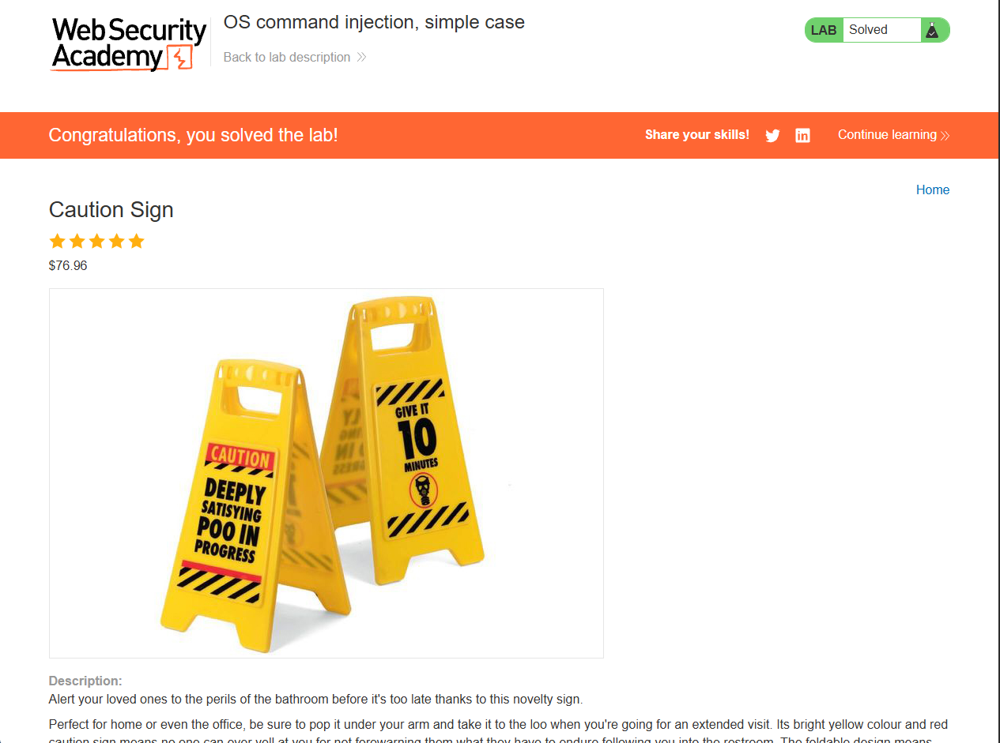

Write-up by wook413

# Lab: OS command injection, simple case

This lab contains an OS command injection vulnerability in the product stock checker.

The application executes a shell command containing user-supplied product and store IDs, and returns the raw output from the command in its response.

To solve the lab, execute the `whoami` command to determine the name of the current user.

---

This is what the main page of the lab looks like.

Since the lab description states that the application contains an OS command injection vulnerability in the product stock checker, I selected a random product, **Caution Sign**.

I clicked the **Check stock** button, and the application returned "**32 units.**"

Next, I opened Burp Suite and reviewed the requests in the **HTTP History** tab. I found the POST request sent to the `/product/stock` endpoint. The request body contained two parameters: `productId` and `storeId`.

Knowing that the application was vulnerable to OS command injection, I began testing both parameters. First, I appended `;whoami` to the value of the `productId` parameter (after the value `2`). The application returned a **200 OK**, but the `whoami` command was not executed.

Next, I appended the same payload, `;whoami`, to the `storeId` parameter instead. This time, the application returned `peter-rXZ1C3`, indicating that the injected command had been executed successfully. Since `whoami` prints the username of the current user, I confirmed that the command injection was successful.

### Solved!

