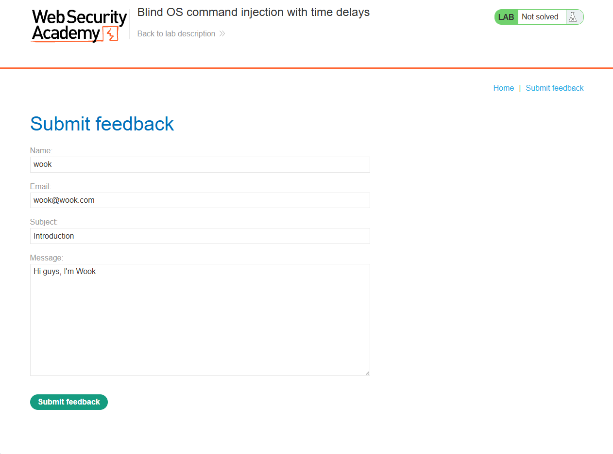
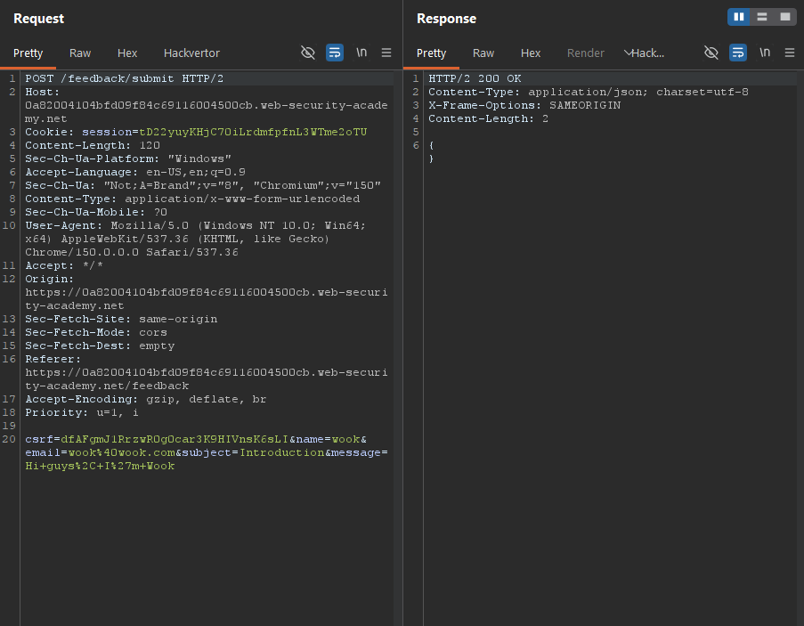
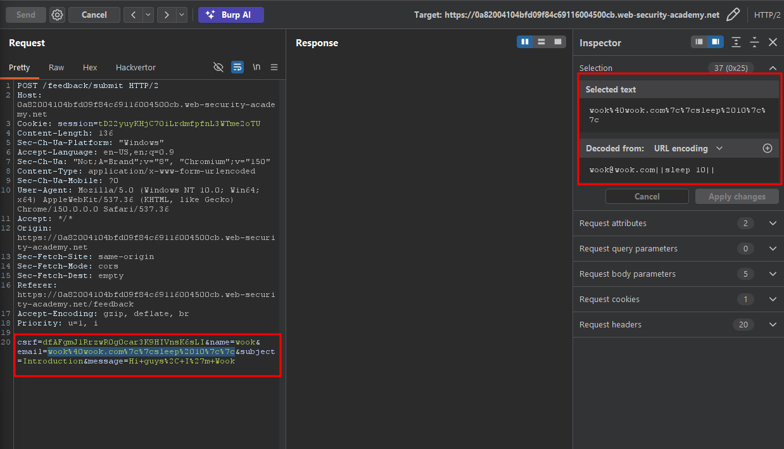
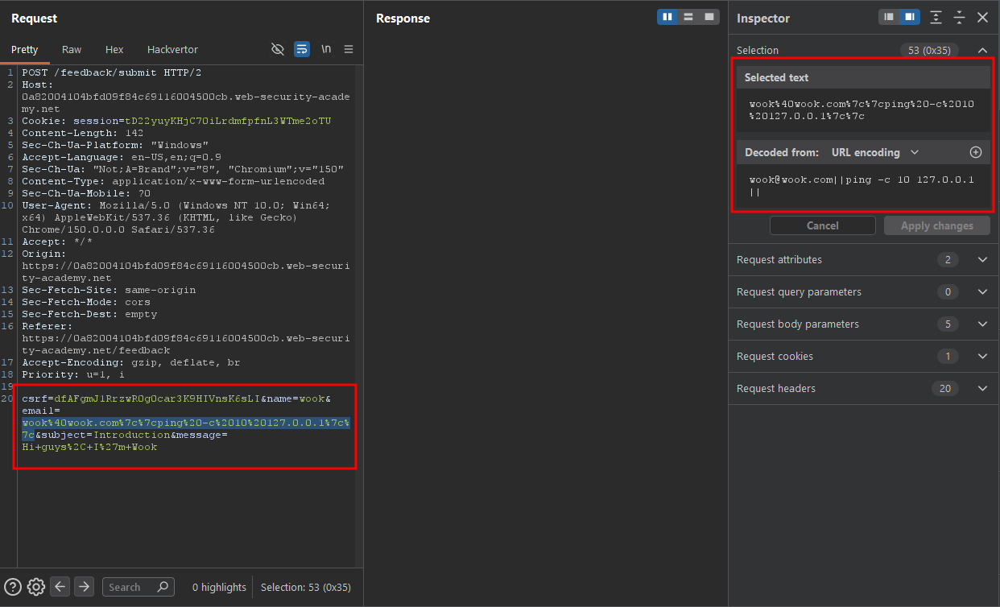
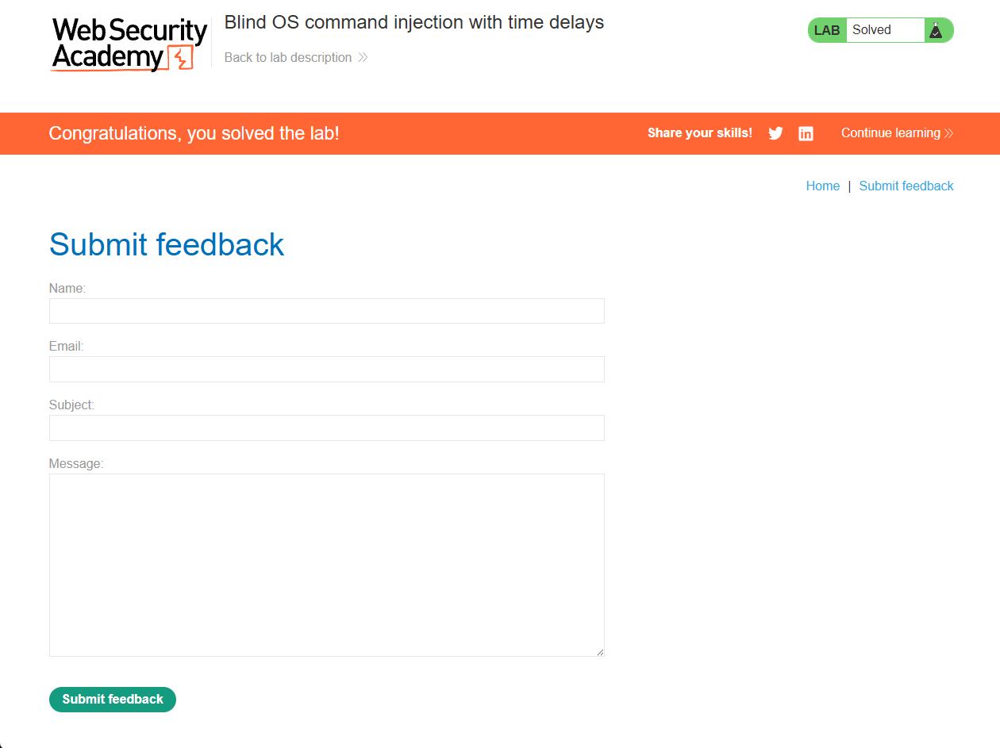

Write-up by wook413

# Lab: Blind OS command injection with time delays

This lab contains a blind OS command injection vulnerability in the feedback function.

The application executes a shell command containing the user-supplied details. The output from the command is not returned in the response.

To solve the lab, exploit the blind OS command injection vulnerability to cause a 10 second delay.

---

As the lab description states, this lab contains a blind OS command injection vulnerability in the feedback function. Therefore, I navigated directly to the feedback page by clicking the **"Submit feedback"** button in the top-right corner.

On the feedback page, I filled out every field with arbitrary information and clicked **"Submit feedback"** to inspect the request.

I opened the POST request sent to `/feedback/submit`. The request body contains the parameters `csrf`, `name`, `email`, `subject`, and `message`.

Since we do not know which parameter is vulnerable, I started appending the following payload to the value of each parameter, beginning with the `name` parameter: `||sleep 10||`

When I appended the payload to the value of the `email` parameter, the response took about 10 seconds to return. This indicated that the injected command had been executed successfully.

Although we already confirmed the vulnerability using the `sleep` command, there is another way to introduce a delay. The following payload does not make the server sleep. Instead, it causes the server to send 10 ICMP echo requests to the localhost. Because the server waits for the `ping` command to finish, the HTTP response is delayed by approximately 10 seconds.

`||ping -c 10 127.0.0.1||`

### Solved!

