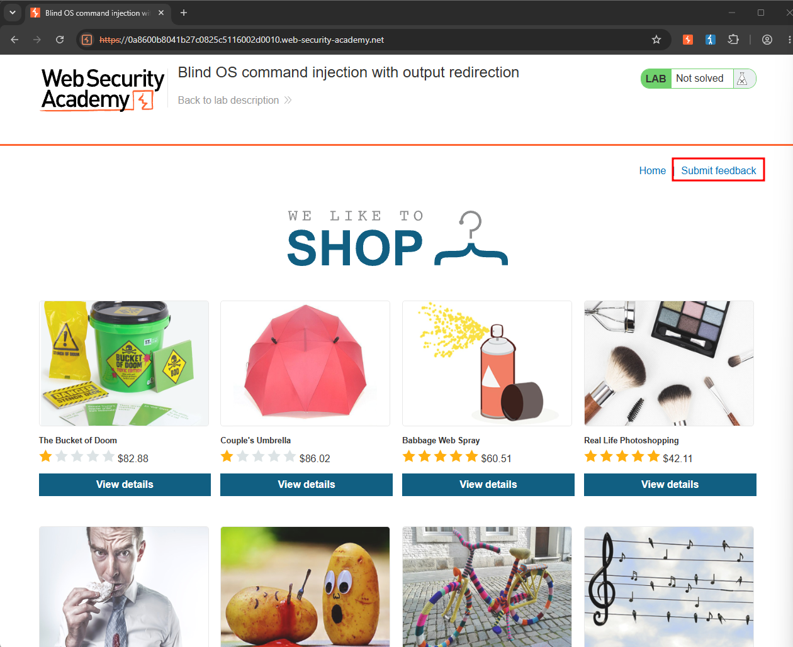
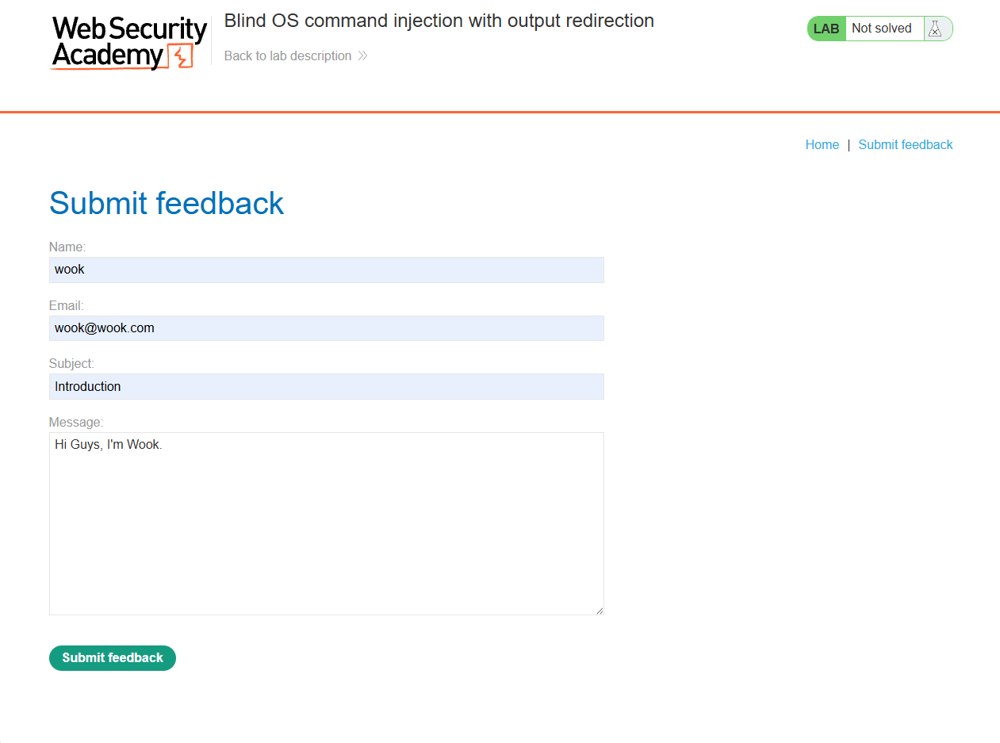
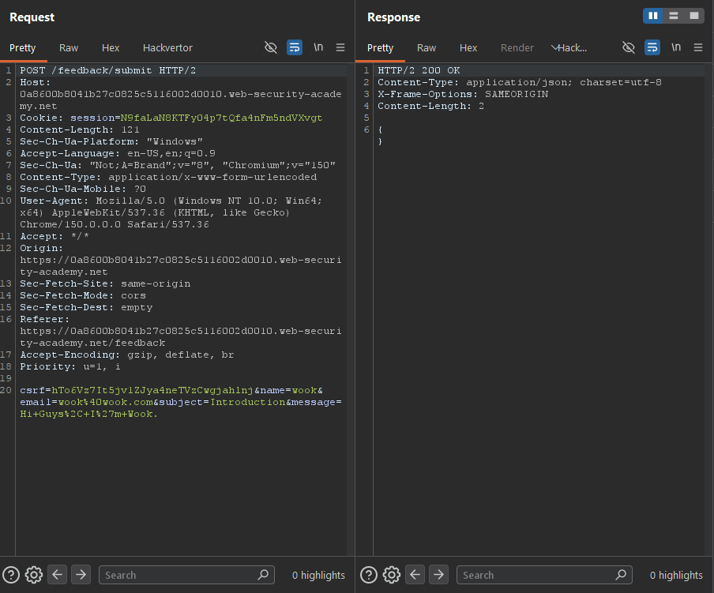
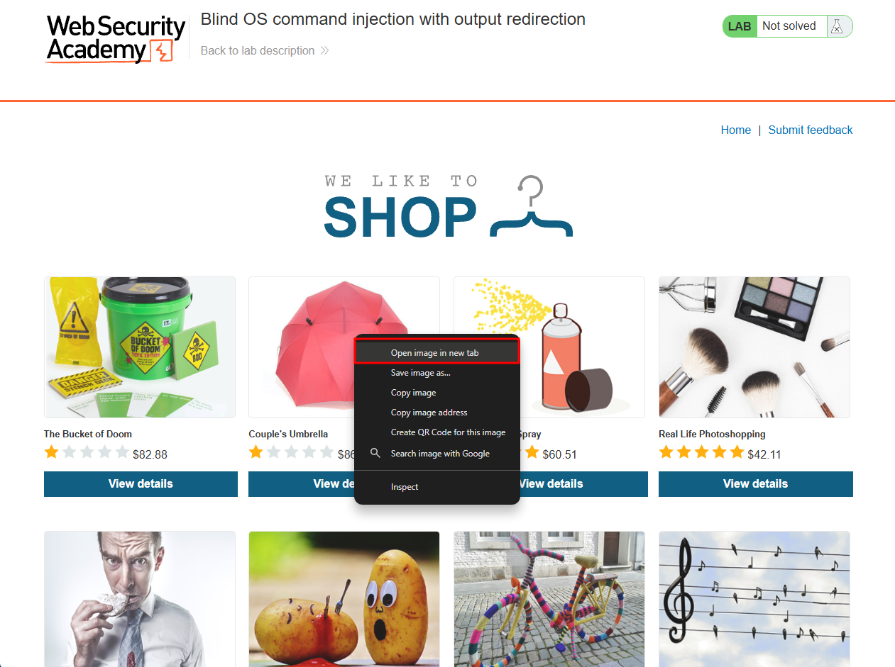
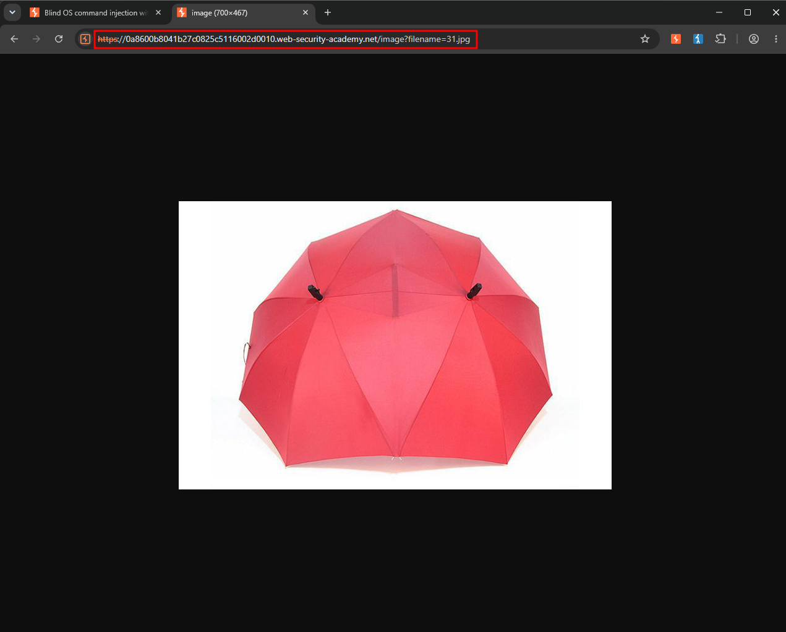
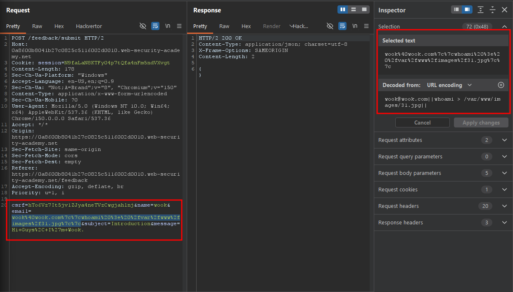
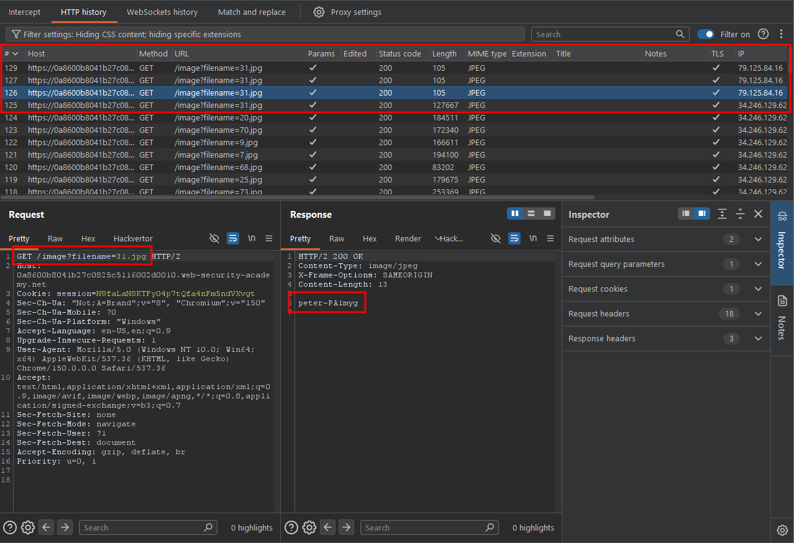

Write-up by wook413

# Lab: Blind OS command injection with output redirection

This lab contains a blind OS command injection vulnerability in the feedback function.

The application executes a shell command containing the user-supplied details. The output from the command is not returned in the response. However, you can use output redirection to capture the output from the command. There is a writable folder at: `/var/www/images/`

The application serves the images for the product catalog from this location. You can redirect the output from the injected command to a file in this folder, and then use the image loading URL to retrieve the contents of the file.

To solve the lab, execute the `whoami` command and retrieve the output.

---

Just like the previous lab, the lab description stated that the feedback page contained an OS command injection vulnerability. So, I clicked the **"Submit feedback"** button to navigate to the feedback page.

On the feedback page, I entered arbitrary values into every field and submitted the form, just as I did in the previous lab.

I then located the POST request I had just submitted in Burp Suite.

According to the lab description, my goal was to execute the `whoami` command to identify the current user. However, the command output would not be reflected in the HTTP response. Instead, I needed to redirect the output to a writable location, `/var/www/images`, and then retrieve it using the image-loading URL. To prepare for this, I returned to the main page, right-clicked on the image of a random product, and selected **"Open image in new tab"**.

The image URL showed that the current image filename was `31.jpg`.

I went back to Burp Suite and appended the following payload to the end of the vulnerable `email` parameter, which was the same vulnerable parameter used in the previous lab: `||whoami > /var/www/images/31.jpg||`

After forwarding the modified request, I requested `31.jpg` again. This time, when I inspected the response in Burp Suite's HTTP History, I found that the `whoami` command had been executed successfully. The response revealed that the current user was `peter-PA1myg`.

### Solved!

