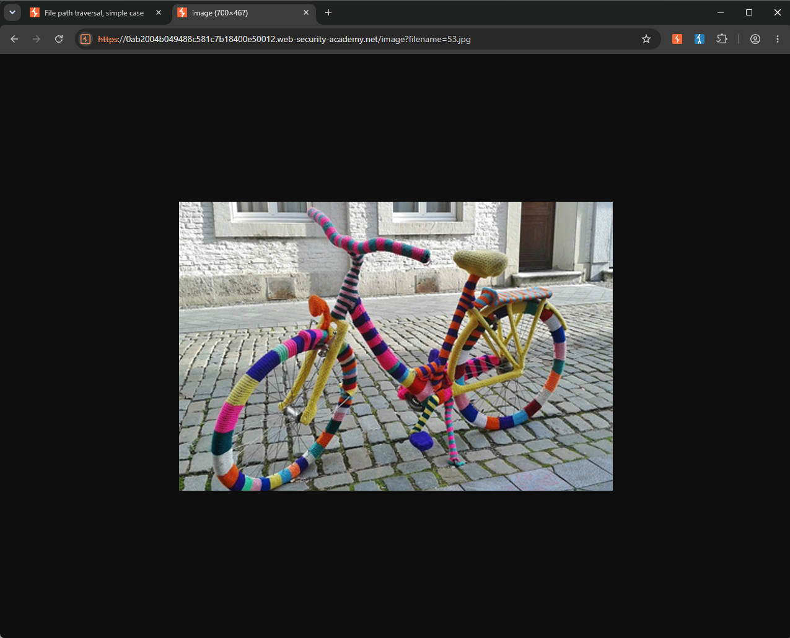
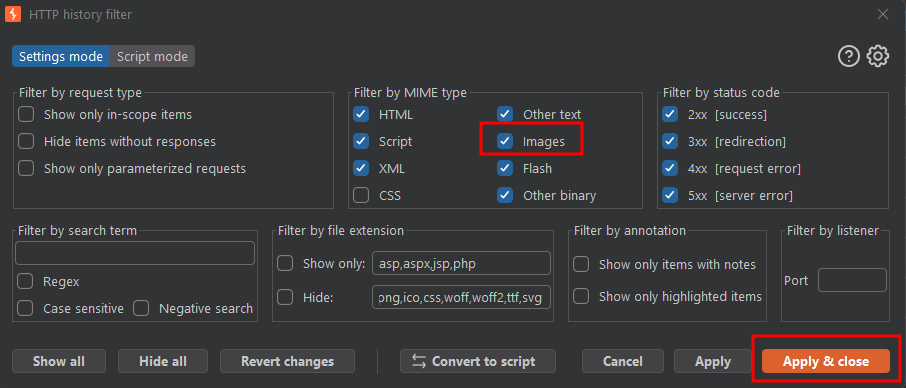
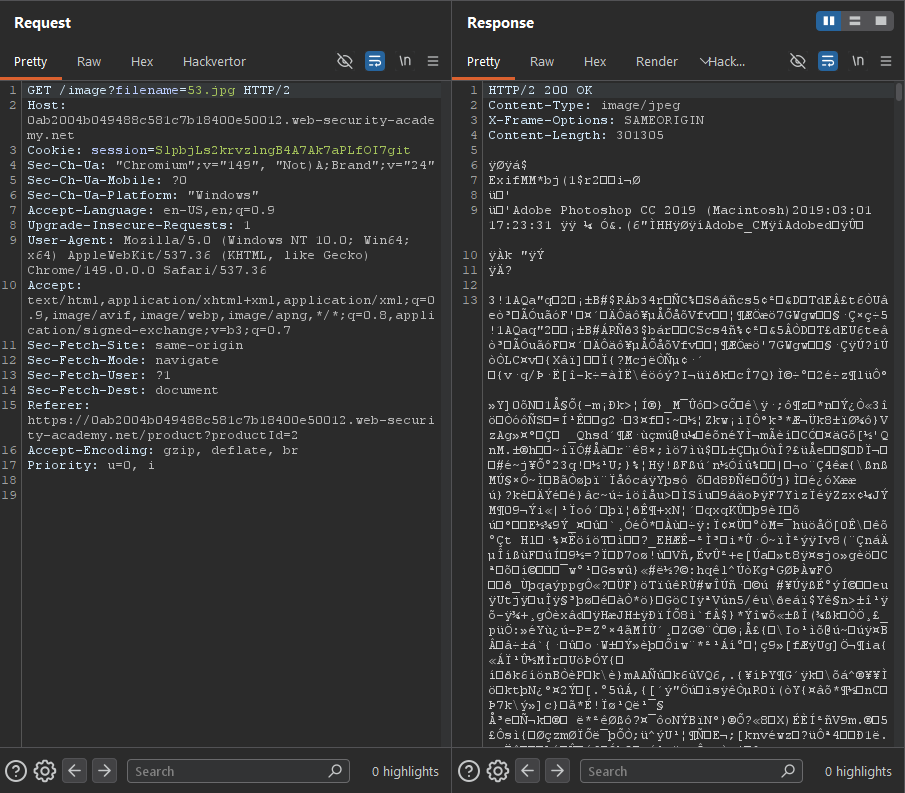
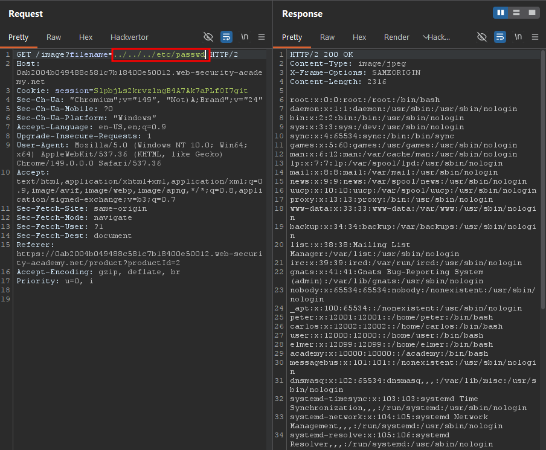

Write-up by wook413

# Lab: File path traversal, simple case

This lab contains a path traversal vulnerability in the display of product images.

To solve the lab, retrieve the contents of the `/etc/passwd` file.

---

This is what the web application looks like.

I clicked on a random item, "**High-End Gift Wrapping**". The lab specified that it contains a path traversal vulnerability in the display of product images. I right-clicked on the product image and selected "**Open image in new tab**".

The image opened in a new tab, and the URL was the following: `0ab2004b049488c581c7b18400e50012.web-security-academy.net/image?filename=53.jpg`

I pulled up Burp and check the `Images` filter in the HTTP history settings so I could see the GET request I made to `/image?filename=53.jpg`.

I was able to pull up the GET request, and the response contained the binary data of the image file.

I changed the `filename` parameter value from `53.jpg` to `../../../etc/passwd` to test whether the parameter was vulnerable to path traversal, and it was -- the response returned the contents of `/etc/passwd`.

### Solved!

