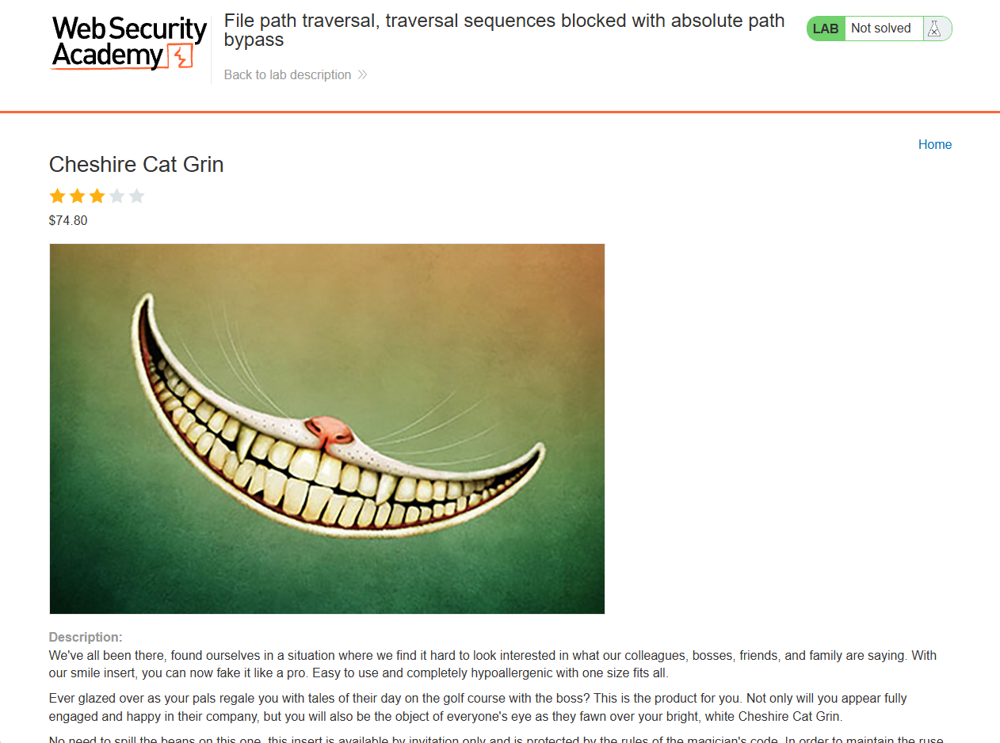
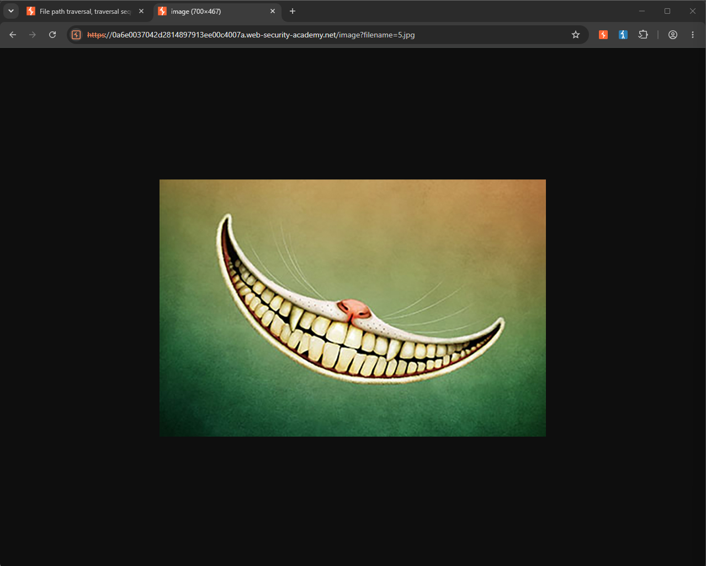
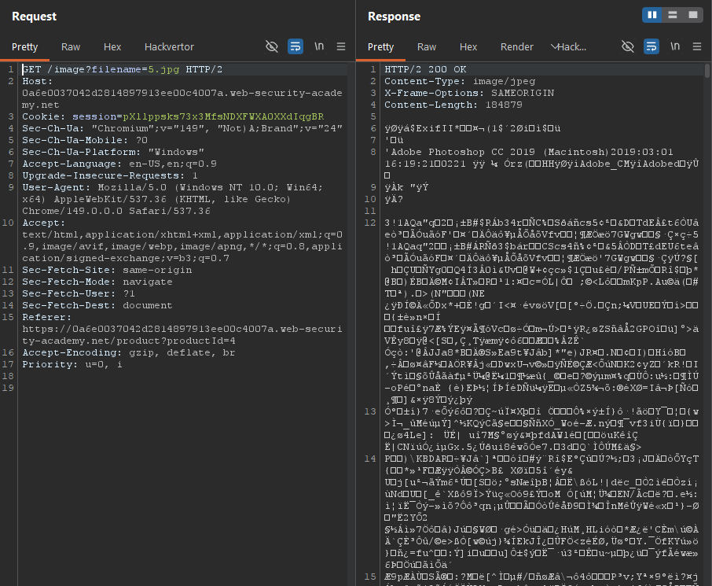
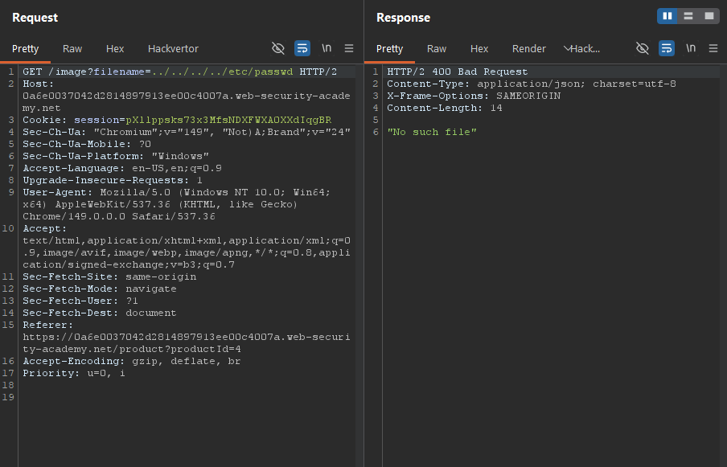
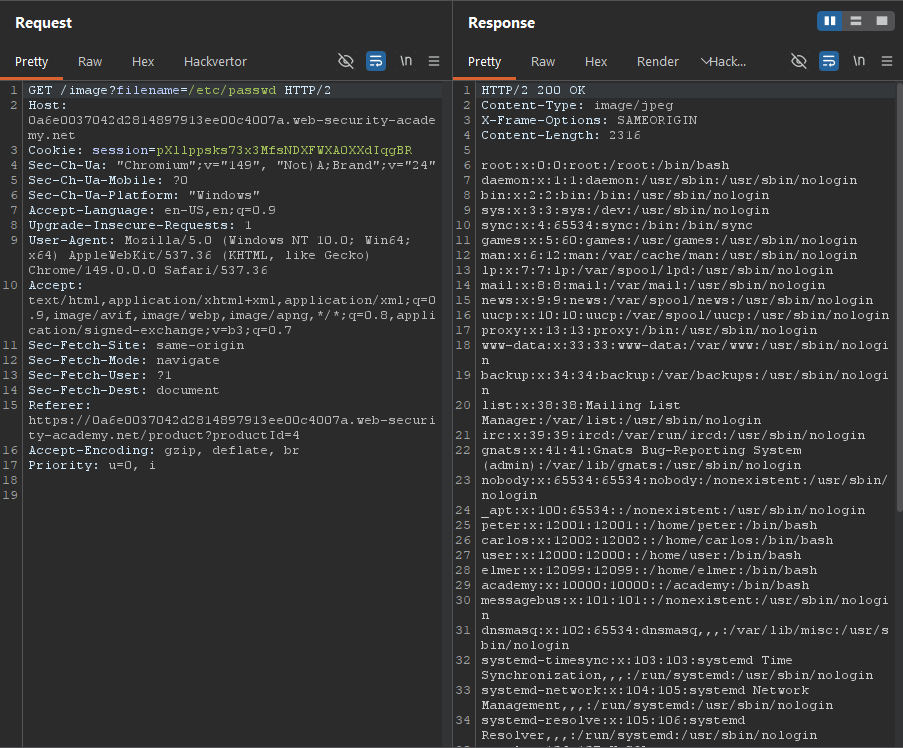
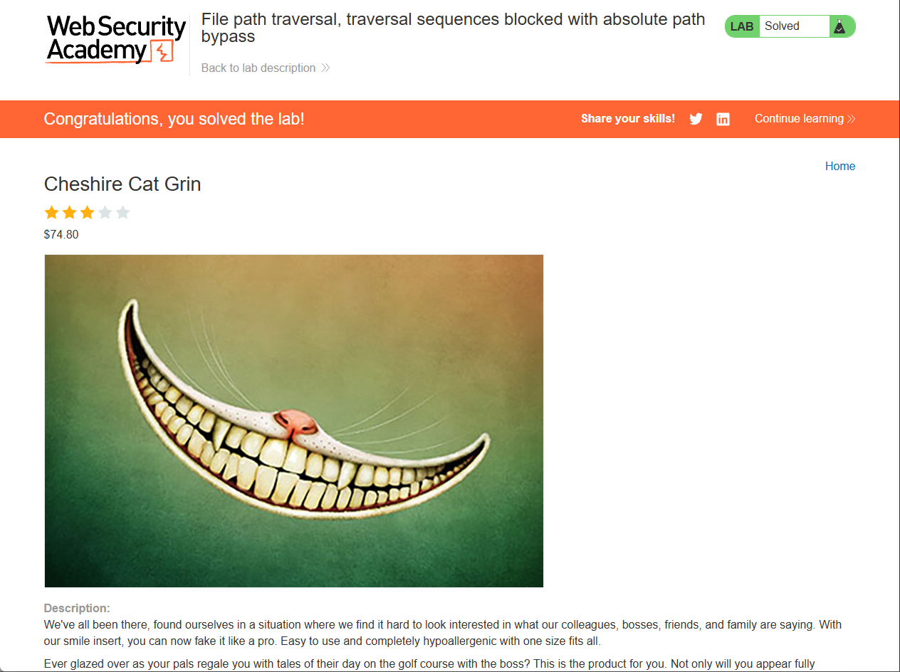

Write-up by wook413

# Lab: File path traversal, traversal sequences blocked with absolute path bypass

This lab contains a path traversal vulnerability in the display of product images.

The application blocks traversal sequences but treats the supplied filename as being relative to a default working directory.

To solve the lab, retrieve the contents of the `/etc/passwd` file.

---

This is what the landing page of the lab looks like.

According to the lab description, the application contains a path traversal vulnerability in the product image endpoint. To test this, I clicked on a random product, **Cheshire Cat Grin**.

I right-clicked product image and selected "**Open image in new tab.**" Notice that the URL changed and now includes a `filename` parameter.

`https://0a6e0037042d2814897913ee00c4007a.web-security-academy.net/image?filename=5.jpg`

As shown below, the GET request to `/image?filename=5.jpg` returns the binary data of the requested image.

Although the lab states that path traversal sequences are blocked, I tested them to observer the server's behavior. I supplied `../../../etc/passwd` as the `filename` parameter, and the server responded with **"No such file"**.

However, when I supplied `/etc/passwd` as an absolute path without using any traversal sequences, the server successfully returned the contents of the `/etc/passwd` file.

### Solved!

