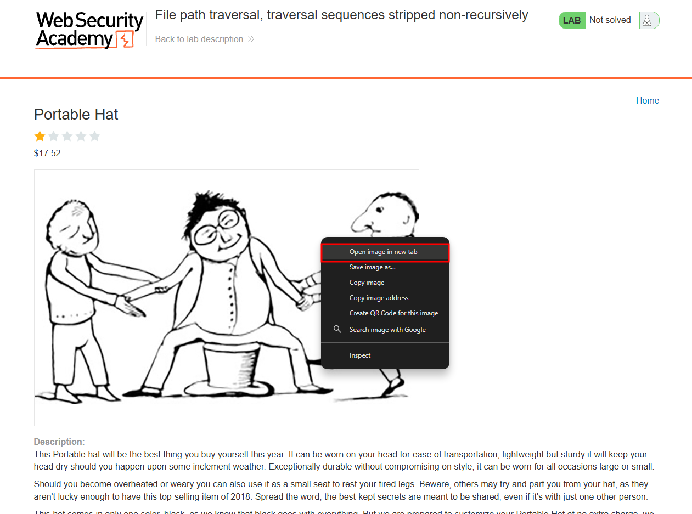
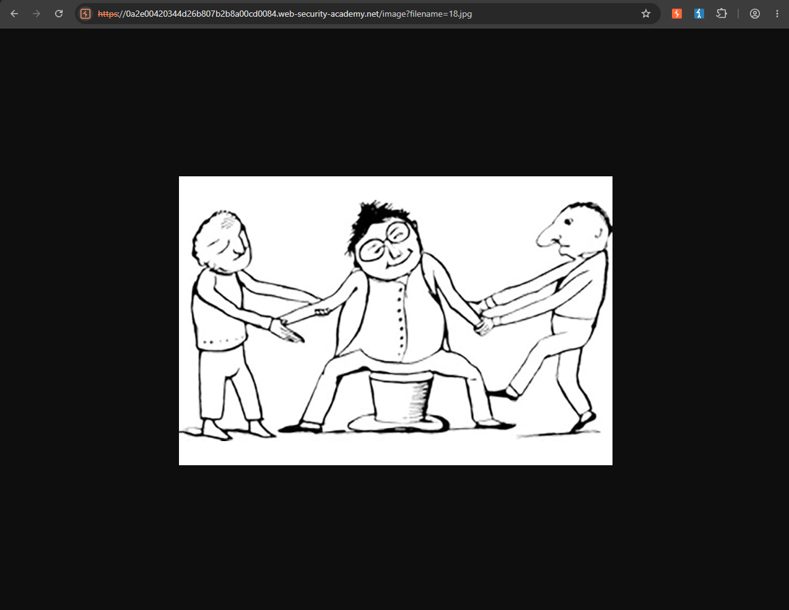
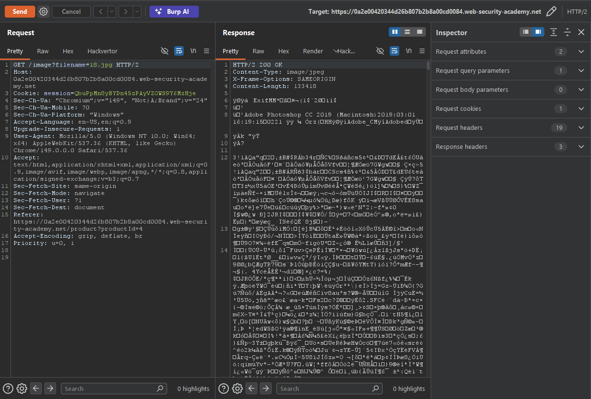
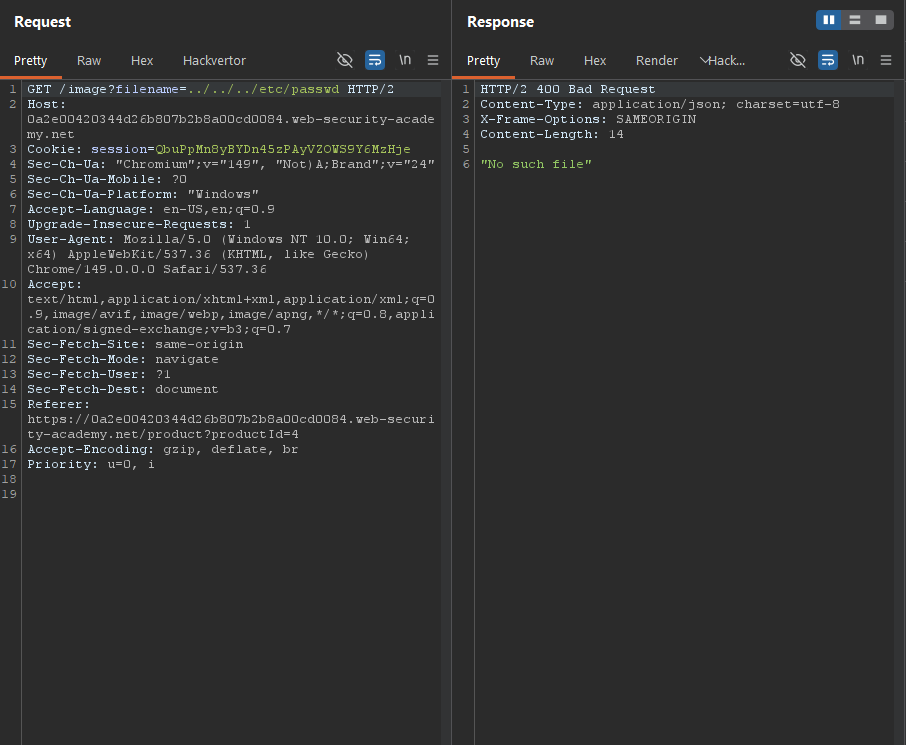
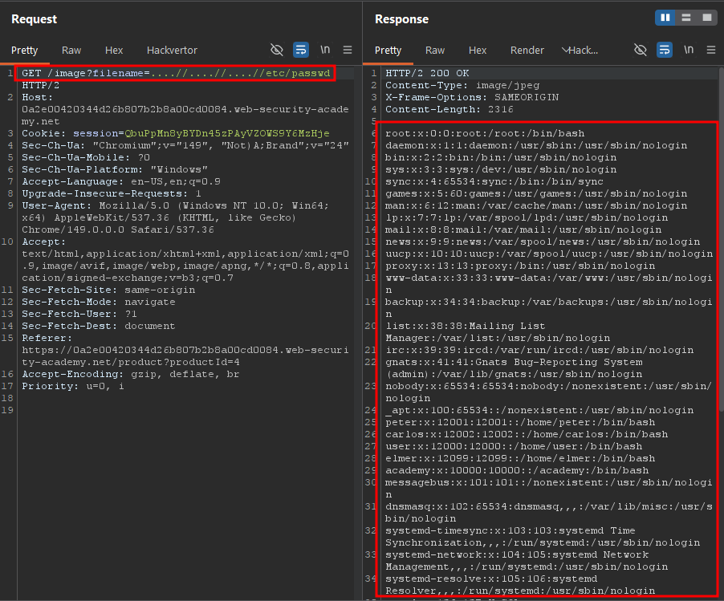

Write-up by wook413

# Lab: File path traversal, traversal sequences stripped non-recursively

This lab contains a path traversal vulnerability in the display of product images.

The application strips path traversal sequences from the user-supplied filename before using it.

To solve the lab, retrieve the contents of the `/etc/passwd` file.

---

I started the lab, and this is what the web applications looks like:

I selected a random item, **Portable Hat**, then right-clicked on its image and selected "**Open image in new tab**".

The image opened in a new tab, and the full URL was: `0a2e00420344d26b807b2b8a00cd0084.web-security-academy.net/image?filename=18.jpg`

I intercepted the request in Burp Suite. As you can see, the response body contains the binary data of the image.

First, I tried using the payload `../../../etc/passwd`, but the server responded with **"No such file"**.

Then I remembered that the lab description mentioned the application strips path traversal sequences from user-supplied filenames **non-recursively**. That means if I use `....//` instead of `..//`, the application removes only the first `../` sequence, leaving the second one intact. As a result `....//` effectively becomes `../` after the filtering process. I used the payload `....//....//....//etc/passwd`, and the server returned the contents of the `/etc/passwd` file.

### Solved!

