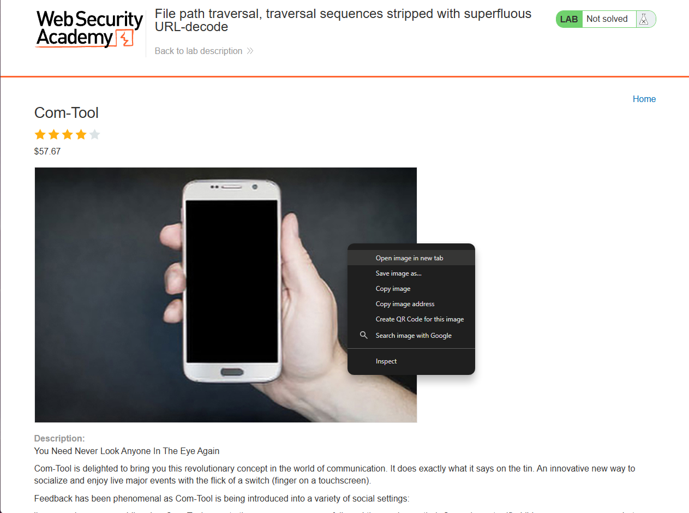
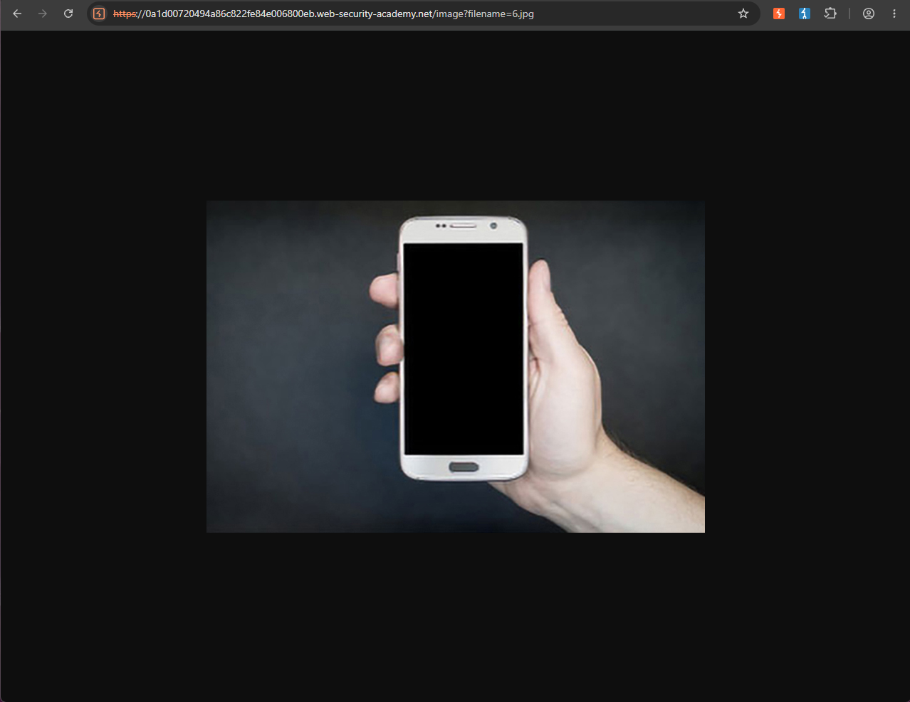
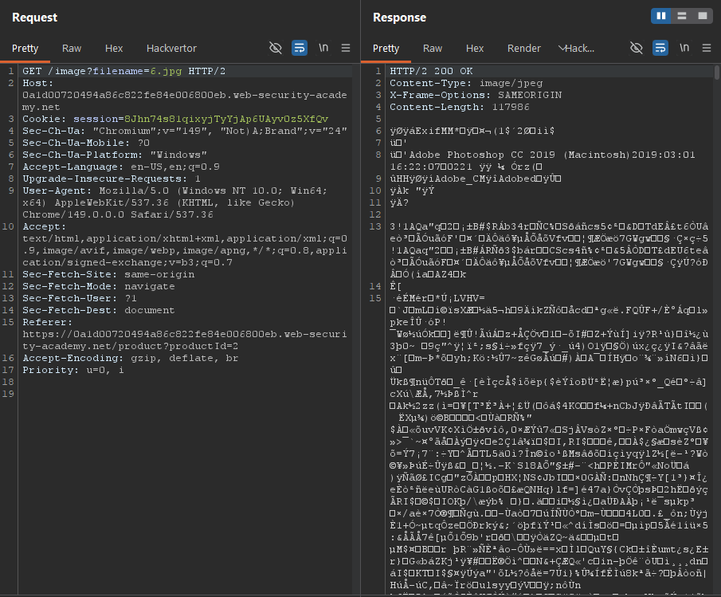
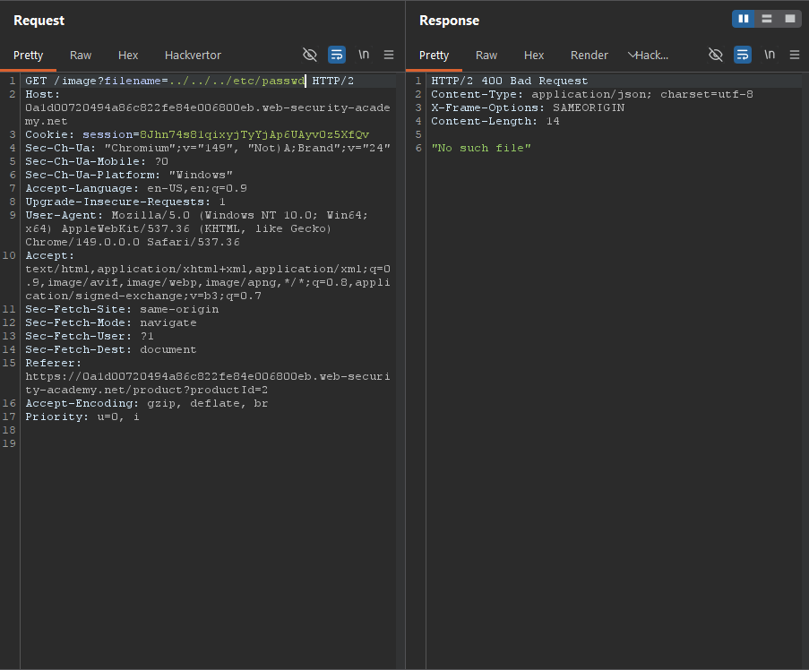
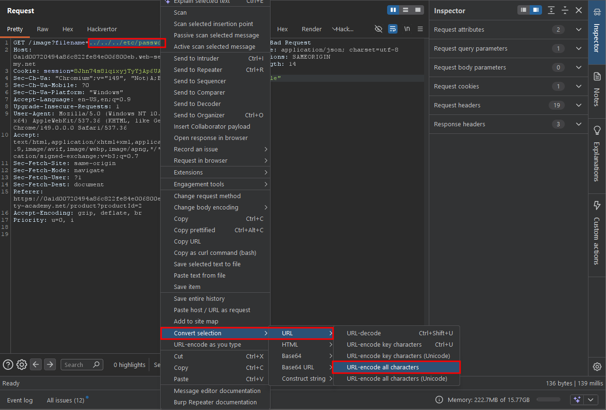
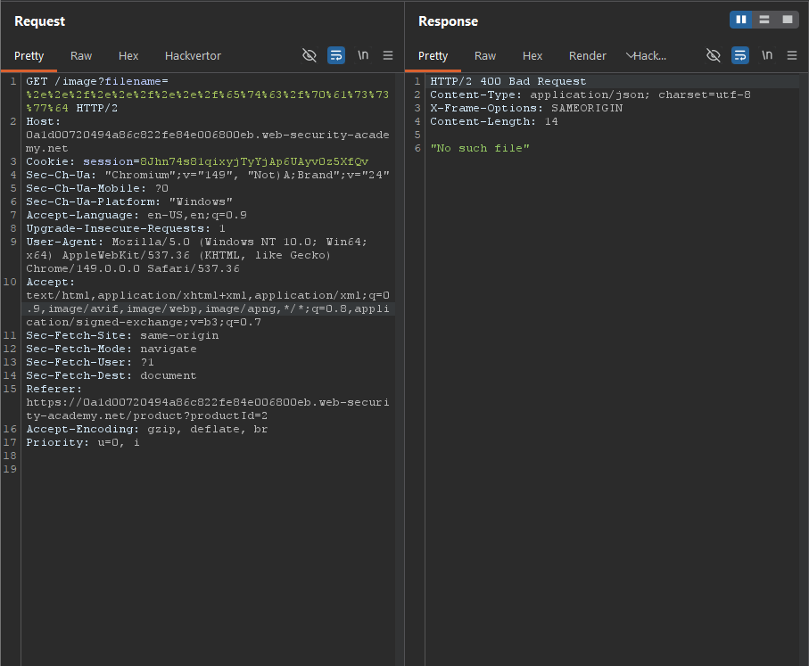
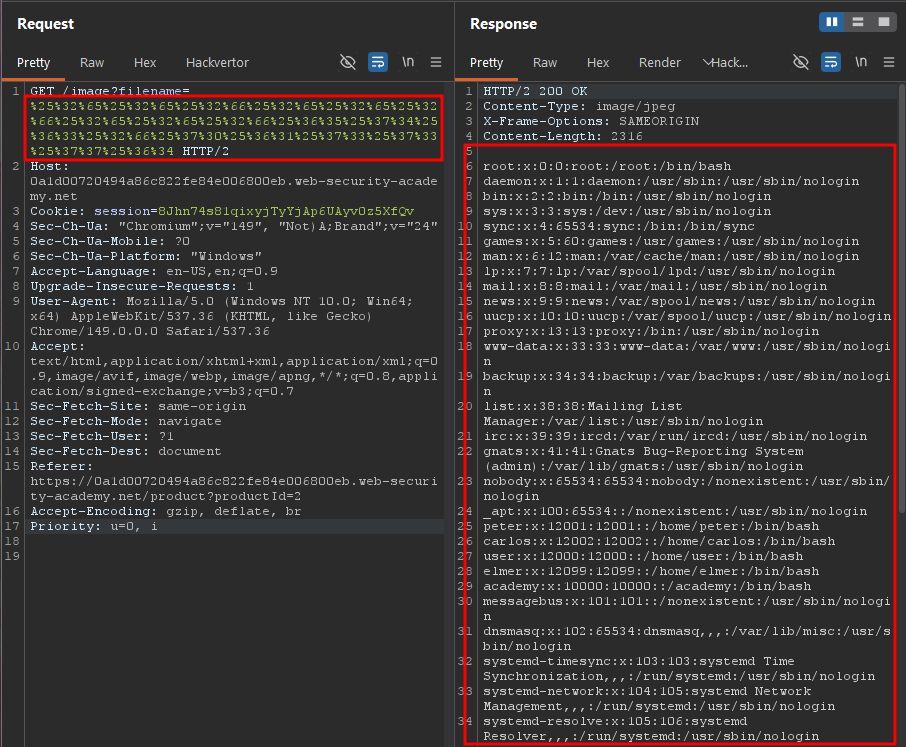
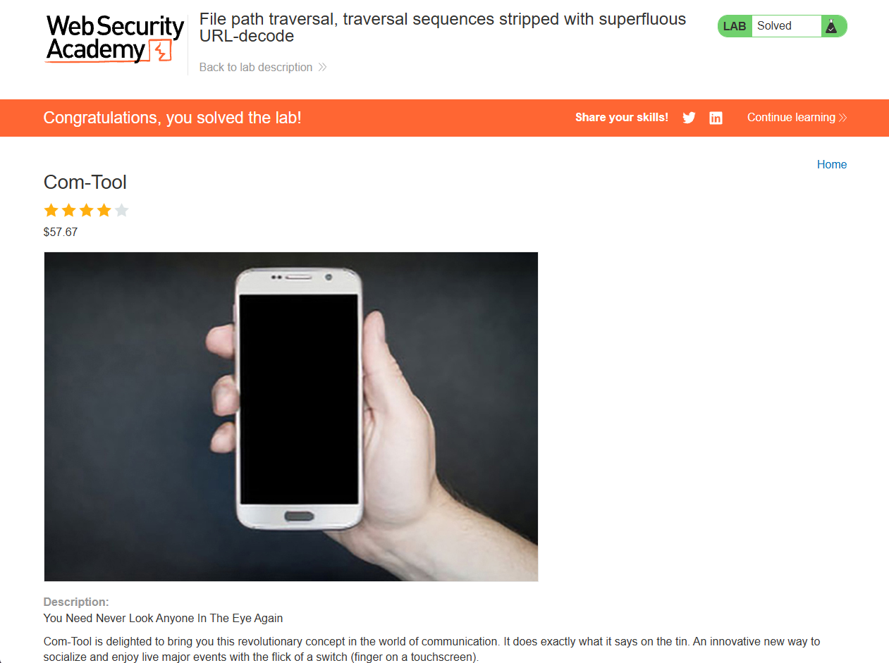

Write-up by wook413

# Lab: File path traversal, traversal sequences stripped with superfluous URL-decode

This lab contains a path traversal vulnerability in the display of product images.

The application blocks input containing path traversal sequences. It then performs a URL-decode of the input before using it.

To solve the lab, retrieve the contents of the `/etc/passwd` file.

---

Since the lab description states that the application is vulnerable to path traversal in the product image display functionality, I selected a random item, **Com-Tool**, from the main page. Then I right-clicked on the product image and selected "**Open image in new tab**".

The image URL is `https://0a1d00720494a86c822fe84e006800eb.web-security-academy.net/image?filename=6.jpg`

I intercepted the request with Burp Suite and sent it to Burp Repeater. As you can see, the response contains the binary data of the image.

Although I didn't expect it to work, I first tested the application with a standard directory traversal payload: `../../../etc/passwd`.

I highlighted the payload, right-clicked it, and selected **Covnert selection** - **URL** - **URL-encode all characters**.

This URL-encoded the entire payload. After sending the request, the server responded with **"No such file"**.

At that point, I noticed that the lab title mentions "superfluous URL decode", which suggested that the application might be decoding the input more than once. Based on that observation, I URL-encoded the payload a second time, effectively double URL-encoding it.

After sending the modified request, the server successfully returned the contents of the `/etc/passwd` file.

### Solved!

