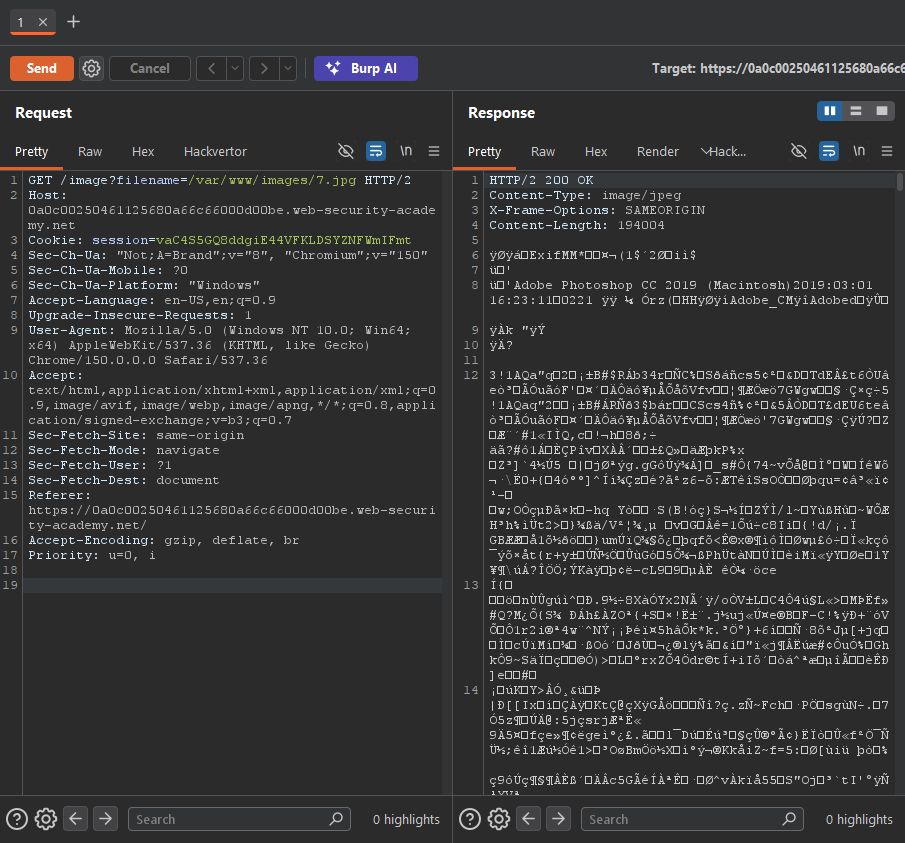
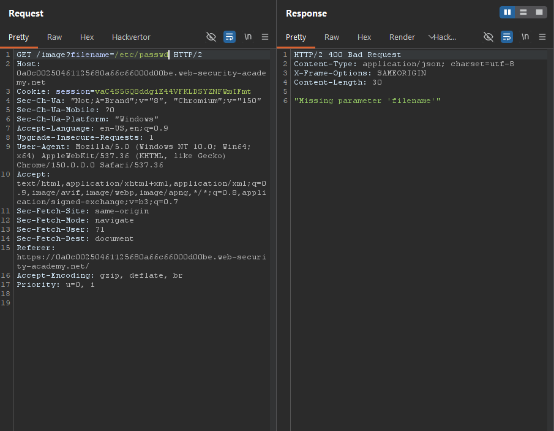
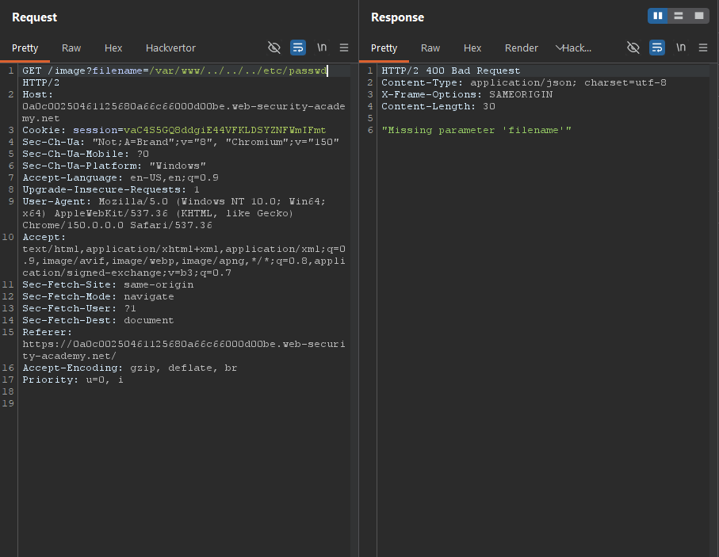
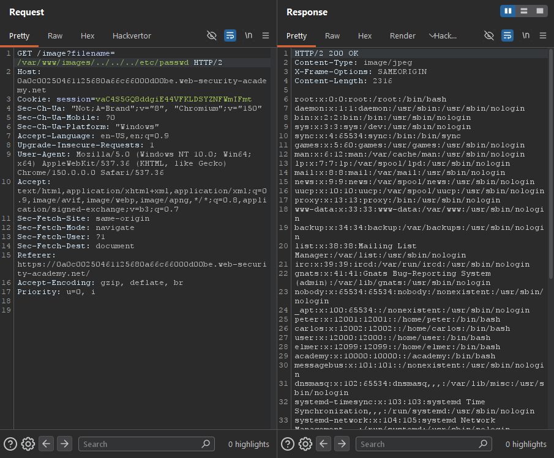

Write-up by wook413

# Lab: File path traversal, validation of start of path

This lab contains a path traversal vulnerability in the display of product images.

The application transmits the full file path via a request parameter, and validates that the supplied path starts with the expected folder.

To solve the lab, retrieve the contents of the `/etc/passwd` file.

---

From the main page of the lab, I selected a random item, right-clicked its image, and chose "**Open image in new tab.**"

Notice the image URL: `0a0c00250461125680a66c66000d00be.web-security-academy.net/var/www/images/7.jpg`. In the previous labs, only the filename (for example, `7.jpg`) was required in the `filename` parameter. However, this lab appears to require the full path to the image, such as `/var/www/images/7.jpg`.

I Intercepted the request and pulled it up in Burp. Notice the server returned the binary data of the image.

Although I didn't expect it to work, I tried requesting `/etc/passwd` for testing purposes. Instead of returning the file, the server responded with the error message **"Missing parameter 'filename'"**.

Next, I tried `/var/www/../../../etc/passwd`, thinking the application might expect the supplied path to begin with `/var/www`. However, the server still responded with **"Missing parameter 'filename'"**.

Finally, I tried `/var/www/images/../../../etc/passwd`, and this time the server returned the contents of the `/etc/passwd` file.

### Solved!

