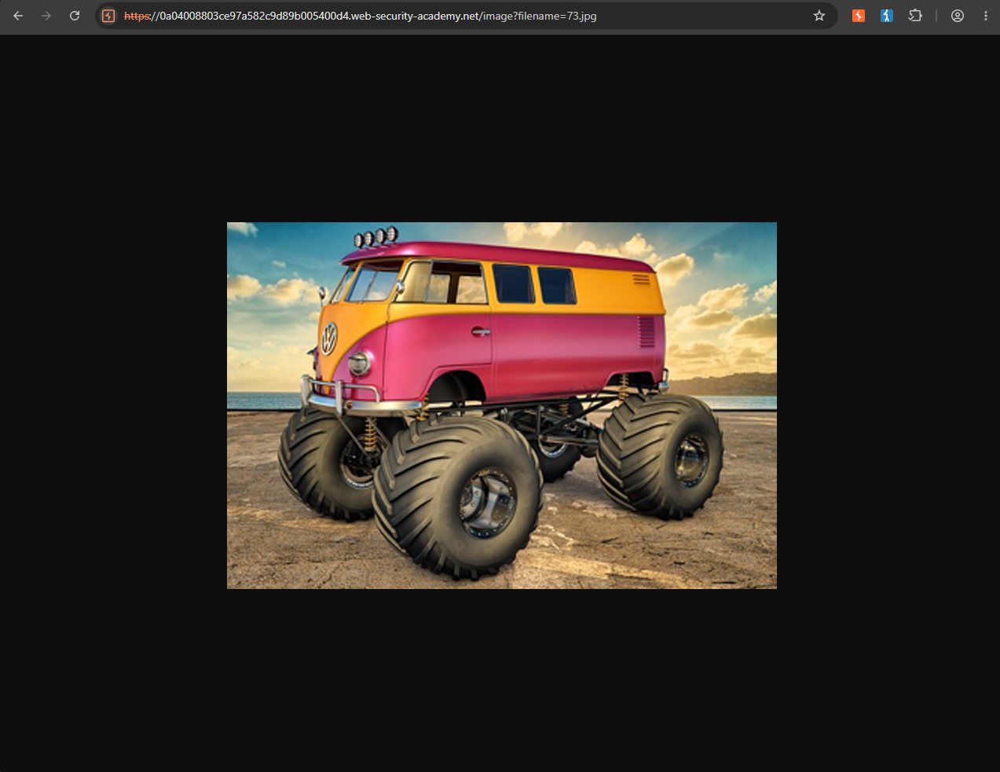
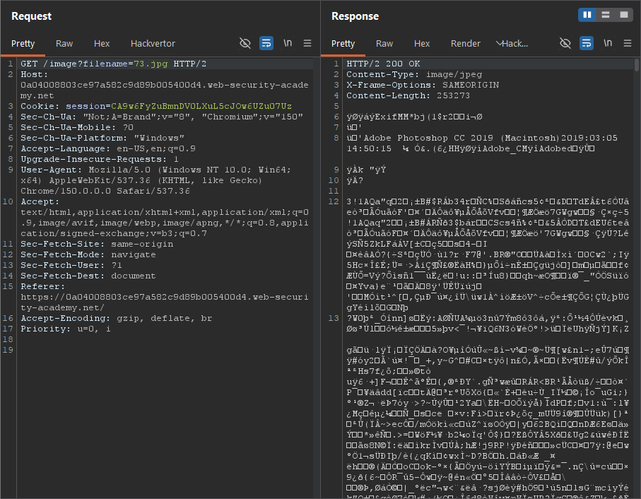
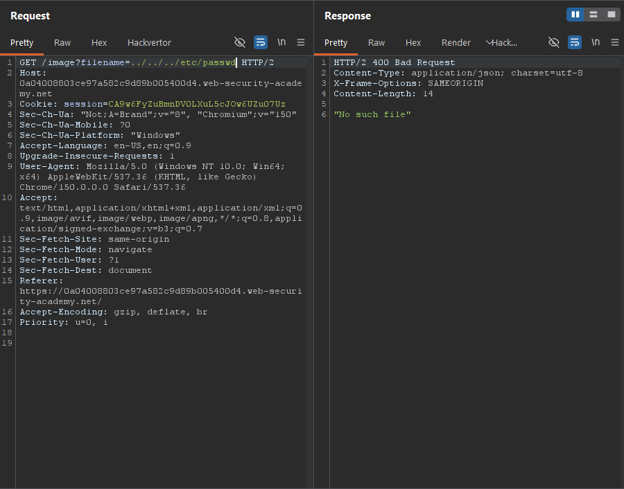
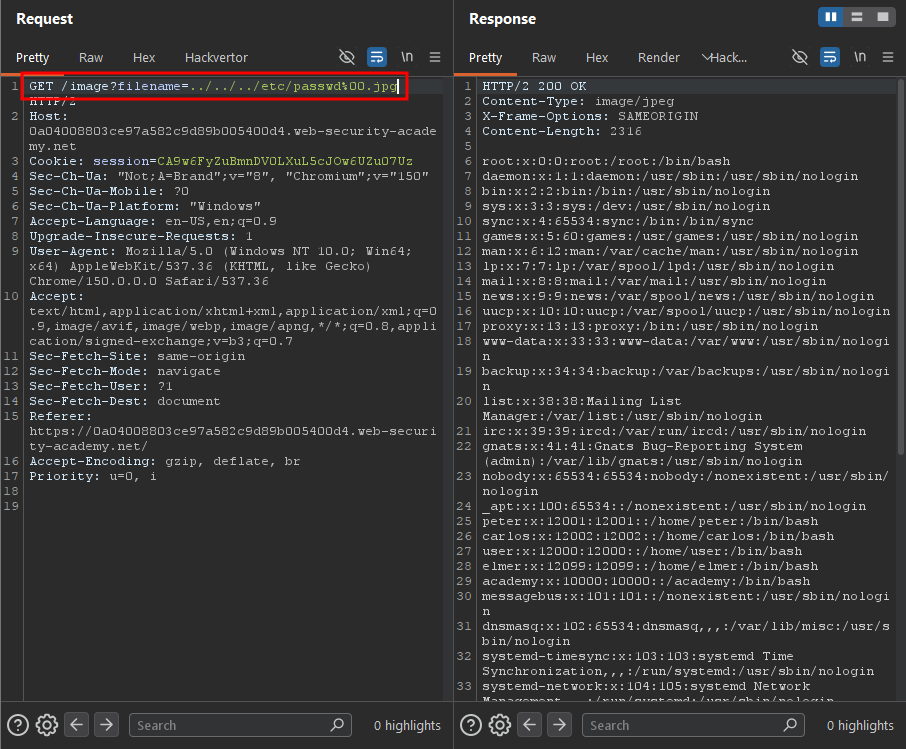

Write-up by wook413

# Lab: File path traversal, validation of file extension with null byte bypass

This lab contains a path traversal vulnerability in the display of product images. 

The application validates that the supplied filename ends with the expected file extension.

To solve the lab, retrieve the contents of the `/etc/passwd` file.

---

As in the previous labs, I selected a random item, right-clicked its image, and chose "**Open image in new tab**".

The image opened in a new tab with the following URL: `0a04008803ce97a582c9d89b005400d4.web-security-academy.net/image?filename=73.jpg`. At this point, there was nothing unusual about it.

I intercepted the GET request for the image and sent it to Burp Repeater. The response contained the binary data of the image, confirming that the request was simply retrieving the image file.

I first tried common path traversal payloads such as `../../../etc/passwd` and several similar variations. However, the server consistently responded with **"No such file."**

After reading the lab title and description, I inferred that the application expected the requested file to have an image extension such as `.jpg` or `.png`. The lab also hinted that this validation could be bypassed using a **null byte**. Based on that hint, I tried the following payload: `../../../etc/passwd%00.jpg`. This time, the server returned the contents of the `/etc/passwd` file.

The `%00` represents a null byte, which causes the underlying file-handling function to treat the filename as ending at `/etc/passwd`. As a result, the trailing `.jpg` is ignored when the file is opened. However, the application still validates the input as ending with `.jpg`, allowing the payload to bypass the file extension check.

### Solved!

