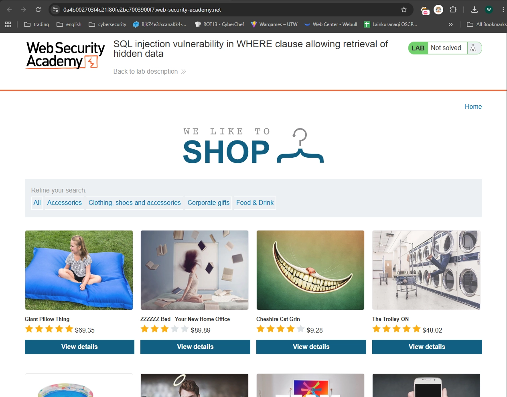
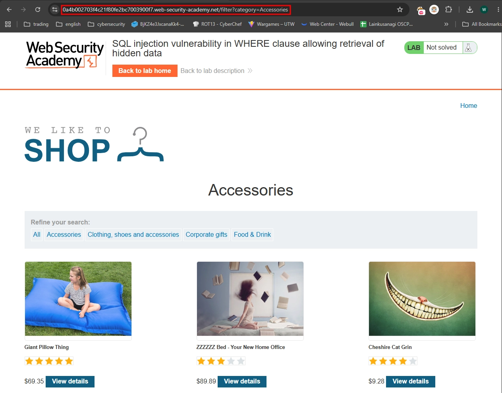
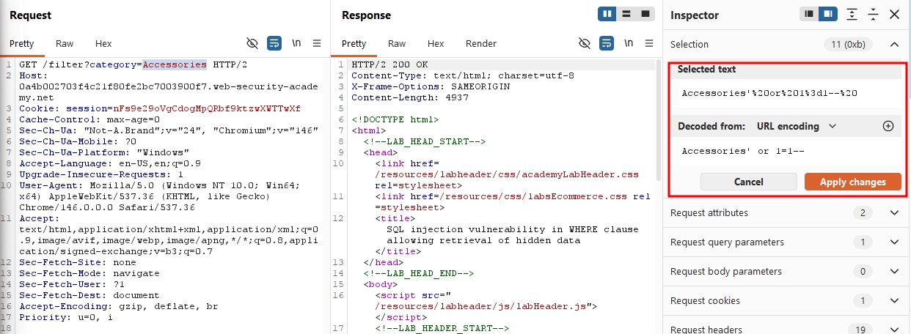
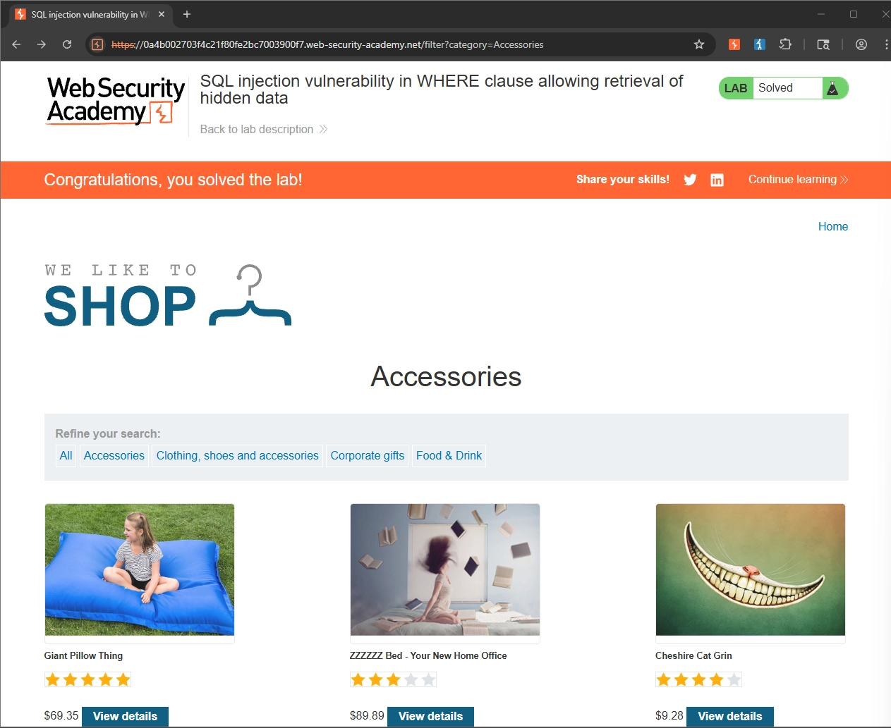

Writeup by wook413

# Lab: SQL injection vulnerability in WHERE clause allowing retrieval of hidden data

**Apprentice-level lab**

This lab contains a SQL injection vulnerability in the product category filter. When the user selects a category, the application carries out a SQL query like the following:

```
SELECT * FROM products WHERE category = 'Gifts' AND released = 1
```

To solve the lab, perform a SQL injection attack that causes the application to display one or more unreleased products.

------

This is what the main page looks like when you first arrive:



When the **Accessories** category button is clicked, only items in the Accessories category are displayed, and the URL changes to end with `/filter?category=Accessories`.



I opened Burp Suite and intercepted the request generated when I clicked the Accessories button. I then modified the category parameter to `Accessories' or 1=1-- `, which bypassed the `released = 1` condition in the SQL query.



**Solved!**

