Write-up by wook413

# Blind SQL injection with conditional errors

This lab contains a blind SQL injection vulnerability. The application uses a tracking cookie for analytics, and performs a SQL query containing the value of the submitted cookie.

The results of the SQL query are not returned, and the application does not respond any differently based on whether the query returns any rows. If the SQL query causes an error, then the application returns a custom error message.

The database contains a different table called `users`, with columns called `username` and `password`. You need to exploit the blind SQL injection vulnerability to find out the password of the `administrator` user.

To solve the lab, log in as the `administrator` user.

---

I clicked **My account** button on the main page.


I intercepted the request and sent it to **Burp Repeater**. As in the previous lab, we're assigned a cookie.

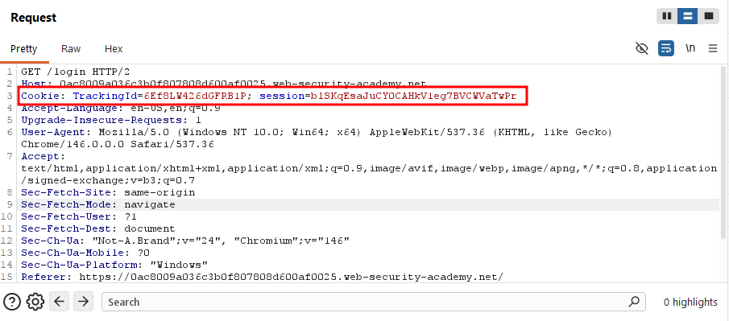

Unlike the previous lab, though, changing the cookie value to a random string doesn't produce an error. The server just returned a **200 OK**.

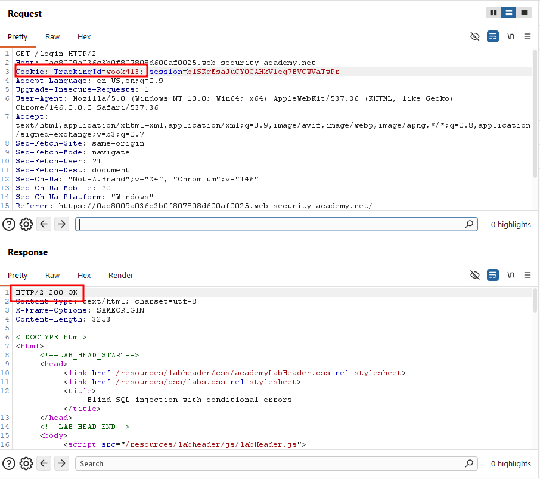

However, when I appended a single quote `'`, it returned a **500 Internal Server Error**.

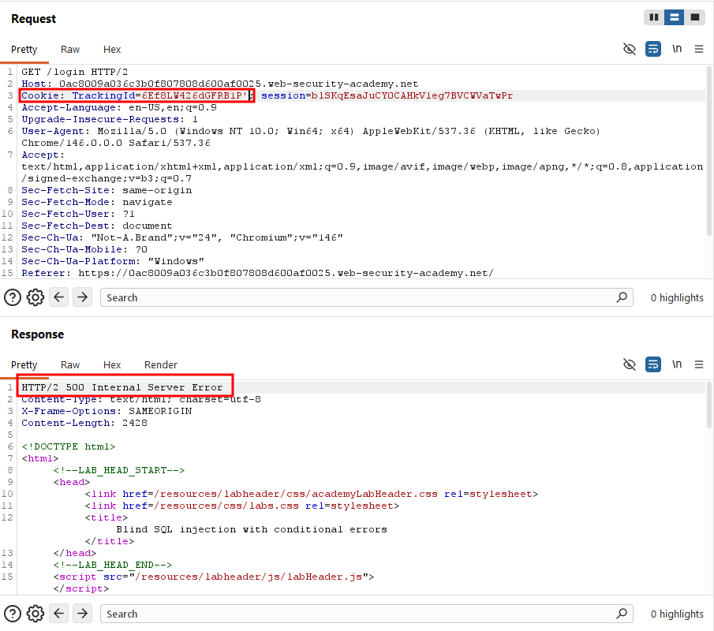

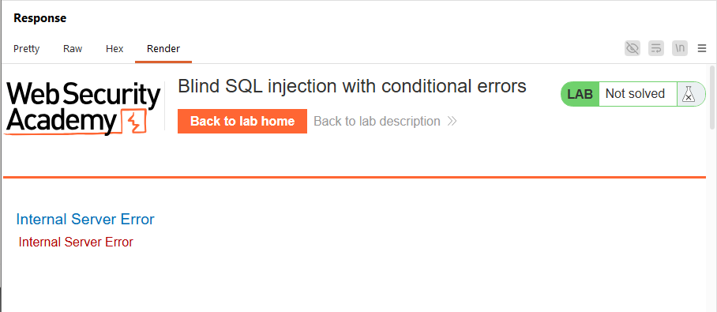

As the lab title suggests, we need to exploit this using conditional errors. Referring to the provided SQL injection cheat sheet, I came up with the following payload: `6Ef8LW426dGFRB1P' AND (SELECT CASE WHEN (1=2) THEN TO_CHAR(1/0) ELSE 'wook' END FROM dual) = 'wook'-- `

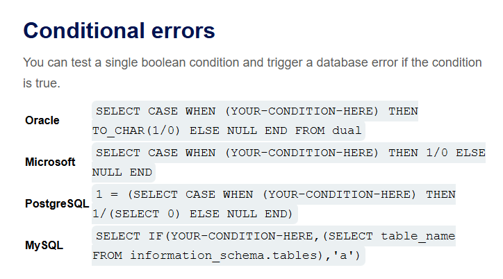

The logic here is: if the condition evaluates to true, the server tries to evaluate `TO_CHAR(1/0)`, which throws a **division-by-zero error**. If the condition is false, it returns a `'wook'` instead, which is then compared against the `'wook'` string outside the subquery. If they match, the overall expression is true; otherwise, false. 

I started with `1=2`, which is always false, so the subquery returns `'wook'`, which matches the outer `'wook'`, and the whole thing evaluates to true. It didn't error, as expected.

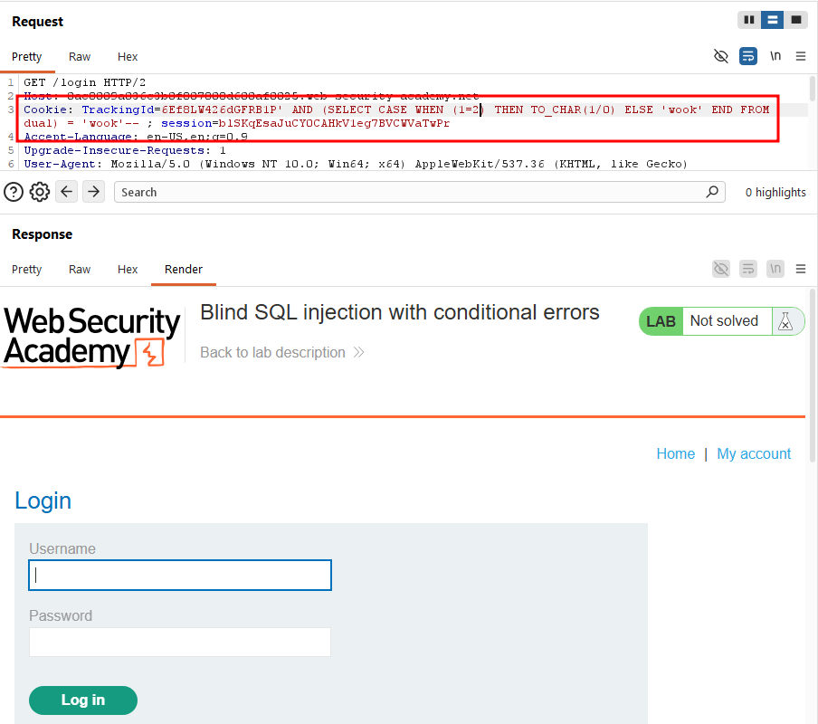

When I changed the condition to `1=1`, the server returned **a 500 error**, confirming the injection point works as intended.

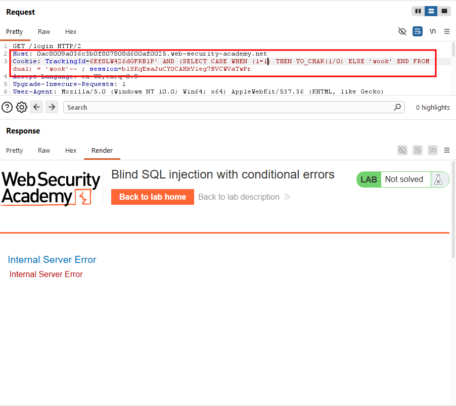

Now that I'd validated the technique, I used it to find the length of the administrator's password:

```
`6Ef8LW426dGFRB1P' AND (SELECT CASE WHEN (LENGTH(password) > 1) THEN TO_CHAR(1/0) ELSE 'wook' END FROM users WHERE username = 'administrator') = 'wook' -- `
```

 This returned a 500 error, confirming the password length is greater than 1.

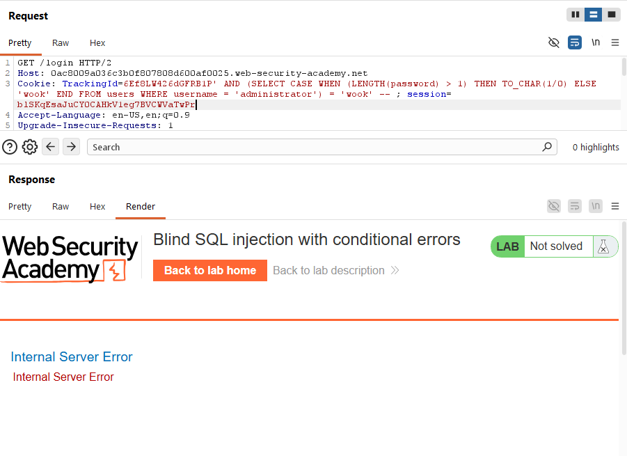

As a sanity check, I changed the `1` to `100`, and the server returned a 200 OK, confirming the password is shorter than 100 characters.

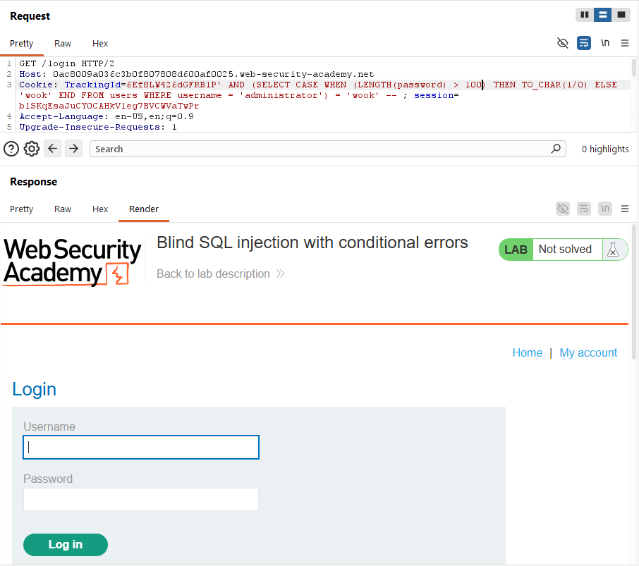

 I sent the request to Intruder and set `100` as the payload position, sweeping values from 1 to 30.

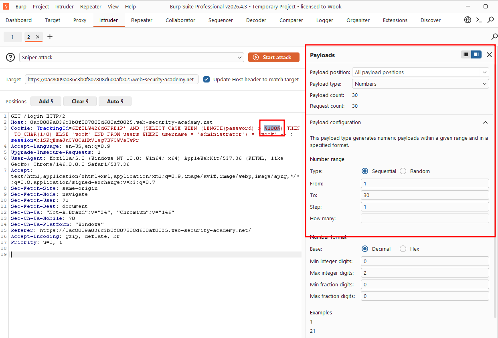

The attack finished within seconds. Looking at the results, the response length stayed at 2555 with a 500 status code up through payload **19** but at **20** the status flipped to 200 and the response length jumped to 3361. This confirmed the password length is 20 characters.

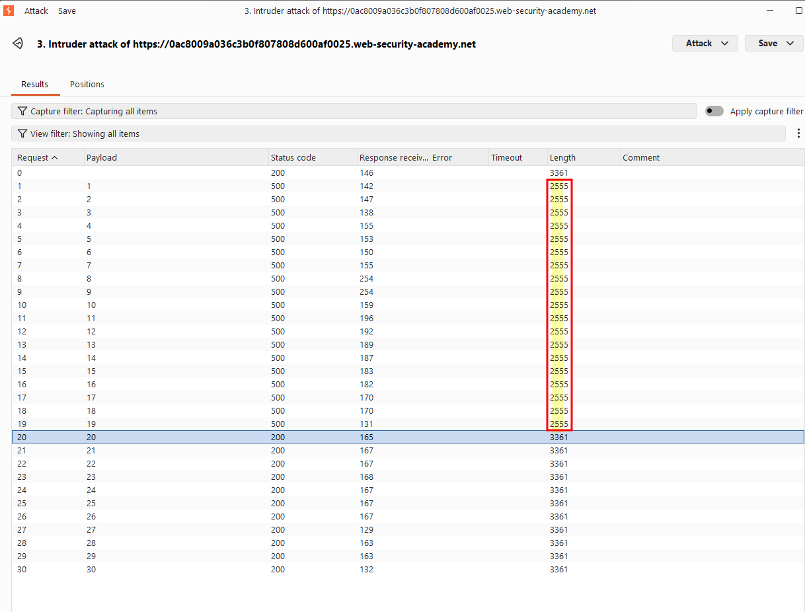

With the length known, I moved on to extracting the password character by character:

```
6Ef8LW426dGFRB1P' AND (SELECT CASE WHEN (SUBSTR(password, 1, 1) = 'a') THEN TO_CHAR(1/0) ELSE 'wook' END FROM users WHERE username = 'administrator') = 'wook' -- 
```

This returned a 200 OK, meaning the first character isn't `'a'`.

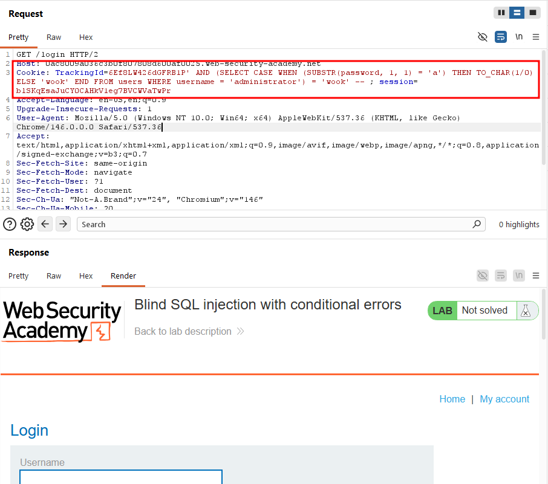

I sent the request to Intruder again, this time with two payload positions: one sweeping the character position from 1 to 20, and the other sweeping candidate characters from a-z and 0-9.

Since there are two independent payload sets, I used **Cluster Bomb mode** instead of **Sniper mode**.

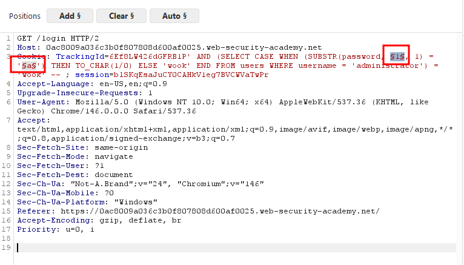

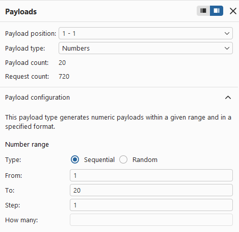

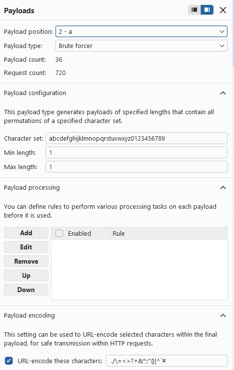

This attack also completed in just a few seconds after I ran it. Sorting the results by response length and then status code, I found exactly 20 results with a response length of **2555** and status code **500** -- matching the password length exactly, which confirmed these were the correct characters. The extracted password was `5vjmmnpr8281md1bvksp`.

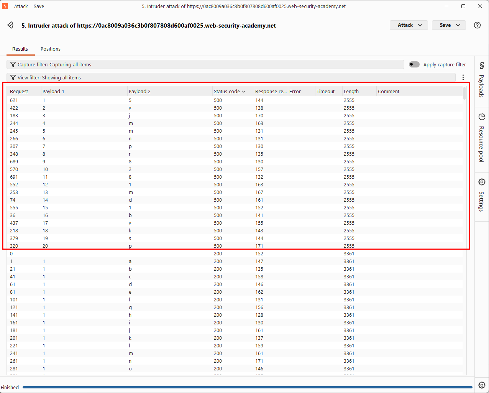

I logged in as the administrator using the password.

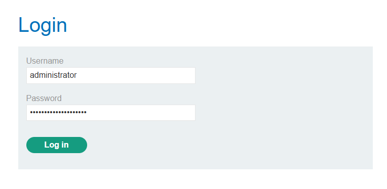

### Solved!

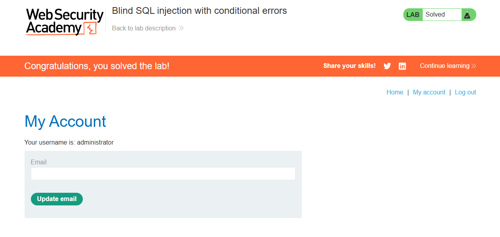

