Write-up by wook413

# Lab: Visible error-based SQL injection

This lab contains a SQL injection vulnerability. The application uses a tracking cookie for analytics, and performs a SQL query containing the value of the submitted cookie. The results of the SQL query are not returned.

The database contains a different table called `users`, with columns called `username` and `password`. To solve the lab, find a way to leak the password for the `administrator` user, then log in to their account.

---

This lab is another **Blind SQL injection** challenge, but this time it's solvable through visible error messages.

I fired up Burp Suite, clicked on the **Pets** category, and noticed I was assigned a `TrackingId` value in a cookie, just like in the previous lab. I modified the value to a random string, `abc`, and the server didn't return an error.

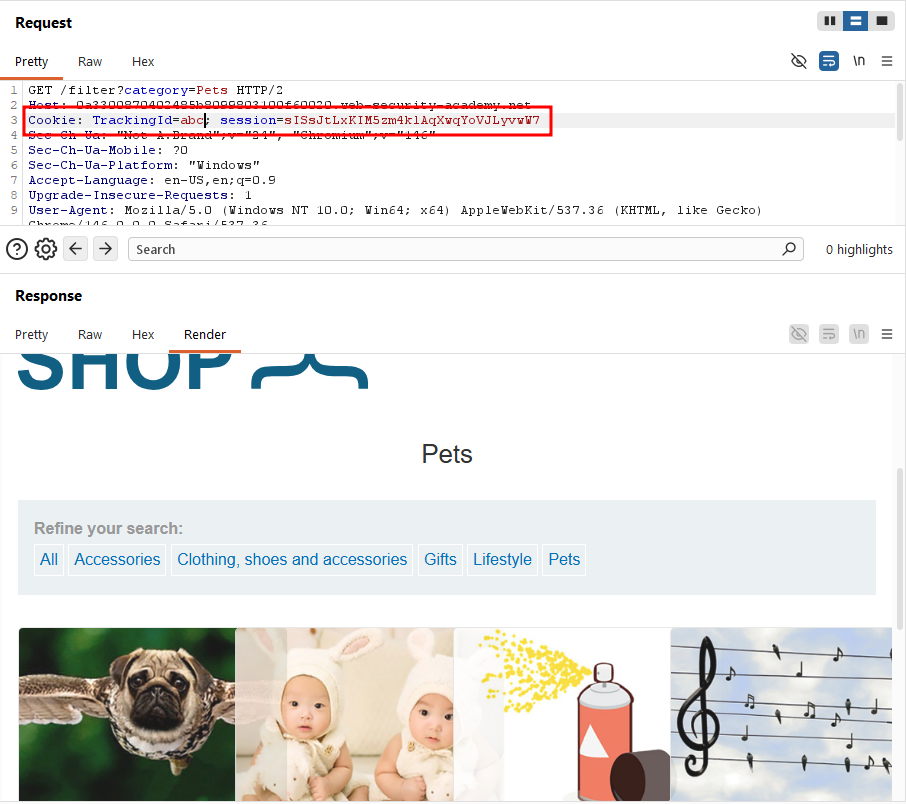

Then I appended a single quote `'` to the `TrackingId` value, and this time the application returned a visible error. Based on this behavior and the title of the lab, I knew I needed to solve it using these visible errors.

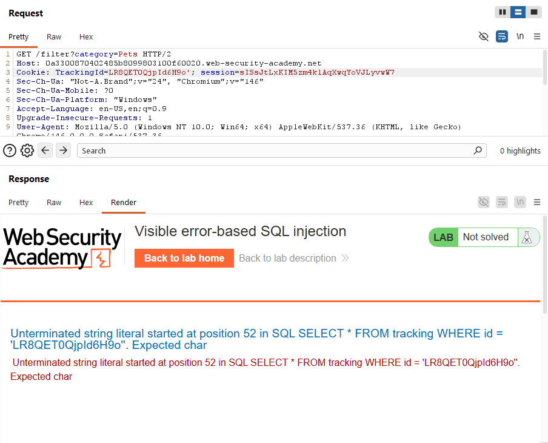

I referred to the PortSwigger cheat sheet to get familiar with the relevant syntax.

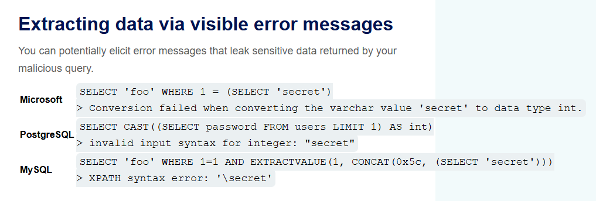

My attempted query looed like this:

`TrackingId=LR8QET0QjpId6H9o' AND CAST((SELECT 1) AS INT)-- ` This is functionally the same as `TrackingId=LR8QET0QjpId6H9o' AND 1-- `. As shown in the screenshot below, this returned an error, because the `AND` operator expects a boolean on both sides, and I was feeding it an integer instead.

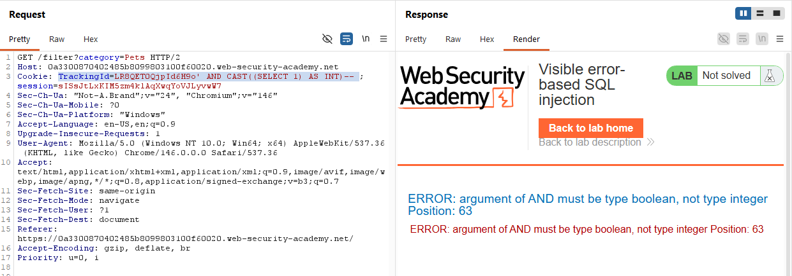

So I rewrote it as a proper boolean comparison: `TrackingId=LR8QET0QjpId6H9o' AND 1 = CAST((SELECT 1) AS INT)-- `

This time the request went through without an error, confirming the query was syntactically valid.

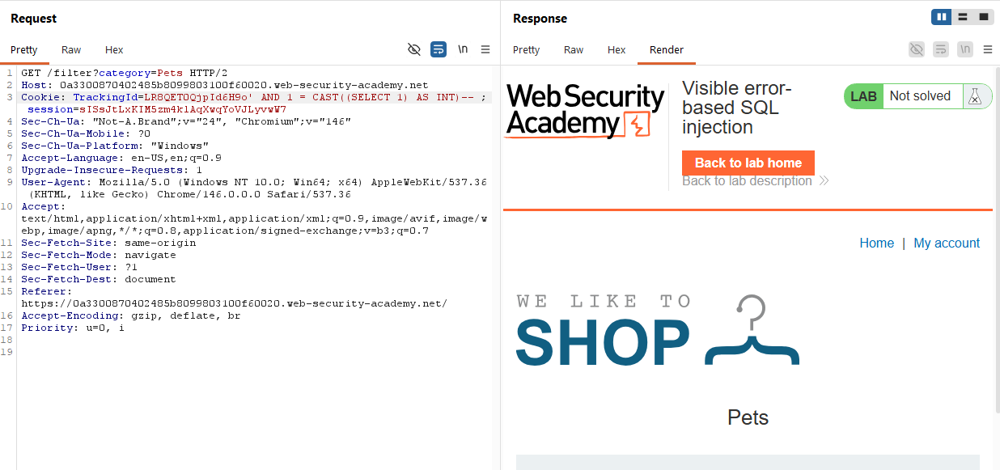

Next, I tried pulling usernames from the `users` table, but ran into another error. This wasn't a logic issue, it was a length limit on the `TrackingId` parameter. Looking at the error response, I could see the query was getting truncated before `AS INT -- `, cutting off the rest of my payload.

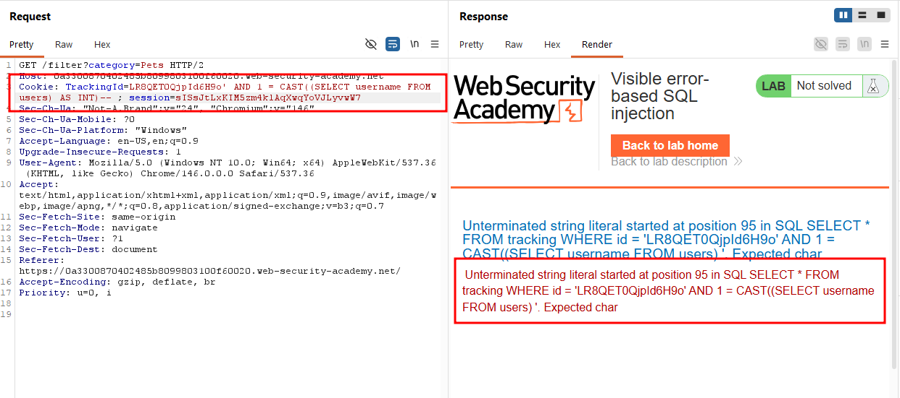

Since the `TrackingId` value itself wasn't actually needed for the injection to work, I stripped it out entirely to free up space. With that extra room, the server returned a more meaningful error: the subquery was returning more than one row, which the single-value comparison couldn't handle.

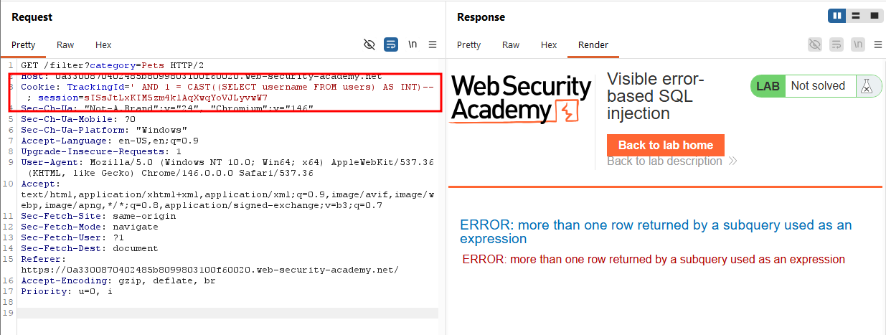

I added `LIMIT 1` to the subquery, and the resulting error message actually leaked the first username directly in the response.

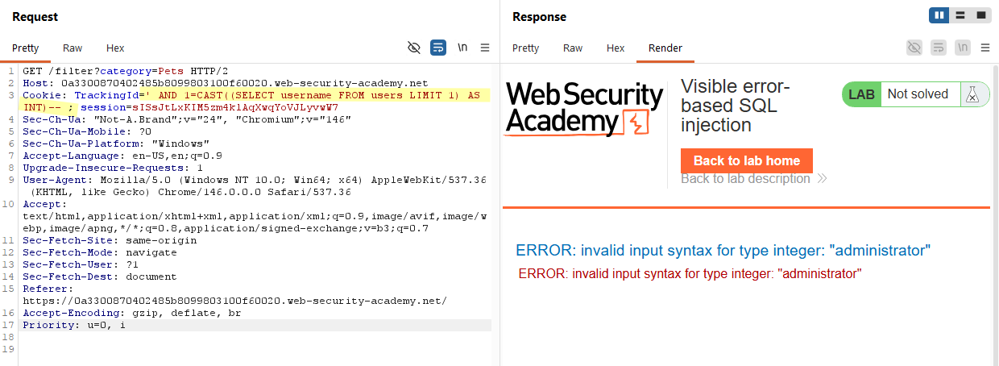

From there, I swapped `username` and `password` in the same query and used it to extract the administrator's password.

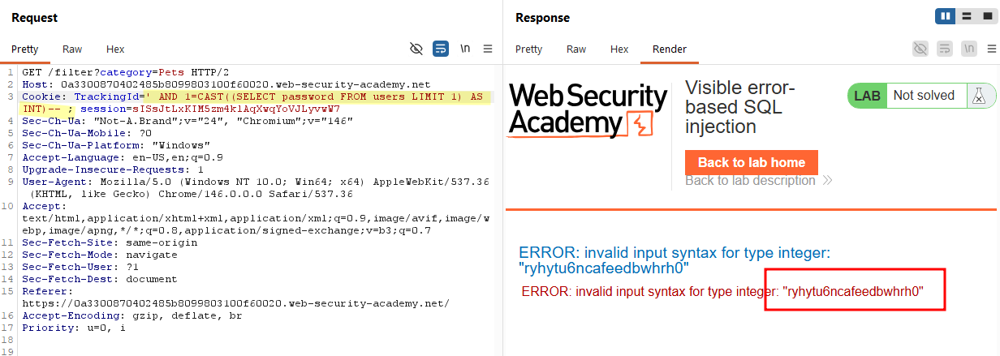

I logged in as `administrator`.

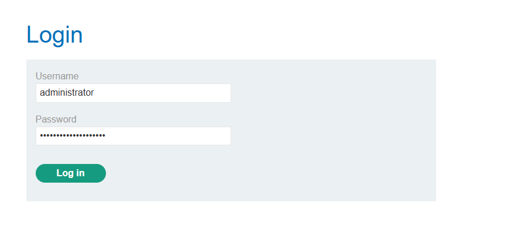

### Solved!

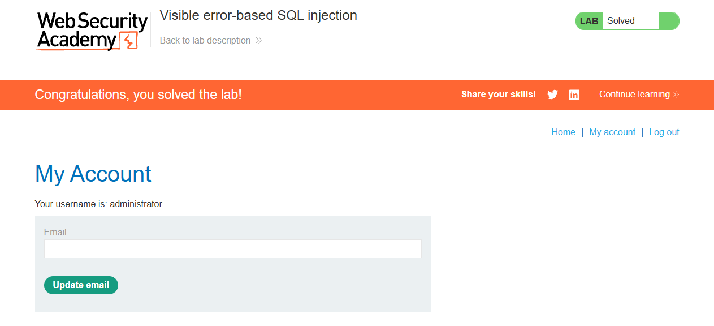

