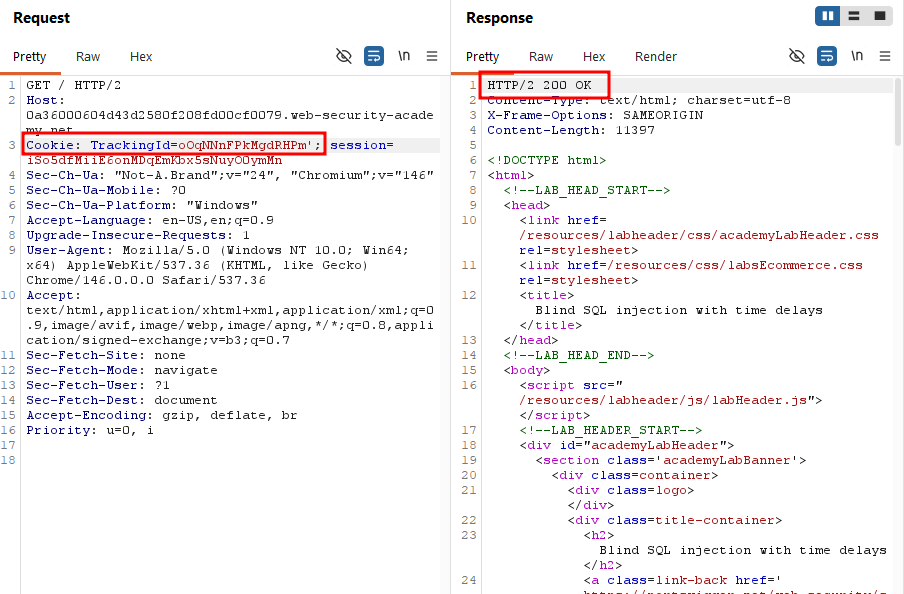
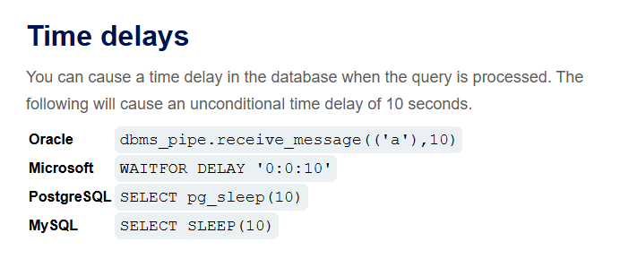
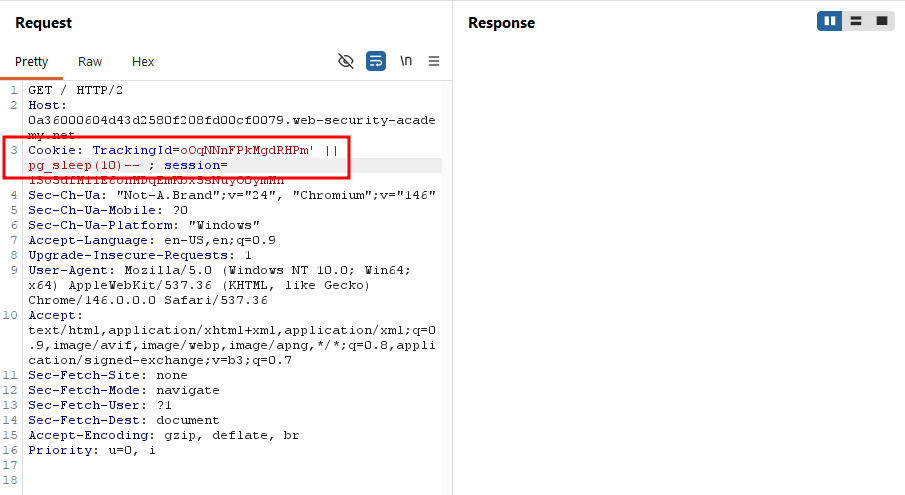
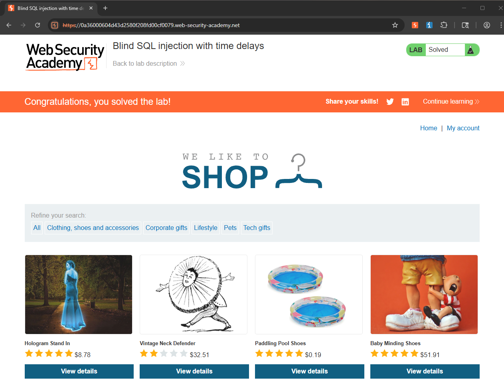

Write-up by wook413

# Lab: Blind SQL injection with time delays

This lab contains a blind SQL injection vulnerability. The application uses a tracking cookie for analytics, and performs a SQL query containing the value of the submitted cookie.

The results of the SQL query are not returned, and the application does not respond any differently based on whether the query returns any rows or causes an error. However, since the query is executed synchronously, it is possible to trigger conditional time delays to infer information.

To solve the lab, exploit the SQL injection vulnerability to cause a 10 second delay.

---

This lab's landing page looked like this.

As specified in the lab instructions, we're assigned a `TrackingId`, which gets passed to the server via a cookie. In previous labs, modifying this value or appending a single quote was enough to trigger a visible error from the server. This time, however, neither approach produced an error.

The application handled malformed input silently.

Since the lab instructions called for causing a 10-second time delay to solve it, I turned to the provided SQL injection cheat sheet for the correct syntax, given that error-based confirmation wasn't an option here.

I modified the `TrackingId` value to `oOqNNnFPkMgdRHPm' || pg_sleep(10)-- `, closing the string with a single quote, concatenating a `pg_sleep(10)` call, and commenting out the rest of the query.

After sending that request, the response stayed blank for several seconds, confirming that the delay had been triggered.

After about 10 seconds, the response finally came back, confirming the time-based blind injection had worked.

### Solved!

