Write-up by wook413

# Lab: SQL injection with filter bypass via XML encoding

This lab contains a SQL injection vulnerability in its stock check feature. The results from the query are returned in the application's response, so you can use a UNION attack to retrieve data from other tables.

The database contains a `users` table, which contains the usernames and passwords of registered users. To solve the lab, perform a SQL injection attack to retrieve the admin user's credentials, then log in to their account.

### Hint

A web application firewall (WAF) will block requests that contain obvious signs of a SQL injection attack. You'll need to find a way to obfuscate your malicious query to bypass this filter. We recommend using the `Hackvertor` extension to do this.

---

This lab specified that a SQL injection vulnerability existed in its stock check feature.

I began by clicking on an arbitrary item, which turned out to be "Paint a rainbow", and found a `Check stock` button at the bottom of the page.

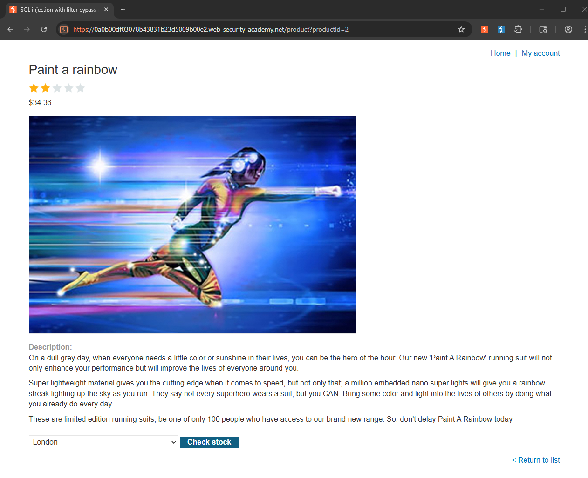

Clicking it triggered a POST request, and upon inspecting the request body, I noticed it was XML-encoded, containing `productId` and `storeId` tags with values of 2 and 1 respectively. Sending this request as-is returned a response of 178 units.

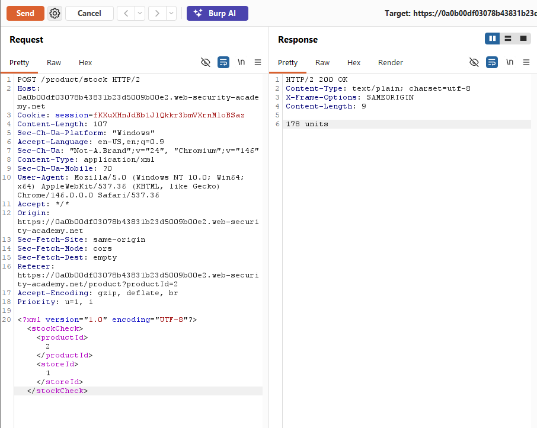

To determine whether these values were being inserted directly into a SQL query, I modified the `productId` value to `2+2`. The response changed to 420 units, suggesting that the server was evaluating the input arithmetically. It is a strong indication that the value was being concatenated directly into the query rather than being treated as literal.

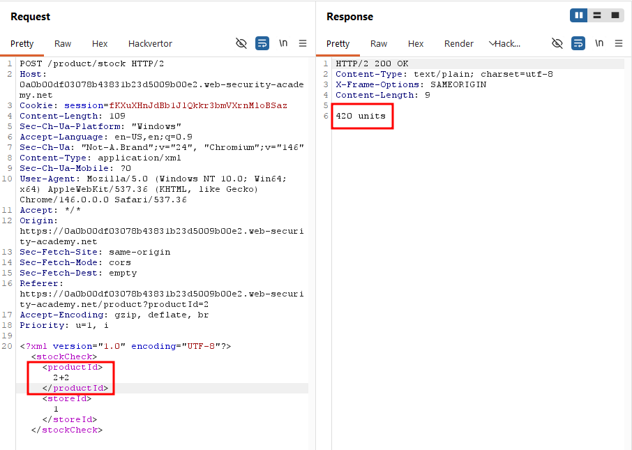

I tested the same theory on `storeId` by changing it to `1+1`, and the response shifted to 86 units, confirming that both parameters were vulnerable to injection.

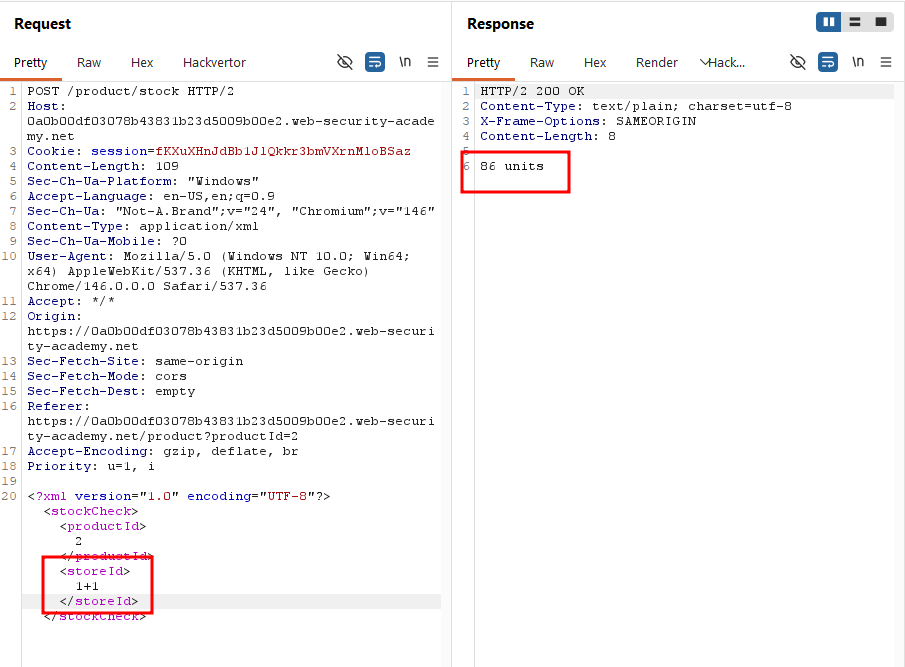

With the injection point confirmed, I attempted a UNION-based attack by setting `storeId` to `1 UNION SELECT NULL`. This returned an **"Attack detected"** message, indicating that a WAF was blocking the request.

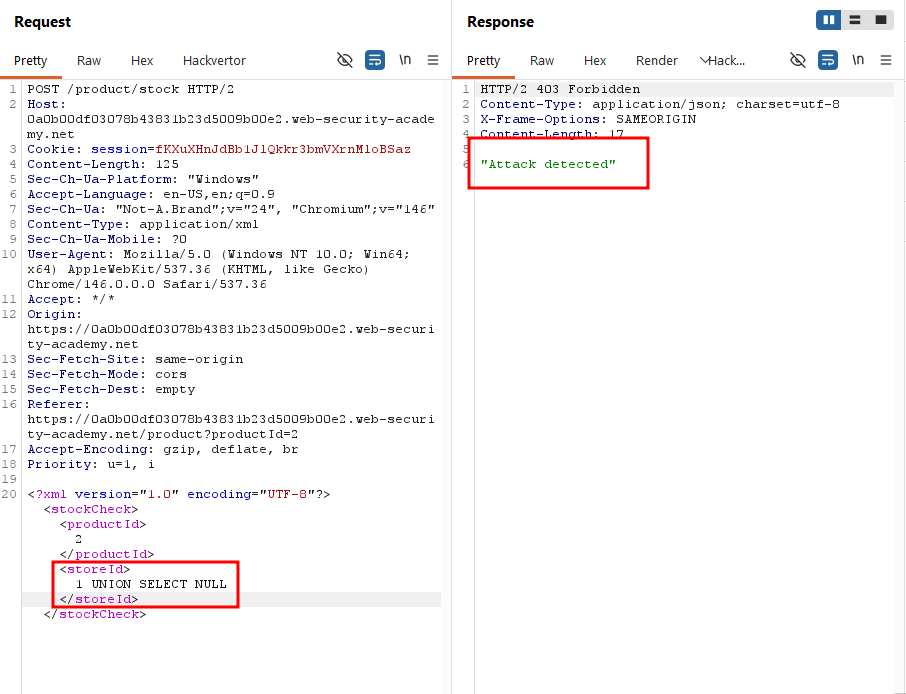

Following the hint provided in the lab, I used the `Hackvertor` extension to wrap my payload in `hex_entities`, which successfully bypassed the WAF.

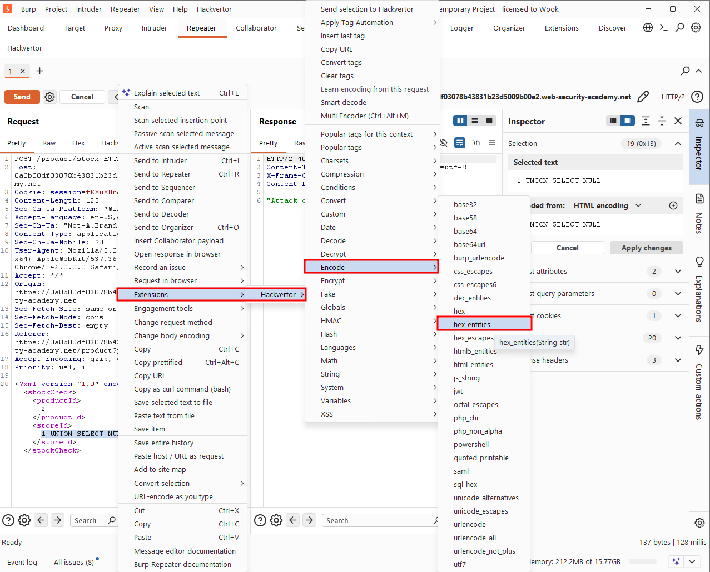

The server returned 178 units along with a NULL string in the response.

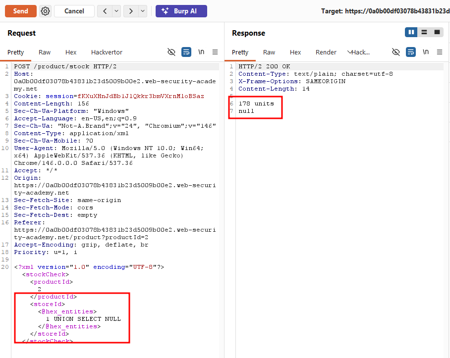

To determine the number of columns in the underlying query, I added a second NULL to the UNION statement. This time, the response dropped to 0 units, indicating that the query only returned expected a single column -- adding a second one broke the query.

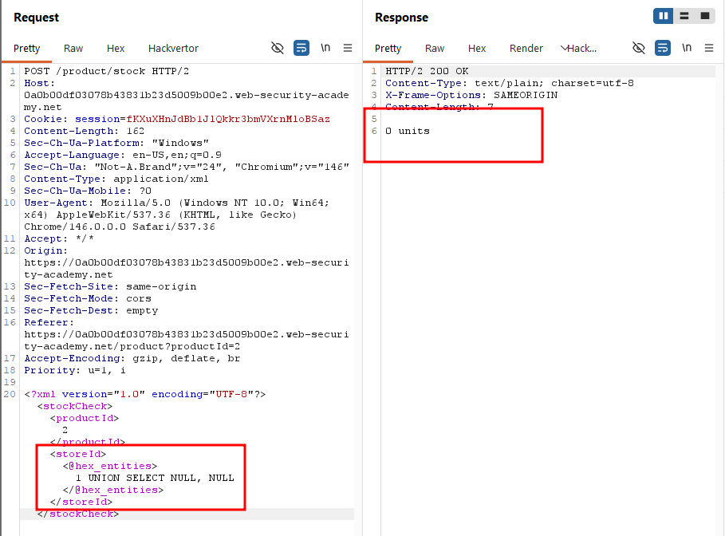

Submitting `1 UNION SELECT username FROM users LIMIT 1` caused the response to display **"administrator"**, confirming the existence of that account.

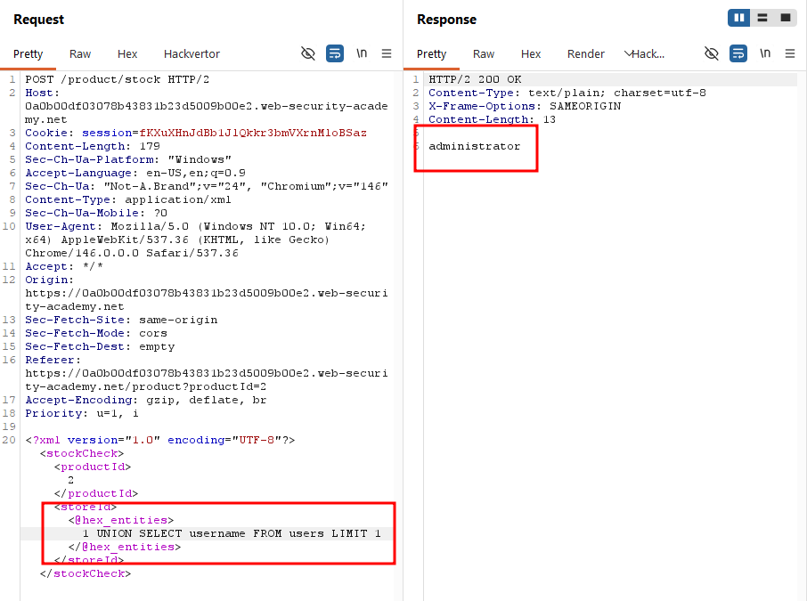

Having identified a valid admin username, I proceeded to extract the corresponding password using the same technique.

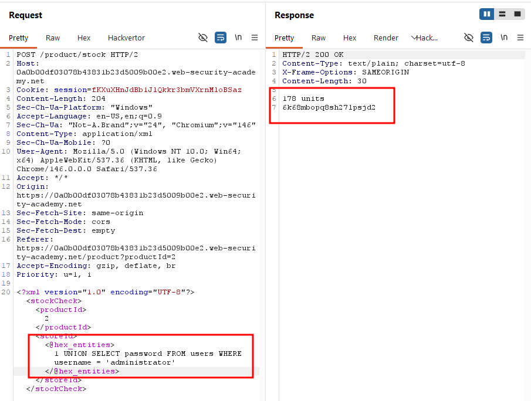

I logged in as administrator with the retrieved credentials.

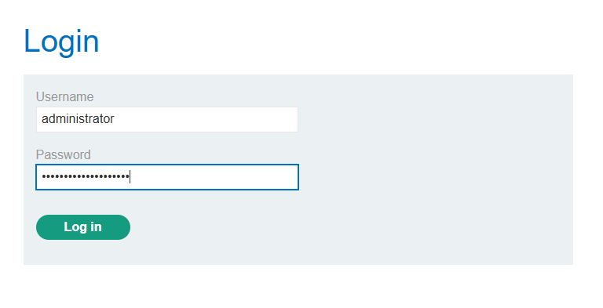

### Solved!

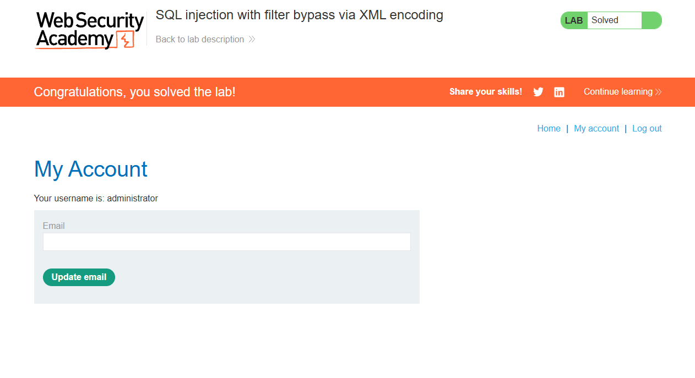

