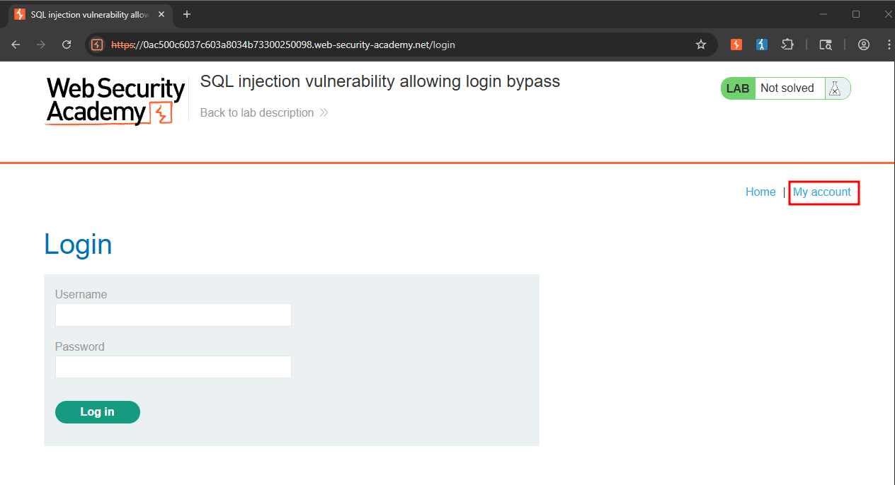
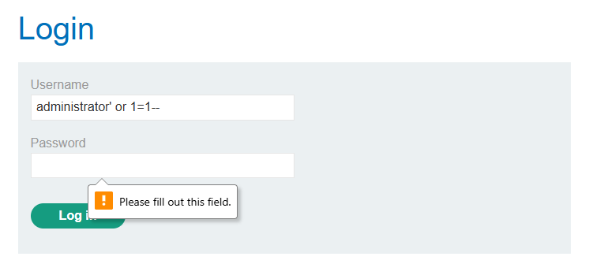
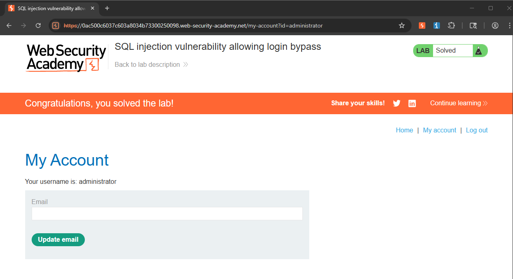

Writeup by wook413

# Lab: SQL injection vulnerability allowing login bypass

This lab contains a SQL injection vulnerability in the login function. To solve the lab, perform a SQL injection attack that logs in to the application as the `administrator` user.

---

This is what you see when you first arrive at the main page.

Clicking on **My account** button takes you to the login page.

Enter `administrator' or 1=1-- ` in the **Username** field and any random characters in the **Password** field. This payload bypasses the password check because the SQL query always evaluates to true.

**Solved!**

