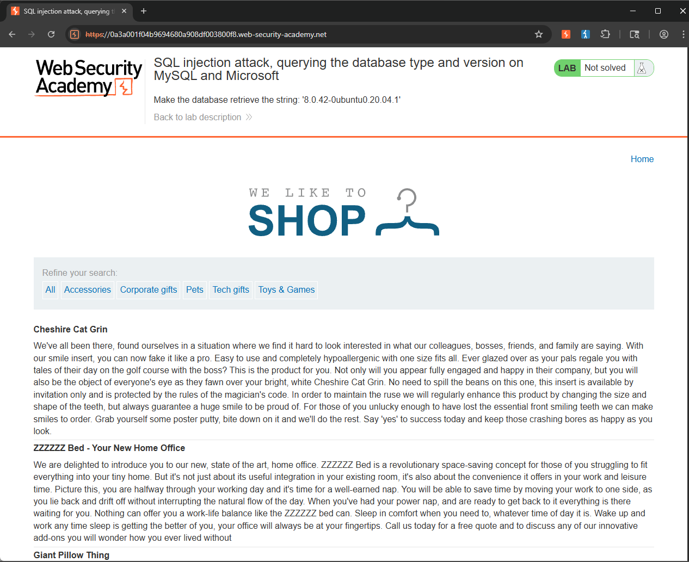
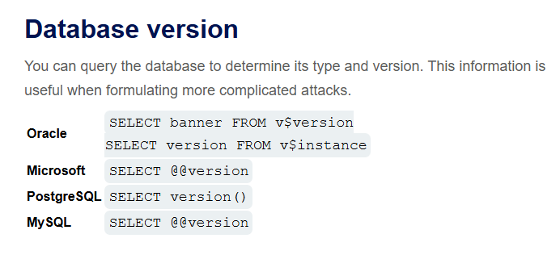
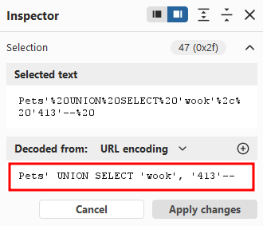
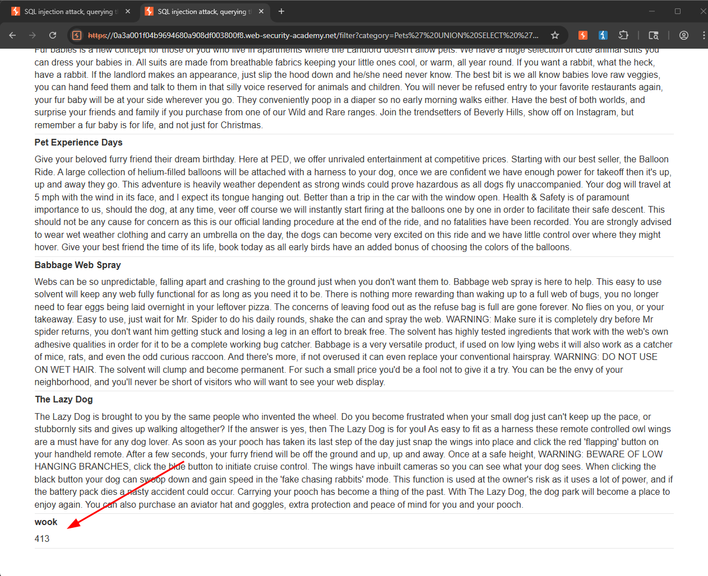
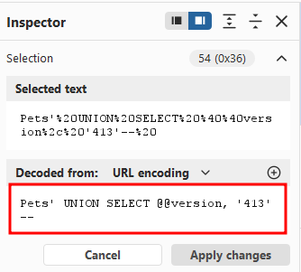
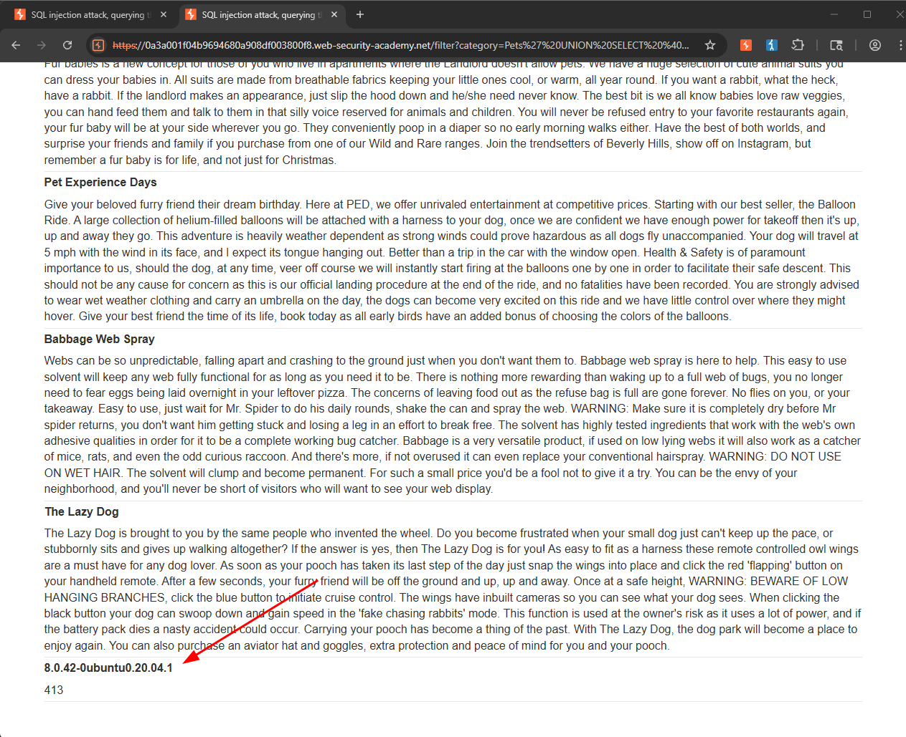
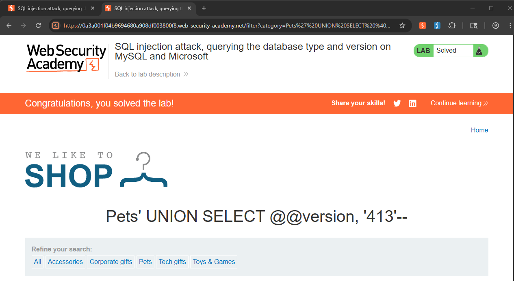

Writeup by wook413

# Lab: SQL injection attack, querying the database type and version on MySQL and Microsoft

This lab contains a SQL injection vulnerability in the product category filter. You can use a UNION attack to retrieve the results from an injected query.

To solve the lab, display the database version string.

---

**Lab#4** is almost the same as the previous lab, **Lab#3**. This lab requires us to display the database version string via a SQL injection attack, but this time the database is MySQL.

Looking at the provided SQL injection cheat sheet, I learned that I can use `SELECT @@version` to query the version on Microsoft SQL Server and MySQL. Also, unlike Oracle, we do not need to specify a table to select from when using a `SELECT` statement.

I clicked on **Pets** category and my initial query to test was the following: `Pets' UNION SELECT 'wook', '413'-- `

It successfully displayed **wook** and **413** on the web application, confirming that my initial query worked.

I then changed my query to `Pets' UNION SELECT @@version, '413'-- ` to display the version of the database.

This time it displayed the database version string on the web application!

**Solved!**

