Writeup by wook413

# Lab: SQL injection attack, listing the database contents on non-Oracle databases

This lab contains a SQL injection vulnerability in the product category filter. The results from the query are returned in the application's response so you can use a UNION attack to retrieve data from other tables.

The application has a login function, and the database contains a table that holds usernames and passwords. You need to determine the name of this table and the columns it contains, then retrieve the contents of the table to obtain the username and password of all users.

To solve the lab, log in as the `administrator` user.

---

Here's what the landing page looks like:

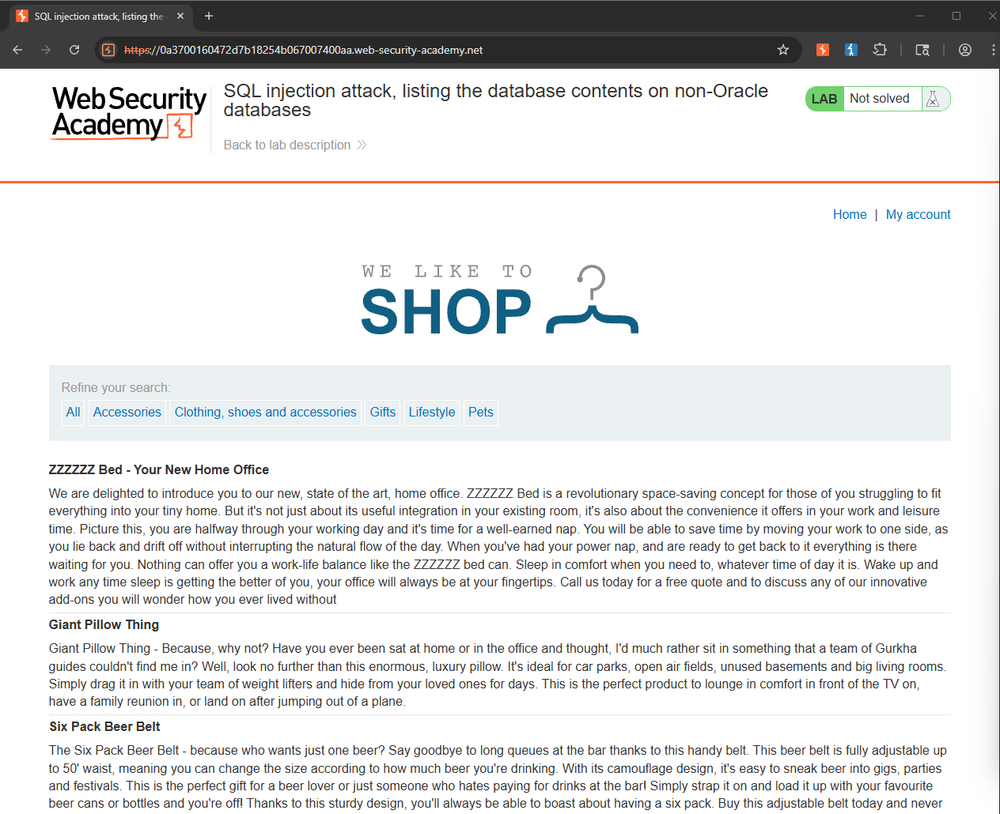

I clicked on the **Pets** category and started guessing the number of columns with the following query: `Pets' UNION SELECT 'wook', '413'-- `.

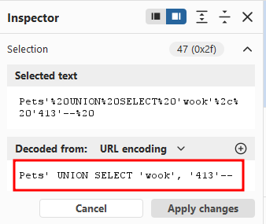

Normally, you'd have to guess both the number and type of columns through trial and error, but this time the payload happened to match on the first try. The response came back with a 200 status code instead of a database error.

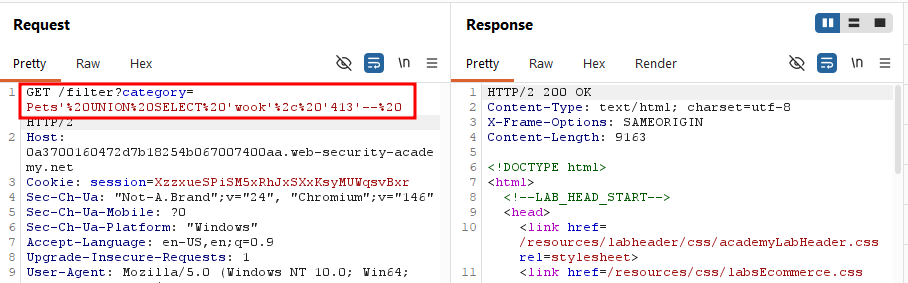

I confirmed the application displayed my strings, **wook** and **413**.

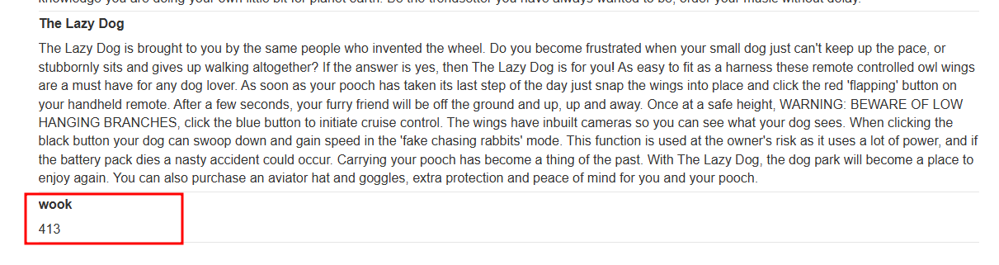

Now that I had confirmed the number and type of columns, it was time to return all of the tables in the database and find which one might contain user information.

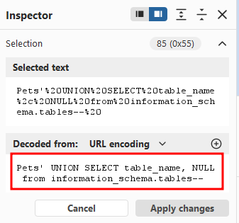

The query in the screenshot above successfully returned all of the tables in the databse.

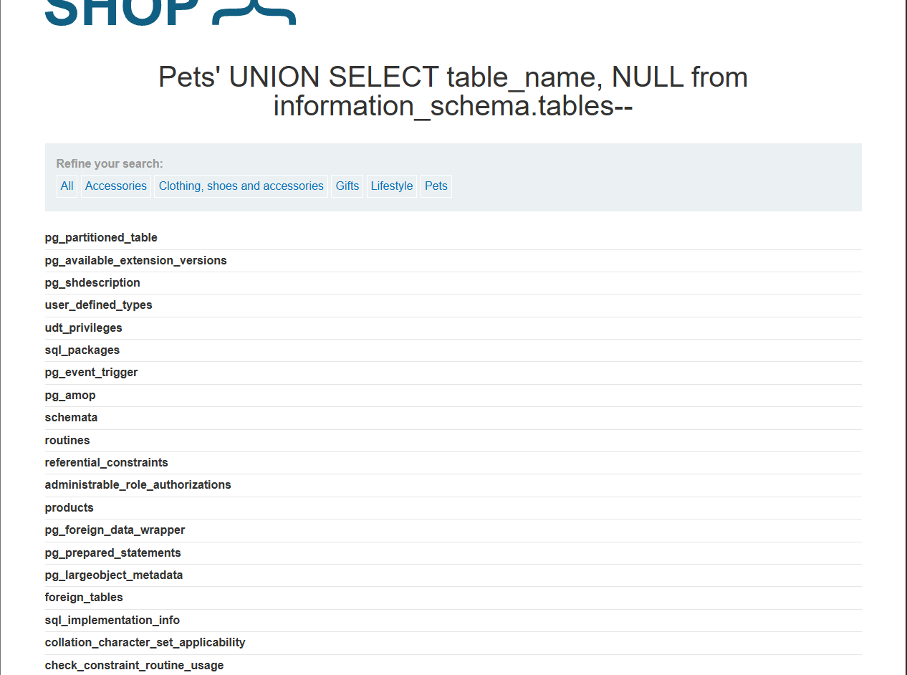

At the bottom of the results, one table name stood out: `users_ytatxu`.

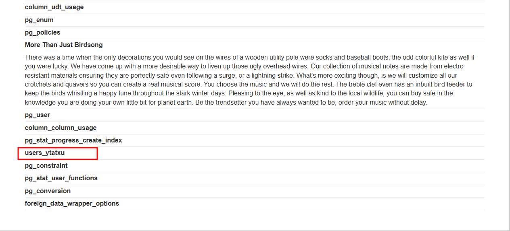

I modified the query to return the column names within the `users_ytatxu` table.

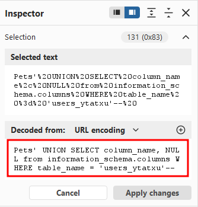

The application displayed three columns: `password_opcuny`, `username_zsklhk`, and `email`.

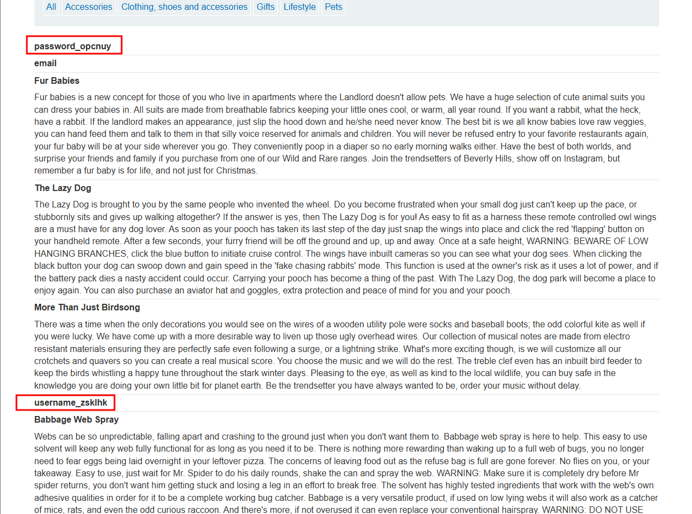

I modified the query once more to pull all usernames and passwords from `users_ytatxu`. I could have included the `email` column too, but since the query only supports two columns, and username/password were enough to login, I left it out.

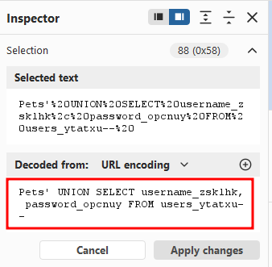

The response returned the administrator's credentials along with those of other users.

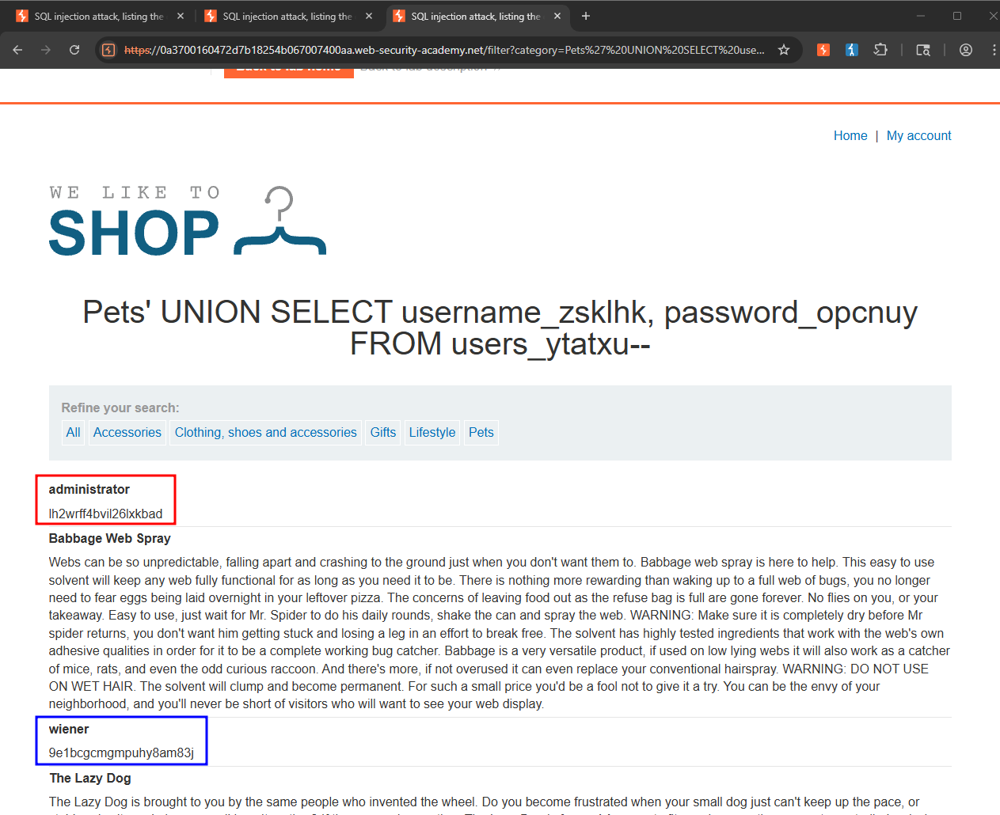

I used the administrator's credentials to login.

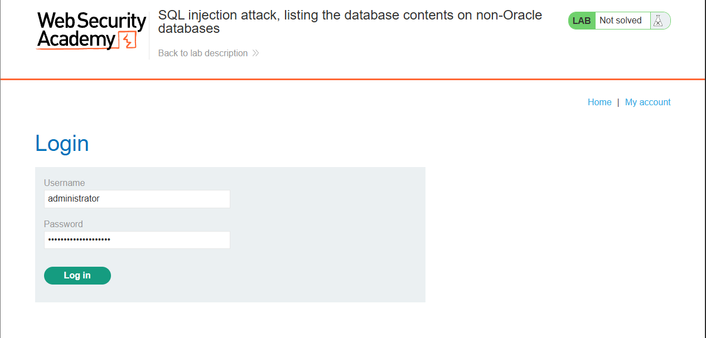

### Solved!

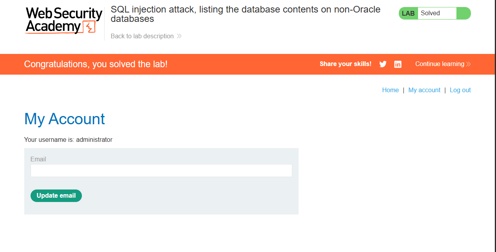

