Writeup by wook413

# Lab: SQL injection attack, listing the database contents on Oracle

This lab contains a SQL injection vulnerability in the product category filter. The results from the query are returned in the application's response so you can use a UNION attack to retrieve data from other tables.

The application has a login function, and the database contains a table that holds usernames and passwords. You need to determine the name of this table and the columns it contains, then retrieve the contents of the table to obtain the username and password of all users.

To solve the lab, log in as the `administrator` user.

---

This lab is very similar to the previous one, except this time we're attacking an Oracle database.

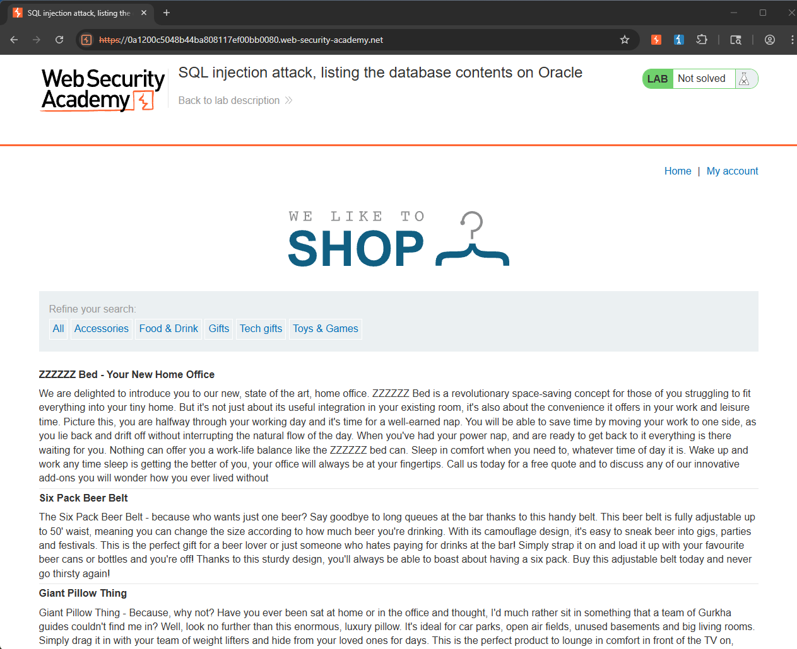

Just like the previous lab, I guessed the number and type of columns using the strings **'wook'** and **'413'**. I made sure to specify the `dual` table at the end, since Oracle requires you to specify a table to query from.

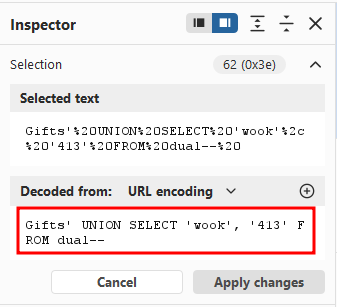

The web application displayed the strings **'wook'** and **'413'**, confirming that the number and type of columns were correct.

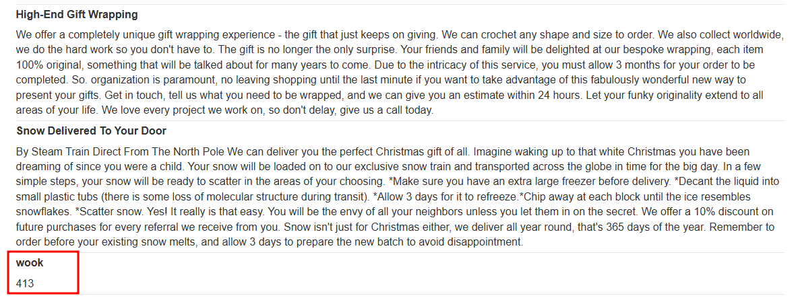

Next, I listed all the table names using the following query, based on a hint from the provided cheat sheet.

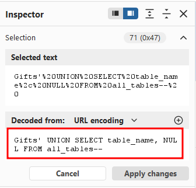

One table in the returned list caught my attention: `USERS_JEMMUO`.

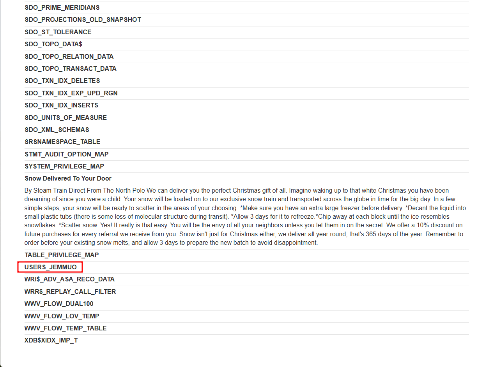

I then modified the query to list all the column names in the `USERS_JEMMUO` table.

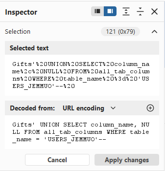

There were three columns: `EMAIL`, `PASSWORD_NEMKWF`, and `USERNAME_GPIWZO`.

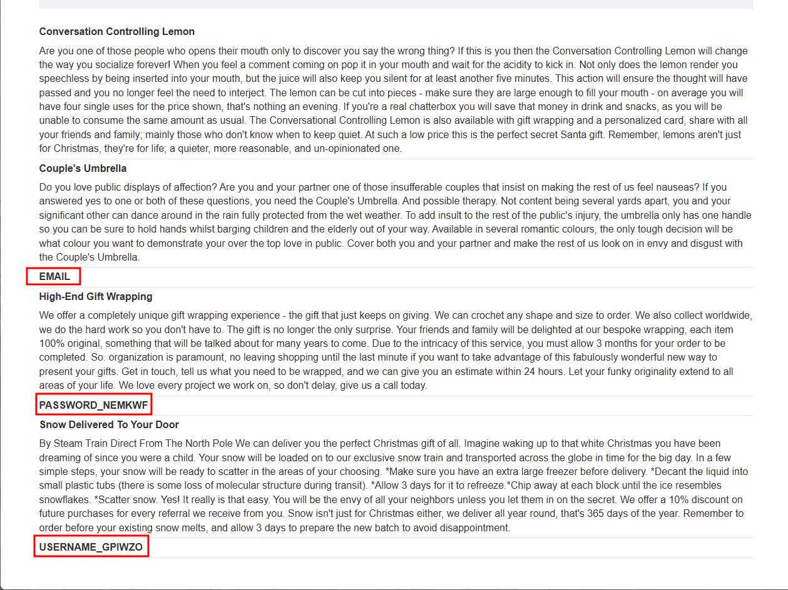

I modified the query again to retrieve all the usernames and passwords from the table.

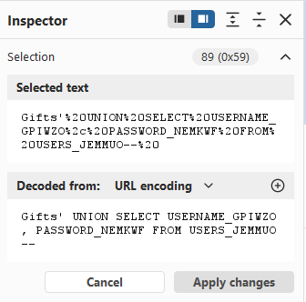

I found three sets of credentials: `administrator`, `carlos`, and `wiener`.

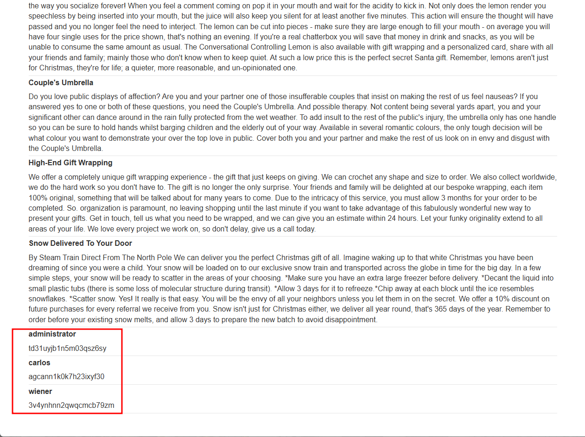

I logged in as `administrator`.

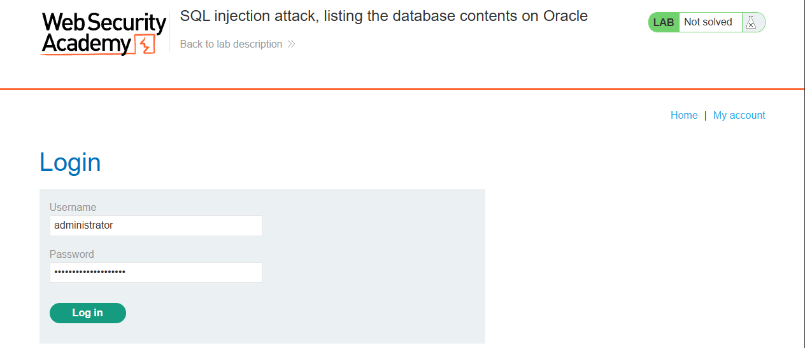

### Solved!

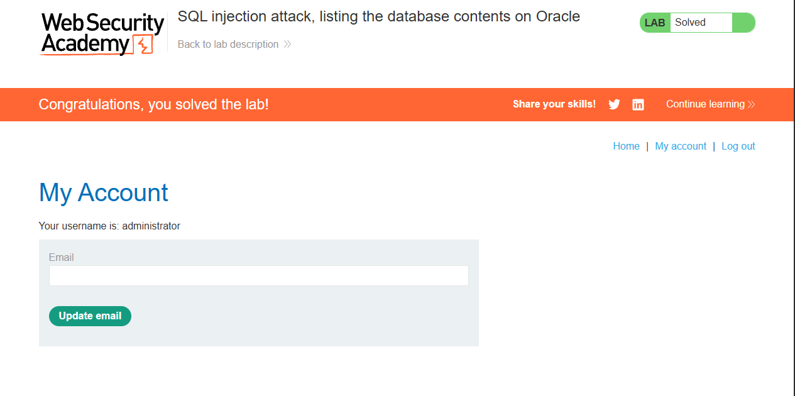