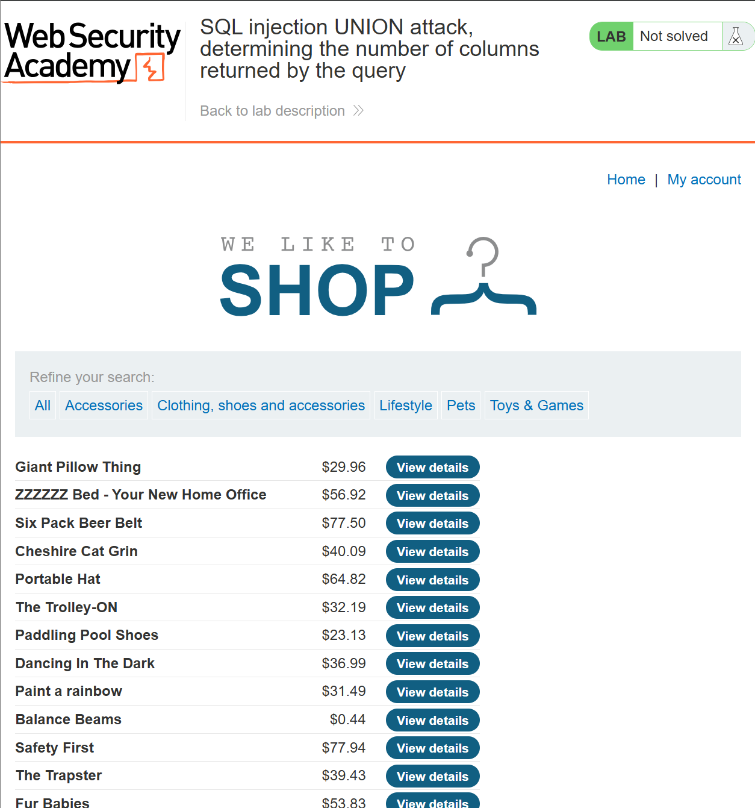
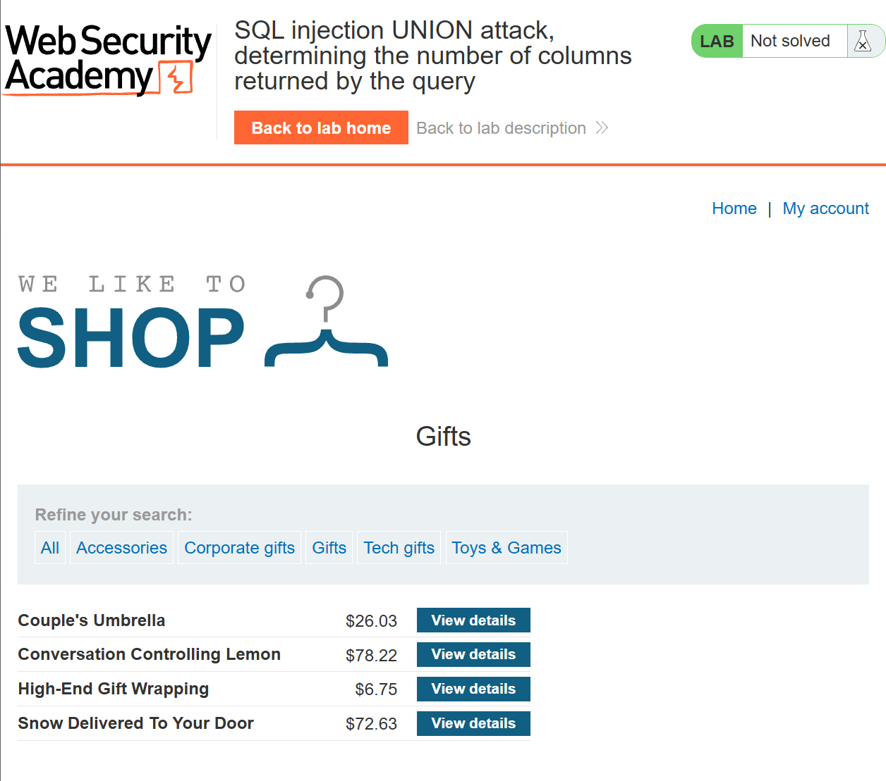
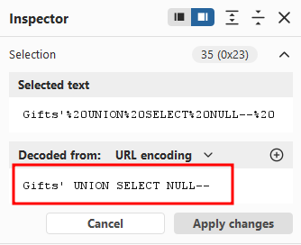
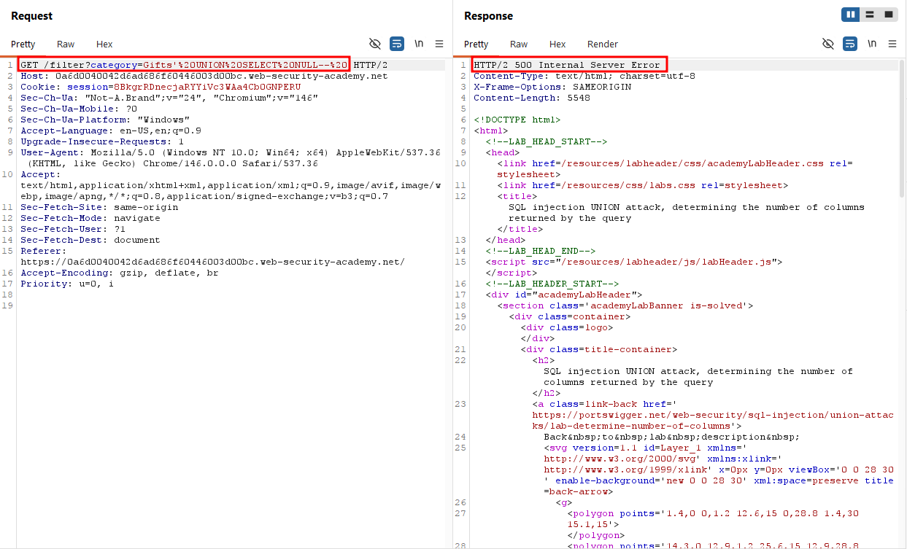
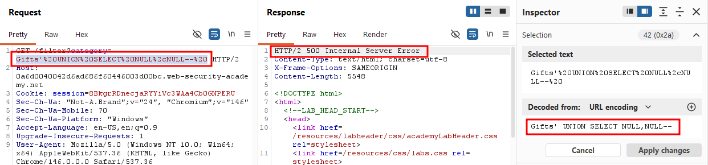
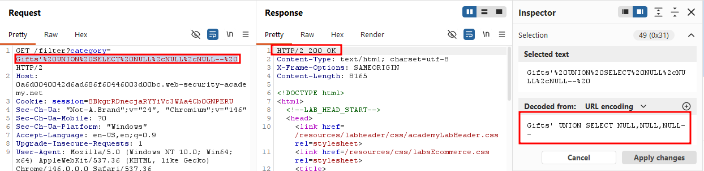
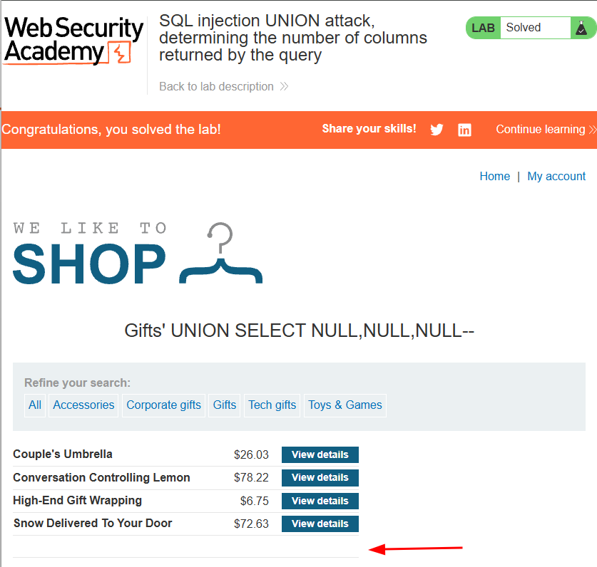

Write-up by wook413

# Lab: SQL injection UNION attack, determining the number of columns returned by the query

This lab contains a SQL injection vulnerability in the product category filter. The results from the query are returned in the application's response, so you can use a UNION attack to retrieve data from other tables. The first step of such an attack is to determine the number of columns that are being returned by the query. You will then use this technique in subsequent labs to construct the full attack.

To solve the lab, determine the number of columns returned by the query by performing a SQL injection UNION attack that returns an additional row containing null values.

---

This is what the landing page of the lab looks like:

I selected the **Gifts** category, and the website only displays items that fall under that category.

To figure out the number of columns, I started with a single NULL value, and I'm going to gradually increase the number of values one by one.

The server returned a **500 Internal Server Error**, which indicates that it has more than one column.

I tried two NULL values, but it still returned a 500 Internal Server Error.

I tried three NULL values, and this time the server returned a **200 OK**, which indicates we guessed the correct number of columns.

When I went back to the web application, there was one additional line displaying the NULL values. The blank entry is your visual confirmation that the UNION query executed successfully.

### Solved!

