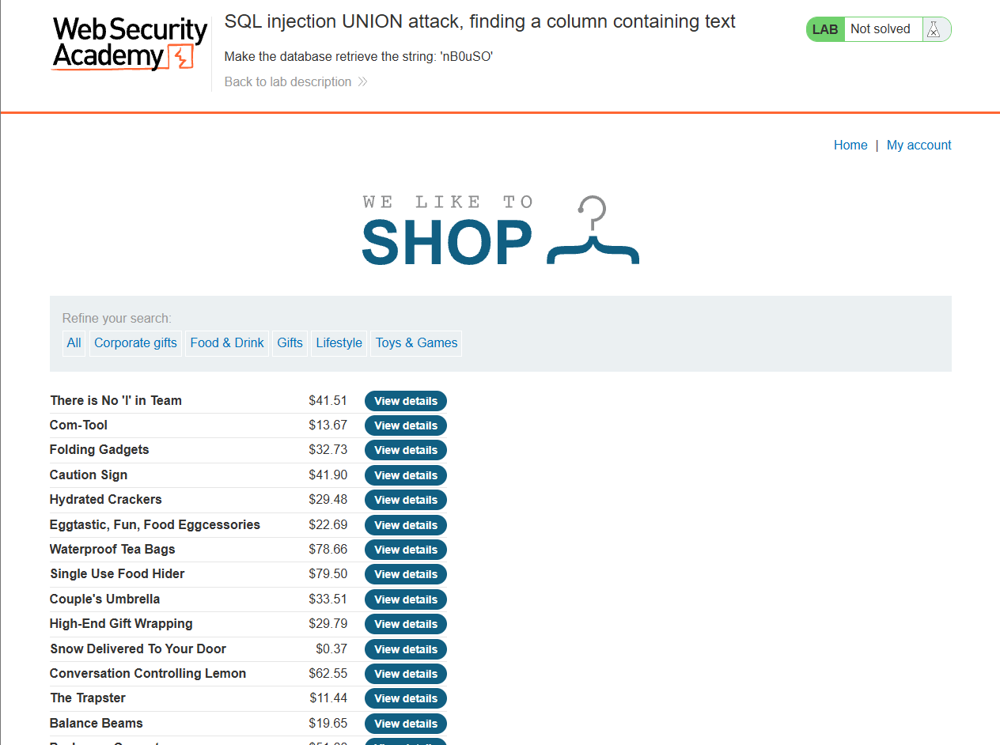
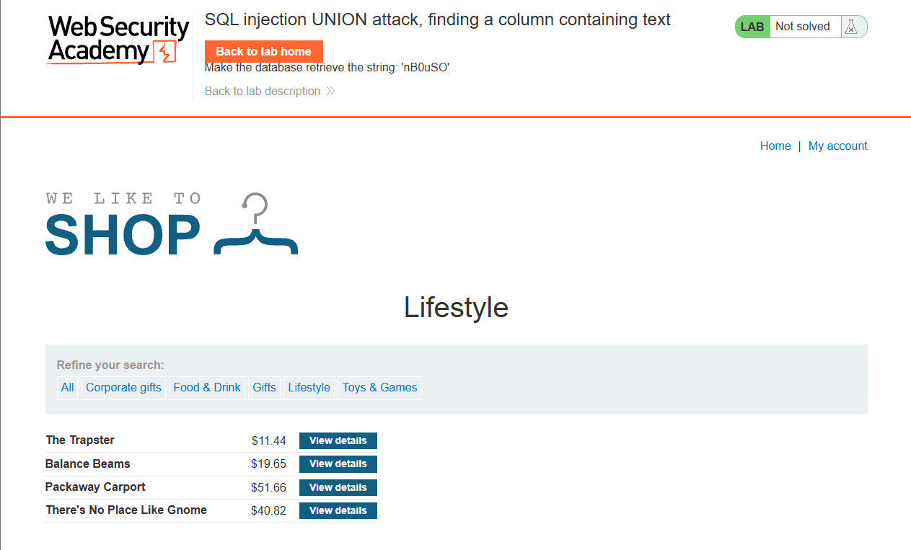
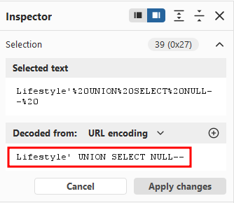
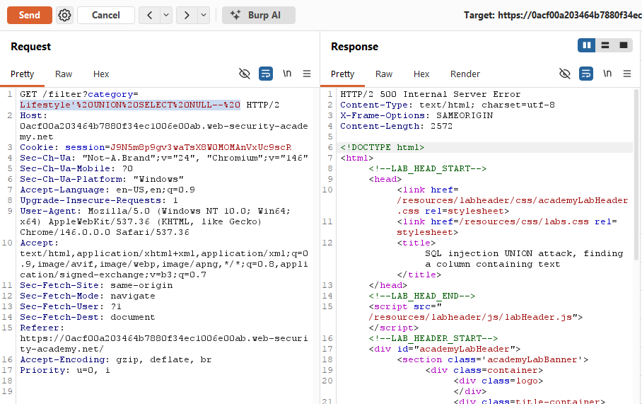
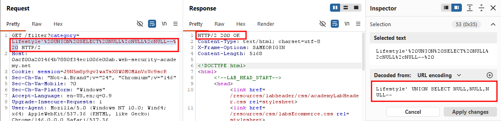
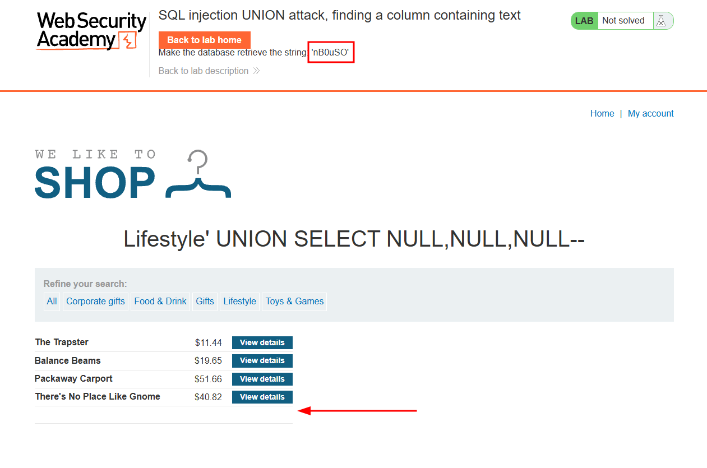
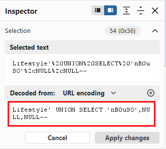
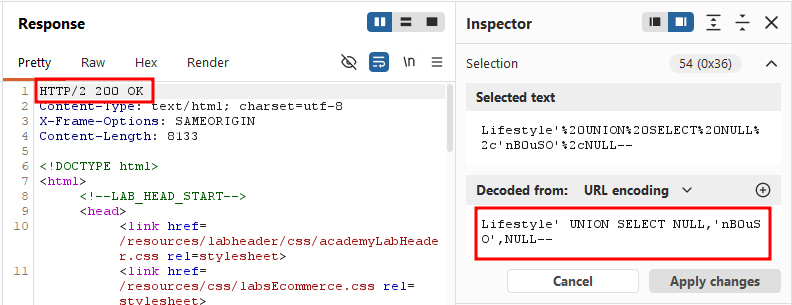
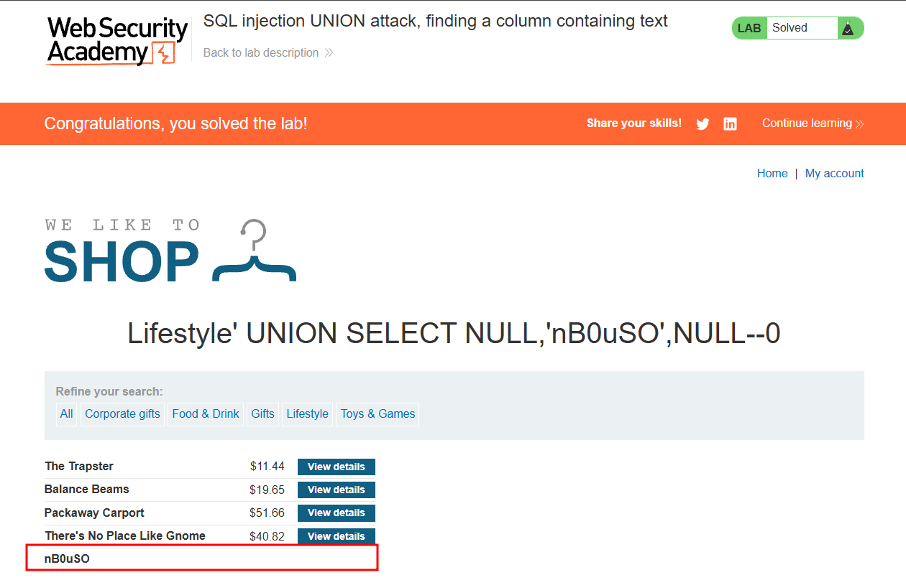

Write-up by wook413

# Lab: SQL injection UNION attack, finding a column containing text

This lab contains a SQL injection vulnerability in the product category filter. The results from the query are returned in the application's response, so you can use a UNION attack to retrieve data from other tables. To construct such an attack, you first need to determine the number of columns returned by the query. You can do this using a technique you learned in a previous lab. The next step is to identify a column that is compatible with string data.

The lab will provide a random value that you need to make appear within the query results. To solve the lab, perform a SQL injection UNION attack that returns an additional row containing the value provided. This technique helps you determine which columns are compatible with string data.

---

For this lab, we need to find not only the number of columns, but also a column that accepts string data.

This is what you'll see when you first open the lab.

For a bit of variety, I selected the **Lifestyle** category instead of **Gifts** for this lab.

To find the number of columns, I first tried a single **NULL** value.

It returned a **500 Internal Server Error**, meaning the query has more than one column.

I then tried two NULL values, which also returned a 500. However, three NULL values returned a **200 OK**.

Going back to the web application, I noticed a blank row had been added at the bottom of the table.

Now that we know the number of columns, we need to find which column accepts text, and ultimately make the database return the string '**nB0uSO**'.

I tried replacing the first NULL with 'nB0uSO' but it returned a 500 Internal Server Error. Then I replaced the second NULL with the string and it returned a 200 OK.

### Solved!

